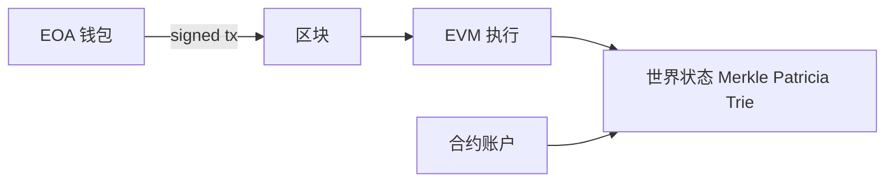

# 区块链基础与 EVM 账户模型

## 30 秒版（开场）

> 以太坊执行层可视为状态机。传统上区分 **EOA**（由私钥原生授权交易）与 **合约账户**；但 EIP-7702 已允许 EOA 在账户状态中设置持久的代码委托，因此“EOA 永远没有代码、合约账户永远不能主动发起动作”的二分法要加版本语境。Go 后端重点是 nonce、typed transaction、fee、safe/finalized 与 chain ID。

## 3 分钟版（一面深度）

1. **是什么**：去中心化账本 + 可编程层（EVM）；区块打包交易，共识（PoS）保证安全。
2. **为什么**：Web3 后端必须懂账户/Gas，否则无法估算费用、排查失败交易、设计索引。
3. **怎么做**：读链用 RPC；写链构造 signed tx；业务层区分 **链上确认数** 与 **链下订单状态**。

## 10 分钟版（原理 + 图示）

```mermaid
flowchart LR
  EOA[EOA 钱包] -->|signed tx| Block[区块]
  Block --> EVM[EVM 执行]
  EVM --> State[世界状态 Merkle Patricia Trie]
  Contract[合约账户] --> State
```

**账户对比**

| 类型 | 控制 | 有代码 | 典型用途 |
|------|------|--------|----------|
| EOA | 原生 secp256k1 密钥授权；可通过 EIP-7702 委托代码执行 | 传统为空；7702 的 delegation indicator 会保留到后续授权替换或清除 | 用户钱包、热钱包 |
| Contract | 代码逻辑 | 是 | ERC20、DEX、NFT |

**交易字段（面试常考）**

| 字段 | 含义 |
|------|------|
| nonce | 发送账户的顺序与同链重放保护参数 |
| gasLimit / fee fields | 执行 gas 上限；legacy 与 EIP-1559 typed tx 的 fee 字段不同 |
| to | 是否可空由交易类型决定；在允许创建合约的交易类型中，空值表示创建。EIP-7702 set-code 交易要求非空目标，不能套用该简写 |
| value | 转 ETH |
| data | 调合约 calldata |

**Gas 机制（EIP-1559 后）**

- `baseFee` 销毁 + `priorityFee` 给验证者
- `SSTORE` 状态转换、首次 cold account/storage access 与后续 warm access 的计价不同；不要只背一个固定 opcode 数字。大数据通常链下存储并在链上提交必要承诺
- EIP-7702 的授权处理与后续目标调用是两个阶段；即使交易执行阶段 revert，已处理的代码委托也不会因此自动回滚。签名 UI 与后端策略必须把授权本身当作持久权限变更审查

**Finality**

- 以太坊 PoS 应优先区分 `latest`、`safe`、`finalized`；确认块数只是业务策略，不存在通用“12 块即最终”。托管 RPC 是否支持标签也要验证
- 与 [S-BC-05 重组](./S-BC-05-indexer-reorg.md) 联动

## 生产场景

- **充值**：用户转 ERC20 到平台地址 → 索引器按链的 safe/finalized 能力、资产价值和风控策略入账；固定 N 块只能是显式配置的替代策略
- **Gas 代付**：元交易 / Paymaster（Account Abstraction）
- **多 EVM 链**：若使用同一私钥，地址通常相同，但 chain ID、nonce、余额、合约代码和安全假设彼此独立；非 EVM 链的派生与地址格式另论

## 排查与工具

- Etherscan / Blockscout 看 tx、internal tx、event logs
- `eth_getTransactionReceipt` 的 `status` 0/1
- Foundry/Hardhat 本地复现

## 架构取舍

| 全链上 | 链下+链上承诺 |
|--------|---------------|
| 规则和状态更容易公开验证；仍受共识最终性、合约权限/升级和实现漏洞影响 | 便宜、可扩展 |
| 执行和数据成本高 | 需保证链下可用性；哈希只证明承诺内容未变，不自动证明内容真实 |

## 追问链

1. **UTXO vs Account？** → BTC UTXO；ETH 账户余额模型，便于智能合约。
2. **为什么 tx 失败仍耗 Gas？** → 已执行部分计费，防 DoS。
3. **chainId 作用？** → 进入交易签名域，降低跨链重放；应用层 EIP-712/授权消息仍要包含 domain、nonce、deadline 等自己的重放保护。
4. **和分布式系统一致性？** → 客户端先看到可能 reorg 的 tentative head，再按共识
   获得 safe/finalized 保证；不要把所有链简单归类成一个“最终一致”数据库。
   跨链桥还引入额外协议与信任假设。

## 反模式与事故

- **把 tentative 交易直接当不可逆入账** → 暴露于 reorg、双花或链异常
- 忽略/信任调用方传入的 chainId → 可能签错网络或形成跨环境事故；签名服务应按受控网络配置校验
- **把私钥放后端** → 用热钱包+HSM/KMS，最小余额

## 代码示例

只拿到 chain ID、且确实要支持当前 go-ethereum 已实现的全部交易类型时，可用
`types.LatestSignerForChainID(chainID)`；若掌握链配置与目标区块/时间，应优先用
`types.MakeSigner`（或对应 fork signer）按已激活分叉选择规则。不要把
`NewLondonSigner` 当作能验证 EIP-7702 等后续交易类型的通用 signer，并应固定
go-ethereum 版本后做兼容测试。

## 延伸阅读

- [Ethereum Accounts](https://ethereum.org/en/developers/docs/accounts/)
- [Gas and Fees](https://ethereum.org/en/developers/docs/gas/)
