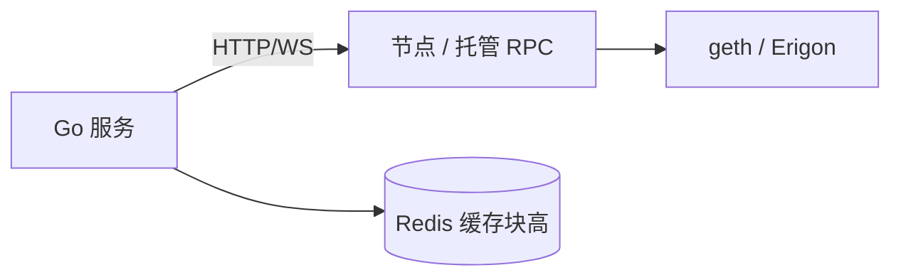

# Go 连接节点：JSON-RPC 与 ethclient

## 30 秒版（开场）

> 链上数据通过 **JSON-RPC 2.0** 访问（HTTP/WebSocket/IPC）。Go 生产用 **go-ethereum/ethclient** 封装；自研网关可用最小 HTTP 客户端。生产关键词：**WS 订阅、限流、多节点 failover、context 超时**。

## 3 分钟版（一面深度）

1. **是什么**：节点暴露 `eth_*`、`net_*`、`debug_*` 等方法；DApp 后端不跑全节点时常连 Infura/Alchemy/自建。
2. **为什么**：索引、发交易、读合约都依赖稳定 RPC；5 年+ Go 后端要能写 **可测试** 的 RPC 层。
3. **怎么做**：`ethclient.Dial(url)`；读多用 HTTP；订阅 `newHeads`/logs 用 WebSocket；批量请求注意 provider 限额。

## 10 分钟版（原理 + 图示）



**常用 RPC 方法**

| 方法 | 用途 |
|------|------|
| eth_blockNumber | 当前块高 |
| eth_getBlockByNumber | 块详情 |
| eth_getLogs | 事件过滤 |
| eth_call | 只读模拟 |
| eth_sendRawTransaction | 广播已签名 tx |

**go-ethereum 示例**

```go
client, err := ethclient.DialContext(ctx, os.Getenv("ETH_RPC_URL"))
if err != nil { return err }
head, err := client.BlockNumber(ctx)
```

**本仓库最小客户端**（无 geth 依赖，便于单测）：

```bash
go test ./examples/senior/ethrpc/...
```

见 `examples/senior/ethrpc/rpc.go`：`BlockNumber`、`GetTransactionReceipt`。

## 生产场景

- **高 QPS 读**：本地缓存 blockNumber；`eth_call` 结果短 TTL 缓存（注意块变化失效）
- **failover**：主备 RPC URL；错误率熔断
- **自建节点**：归档节点查历史 state；全节点够用大部分索引

## 排查与工具

- `curl -X POST -H 'Content-Type: application/json' --data '{"jsonrpc":"2.0","method":"eth_blockNumber","params":[],"id":1}'`
- 429/503 → 退避；`-32005` limit exceeded
- pprof Go 侧 goroutine：WS 重连泄漏

## 架构取舍

| 托管 RPC | 自建 |
|----------|------|
| 快、有 SLA | 数据主权、无限流 |
| 贵、依赖第三方 | 运维成本高 |

## 追问链

1. **HTTP vs WebSocket？** → 轮询用 HTTP；订阅 logs/heads 用 WS。
2. **eth_call 和 tx 区别？** → call 不上链、不改状态、不花 Gas（节点模拟）。
3. **如何 mock 测试？** → httptest 假 RPC（见 ethrpc 示例）或 interface 抽象 Client。
4. **Batch RPC？** → JSON-RPC batch 数组；注意部分 provider 限制 batch 大小。

## 反模式与事故

- **无超时长轮询** → 节点拖垮服务
- **单节点无降级** → provider 故障全站停
- **把 API Key 打日志** → 密钥泄露

## 代码示例

```go
type ChainClient interface {
    BlockNumber(ctx context.Context) (uint64, error)
    FilterLogs(ctx context.Context, q ethereum.FilterQuery) ([]types.Log, error)
}
```

## 延伸阅读

- [JSON-RPC API](https://ethereum.org/en/developers/docs/apis/json-rpc/)
- [go-ethereum ethclient](https://pkg.go.dev/github.com/ethereum/go-ethereum/ethclient)
