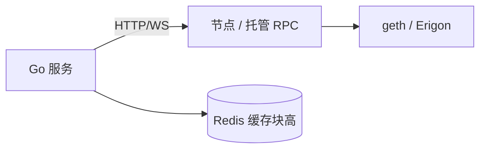

# Go 连接节点：JSON-RPC 与 ethclient

## 30 秒版（开场）

> 链上数据通过 **JSON-RPC 2.0** 访问（HTTP/WebSocket/IPC）。Go 生产用 **go-ethereum/ethclient** 封装；自研网关可用最小 HTTP 客户端。生产关键词：**WS 订阅、限流、多节点 failover、context 超时**。

## 3 分钟版（一面深度）

1. **是什么**：节点暴露 `eth_*`、`net_*`、`debug_*` 等方法；DApp 后端不跑全节点时常连 Infura/Alchemy/自建。
2. **为什么**：索引、发交易、读合约都依赖稳定 RPC；5 年+ Go 后端要能写 **可测试** 的 RPC 层。
3. **怎么做**：`ethclient.DialContext` 建连并 `Close`；普通查询常用 HTTP，订阅用 WebSocket/IPC。订阅不是持久队列，断线重连后必须按最后持久化块高回补缺口，并处理 removed logs/reorg。

## 10 分钟版（原理 + 图示）


```mermaid
flowchart LR
  Go[Go 服务] -->|HTTP/WS| RPC[节点 / 托管 RPC]
  RPC --> Geth[geth / Erigon]
  Go --> Cache[(Redis 缓存块高)]
```

**常用 RPC 方法**

| 方法 | 用途 |
|------|------|
| eth_blockNumber | 当前块高 |
| eth_getBlockByNumber | 块详情 |
| eth_getLogs | 事件过滤 |
| eth_call | 只读模拟 |
| eth_sendRawTransaction | 广播已签名 tx |

**go-ethereum 示例**

```go
client, err := ethclient.DialContext(ctx, os.Getenv("ETH_RPC_URL"))
if err != nil { return err }
defer client.Close()
head, err := client.BlockNumber(ctx)
```

**本仓库最小客户端**（无 geth 依赖，便于单测）：

```bash
go test ./examples/senior/ethrpc/...
```

见 `examples/senior/ethrpc/rpc.go`：`BlockNumber`、`GetTransactionReceipt`。

## 生产场景

- **高 QPS 读**：块高缓存只能用于展示/轮询节流，不能作为入账正确性依据。缓存 `eth_call` 时 key 至少包含 chain、block tag/hash、to、data、from/value 等影响执行的参数
- **failover**：切换前校验 `eth_chainId`，必要时校验 genesis/预期网络；多个 provider 可能处于不同 head，写路径还要防重复 nonce 分配
- **自建节点**：历史区块/log 查询与“历史状态 `eth_call`”需求不同；后者通常需要 archive/historical state 能力，不能笼统说索引都必须归档节点

## 排查与工具

- `curl -X POST -H 'Content-Type: application/json' --data '{"jsonrpc":"2.0","method":"eth_blockNumber","params":[],"id":1}'`
- 429/503 → 尊重 `Retry-After`（若有）并退避；JSON-RPC `-320xx` 多为实现/provider 自定义错误，`-32005` 不是跨节点统一标准
- pprof Go 侧 goroutine：WS 重连泄漏

## 架构取舍

| 托管 RPC | 自建 |
|----------|------|
| 快、可快速接入 | 数据主权、可自行规划容量 |
| 贵、依赖第三方 | 运维成本高 |

## 追问链

1. **HTTP vs WebSocket？** → 查询/可回补轮询常用 HTTP；实时提示可用 WS，但最终正确性仍靠持久 cursor + HTTP 回补。
2. **eth_call 和 tx 区别？** → call 不上链、不改状态、不花 Gas（节点模拟）。
3. **如何 mock 测试？** → httptest 假 RPC（见 ethrpc 示例）或 interface 抽象 Client。
4. **Batch RPC？** → JSON-RPC batch 数组；注意部分 provider 限制 batch 大小。

## 反模式与事故

- **无超时长轮询** → 节点拖垮服务
- **单节点无降级** → provider 故障全站停
- **把 API Key 打日志** → 密钥泄露

## 代码示例

```go
type ChainClient interface {
    BlockNumber(ctx context.Context) (uint64, error)
    FilterLogs(ctx context.Context, q ethereum.FilterQuery) ([]types.Log, error)
}
```

## 延伸阅读

- [JSON-RPC API](https://ethereum.org/en/developers/docs/apis/json-rpc/)
- [go-ethereum ethclient](https://pkg.go.dev/github.com/ethereum/go-ethereum/ethclient)
