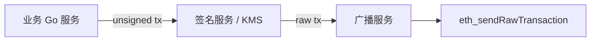

# 交易签名与密钥管理

## 30 秒版（开场）

> 交易由 **私钥 ECDSA 签名** 后广播；后端热钱包必须 **HSM/KMS、最小权限、nonce 队列**。生产关键词：**EIP-155 chainId、离线签名、代签分离、never log private key**。

## 3 分钟版（一面深度）

1. **是什么**：构造 `types.Transaction` → `SignTx(signer, privateKey)` → RLP 编码 → `sendRawTransaction`。
2. **为什么**：Web3 后端常代用户或平台发链上操作；密钥泄露 = 资产归零。
3. **怎么做**：签名服务独立部署；业务服务只调 Sign API；nonce 由 **单线程队列** 或 DB 锁管理。

## 10 分钟版（原理 + 图示）



**签名流程**

1. 填 nonce（`eth_getTransactionCount` pending）
2. 填 gas、to、value、data
3. 选 signer：`LatestSignerForChainID(chainID)`（London/EIP-1559）
4. 签名 → 得到 raw bytes

**go-ethereum 示意**

```go
tx := types.NewTransaction(nonce, to, amount, gasLimit, gasPrice, data)
signed, err := types.SignTx(tx, types.LatestSignerForChainID(chainID), privateKey)
raw, _ := signed.MarshalBinary()
err = client.SendTransaction(ctx, signed)
```

**密钥管理层次**

| 级别 | 方案 |
|------|------|
| 开发 | 本地 keystore / env（仅 testnet） |
| 生产热钱包 | AWS KMS / Hashicorp Vault / 自建 HSM |
| 用户资产 | 用户自持；后端 never 持私钥 |

**HD 钱包（BIP-39/44）**

- 助记词 → seed → 派生路径 `m/44'/60'/0'/0/0`
- 平台可为每用户派生子地址；**链下映射** userId → address

## 生产场景

- **NFT mint 平台**：平台热钱包 mint，Gas 由平台付
- **提现**：人工审核 + 冷钱包批量签名
- **nonce 卡住**：加速用同 nonce 更高 gas 替换（同内容）或 cancel tx

## 排查与工具

- `replacement transaction underpriced`
- `nonce too low / too high`
- 监控热钱包 ETH 余额（Gas）

## 架构取舍

| 集中热钱包 | 每用户子地址 |
|------------|--------------|
| 简单 | 对账清晰 |
| 单点风险 | 地址管理复杂 |

## 追问链

1. **EIP-1559 tx 怎么签？** → `DynamicFeeTx` + tip cap / fee cap。
2. **为何 nonce 必须串行？** → 同 EOA nonce 冲突导致替换或失败。
3. **和 JWT 签名区别？** → 链上 tx 公开广播；私钥泄露不可逆。
4. **MPC 钱包？** → 多方分片签名，后端不持完整私钥。

## 反模式与事故

- **私钥进 Git / 镜像** → 秒被盗
- **多实例并发发 tx 不锁 nonce** → 大量失败
- **主网私钥用于测试** → 资金损失

## 代码示例

签名逻辑隔离在 `internal/signer`，业务层只传 `SignRequest{ChainID, To, Data, Gas}`。

## 延伸阅读

- [Transactions](https://ethereum.org/en/developers/docs/transactions/)
- [EIP-155](https://eips.ethereum.org/EIPS/eip-155)
