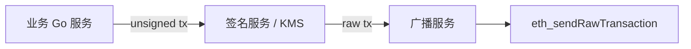

# 交易签名与密钥管理

## 30 秒版（开场）

> 以太坊交易通常由 secp256k1 ECDSA 授权后广播。生产热钱包要把策略、交易构造、签名和广播分层；HSM/KMS/MPC 只是密钥控制的一部分，还必须限制 chain、to、value、method、额度和 nonce，并保存幂等的已签名结果。

## 3 分钟版（一面深度）

1. **是什么**：构造 legacy 或 EIP-2718 typed transaction → 按 chain ID 选择 signer → 签名 → `MarshalBinary` 得到 raw transaction → 广播。
2. **为什么**：Web3 后端常代用户或平台发链上操作；密钥泄露可能造成不可逆资产损失。
3. **怎么做**：签名服务独立部署并执行策略；业务服务提交业务意图而非任意 raw fields。每个发送账户的 nonce 必须唯一分配且连续推进，可用单写者，也可用带持久化 reservation/lease 的并发 nonce manager。

## 10 分钟版（原理 + 图示）


```mermaid
flowchart LR
  Biz[业务 Go 服务] -->|unsigned tx| Signer[签名服务 / KMS]
  Signer -->|raw tx| Broadcaster[广播服务]
  Broadcaster --> RPC[eth_sendRawTransaction]
```

**签名流程**

1. 分配 nonce：`eth_getTransactionCount(..., "pending")` 只能作为节点本地 pending 视图的种子/对账输入，不是跨实例唯一号分配器；生产用持久化 reservation、单写者或线性一致的 nonce manager
2. 填 gas、to、value、data
3. 选 signer：只有 chain ID 时可用 `LatestSignerForChainID(chainID)` 支持当前库已实现的交易类型；有链配置和区块/时间时用 `MakeSigner` 按实际 fork 选择，不能把它只解释成“London signer”
4. 签名 → 得到 raw bytes

**go-ethereum 示意**

```go
tx := types.NewTx(&types.DynamicFeeTx{
    ChainID:   chainID,
    Nonce:     nonce,
    GasTipCap: tipCap,
    GasFeeCap: feeCap,
    Gas:       gasLimit,
    To:        &to,
    Value:     amount,
    Data:      data,
})
signed, err := types.SignTx(tx, types.LatestSignerForChainID(chainID), privateKey)
if err != nil {
    return err
}
// SendTransaction 会编码 signed tx。若系统需要 raw tx 幂等重播，广播前还应
// MarshalBinary 并把同一份 bytes 持久化，而不是超时后重新构造另一笔交易。
err = client.SendTransaction(ctx, signed)
```

**密钥管理层次**

| 级别 | 方案 |
|------|------|
| 开发 | 本地 keystore / env（仅 testnet） |
| 生产热钱包 | 经能力验证的 KMS/Vault/HSM；必须确认 secp256k1、签名编码与 recovery parity、访问策略、审计和 HA，而不能只看产品名称 |
| 非托管用户资产 | 用户/智能账户自持；后端不接触主密钥 |
| 托管平台资产 | 机构签名系统、MPC/HSM、审批与冷热分层 |

**HD 钱包（BIP-39/44）**

- 助记词 → seed → 派生路径 `m/44'/60'/0'/0/0`
- 平台可为每用户派生子地址；只收款场景可让在线系统持扩展公钥，seed/xprv 放在更高安全域。xpub 仍会暴露地址关联关系；父 xpub 与任一非 hardened 子私钥同时泄露还可能推导父私钥。派生方案、路径、备份和恢复必须先做威胁建模

## 生产场景

- **NFT mint 平台**：平台热钱包 mint，Gas 由平台付
- **提现**：人工审核 + 冷钱包批量签名
- **nonce 卡住**：用同 nonce 且满足节点 replacement 规则的更高 fee 交易替换；“加速”通常保持业务意图，“取消”常发向自身的零 value 交易，但链上没有专门 cancel 指令且原交易可能先被打包

## 排查与工具

- `replacement transaction underpriced`
- `nonce too low / too high`
- 监控热钱包 ETH 余额（Gas）

## 架构取舍

| 集中热钱包 | 每用户子地址 |
|------------|--------------|
| 简单 | 对账清晰 |
| 单点风险 | 地址管理复杂 |

## 追问链

1. **EIP-1559 tx 怎么签？** → `DynamicFeeTx` + tip cap / fee cap。
2. **为何 nonce 要集中治理？** → 同一账户的 nonce 唯一且按序生效；不一定所有业务都串行执行，但分配、持久化、替换和故障恢复必须由一个一致的管理面协调。
3. **和 JWT 签名区别？** → 链上 tx 公开广播；私钥泄露不可逆。
4. **MPC 钱包？** → 多方分片签名，后端不持完整私钥。

## 反模式与事故

- **私钥进 Git / 镜像** → 秒被盗
- **多实例并发发 tx 不锁 nonce** → 大量失败
- **主网私钥用于测试** → 资金损失

## 代码示例

签名逻辑隔离在 `internal/signer`，业务层只传 `SignRequest{ChainID, To, Data, Gas}`。

## 延伸阅读

- [Transactions](https://ethereum.org/en/developers/docs/transactions/)
- [EIP-155](https://eips.ethereum.org/EIPS/eip-155)
