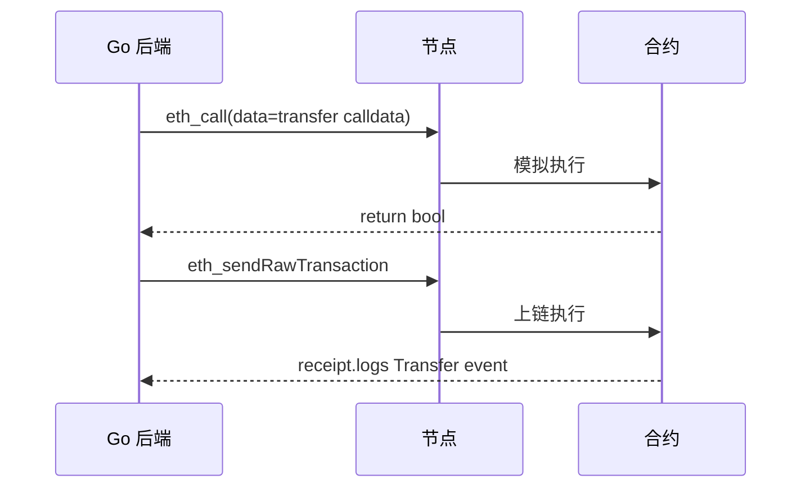

# 智能合约交互：ABI 与事件监听

## 30 秒版（开场）

> 调合约 = **ABI 编码 calldata** + 发 tx 或 `eth_call`；监听业务靠 **Event Logs**（`Transfer` 等）。Go 用 **abigen** 生成绑定。生产关键词：**topics 索引、receipt logs、合约地址白名单**。

## 3 分钟版（一面深度）

1. **是什么**：ABI 描述函数 selector 与参数编码；事件写入 log，indexed 字段进 topics 便于过滤。
2. **为什么**：后端 90% 工作是与已部署合约交互，不是写 Solidity。
3. **怎么做**：`abigen --abi --pkg token --out token.go`；`FilterLogs` 按 address+topics 扫；解析后写 DB。

## 10 分钟版（原理 + 图示）



**ERC20 Transfer 事件**

```solidity
event Transfer(address indexed from, indexed to, uint256 value);
```

- `topics[0]` = event signature hash
- `topics[1]` = from，`topics[2]` = to
- `data` = value

**Go abigen 调用**

```bash
abigen --abi=erc20.abi --pkg=erc20 --out=erc20/erc20.go
```

```go
token, _ := erc20.NewErc20(contractAddr, client)
balance, _ := token.BalanceOf(&bind.CallOpts{Context: ctx}, userAddr)
```

**FilterLogs 查询**

```go
query := ethereum.FilterQuery{
    FromBlock: big.NewInt(int64(from)),
    ToBlock:   big.NewInt(int64(to)),
    Addresses: []common.Address{tokenAddr},
    Topics:    [][]common.Hash{{transferSig}, nil, {toTopic}},
}
logs, err := client.FilterLogs(ctx, query)
```

## 生产场景

- **充值检测**：监听平台地址 `Transfer` 的 to topic
- **Swap 解析**：Uniswap `Swap` event 算成交价
- **多合约版本**：ABI 版本表 + 合约地址 registry

## 排查与工具

- Tenderly / Foundry trace 看 revert reason
- `execution reverted` → 模拟 call 先测
- log 为空 → 块范围错、address 错、topic 错

## 架构取舍

| 轮询 FilterLogs | WS Subscribe |
|-----------------|--------------|
| 简单 | 实时 |
| 块范围分片 | 需重连 |

## 追问链

1. **indexed 限制？** → 最多 3 个 indexed topics；大字符串放 data。
2. **proxy 合约？** → 实现地址升级；用 EIP-1967 slot 读 implementation。
3. **和 [S-BC-05 索引器](./S-BC-05-indexer-reorg.md)？** → FilterLogs 是索引器核心 RPC。
4. **如何防假合约？** → 地址白名单 + 链上 bytecode 校验。

## 反模式与事故

- **不校验 receipt.status** → 失败 tx 当成功
- **decimal 当 1:1** → USDC 6 位小数
- **无限 approve 后端代操** → 用户资产风险

## 代码示例

解析 log 务必用生成代码 `ParseTransfer(l types.Log)` 防手工解码错。

## 延伸阅读

- [Smart Contract Anatomy](https://ethereum.org/en/developers/docs/smart-contracts/anatomy/)
- [abigen](https://geth.ethereum.org/docs/tools/abigen)
