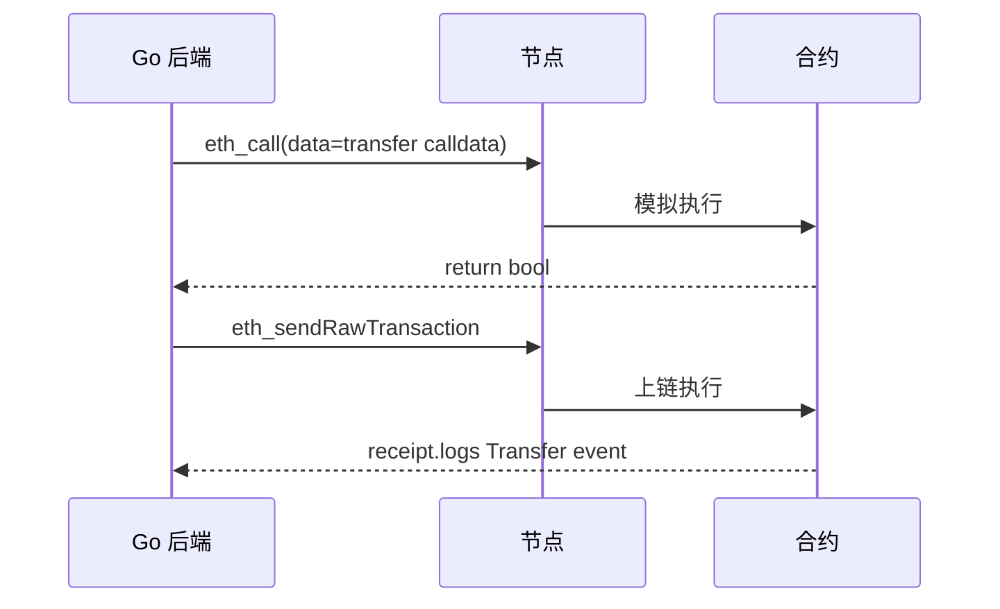

# 智能合约交互：ABI 与事件监听

## 30 秒版（开场）

> 调合约 = **ABI 编码 calldata** + 发 tx 或 `eth_call`；监听业务常用 **Event Logs**（`Transfer` 等）。日志是可重组的执行输出，不是脱离区块上下文的状态证明。Go 用 **abigen** 生成绑定。生产关键词：**topics 索引、receipt status、合约地址白名单、finality**。

## 3 分钟版（一面深度）

1. **是什么**：ABI 描述函数 selector 与参数编码；事件写入 log，indexed 字段进 topics 便于过滤。
2. **为什么**：后端 90% 工作是与已部署合约交互，不是写 Solidity。
3. **怎么做**：`abigen --abi --pkg token --out token.go`；`FilterLogs` 按 address+topics 扫；解析后写 DB。

## 10 分钟版（原理 + 图示）


```mermaid
sequenceDiagram
  participant Go as Go 后端
  participant RPC as 节点
  participant SC as 合约
  Go->>RPC: eth_call(data=transfer calldata)
  RPC->>SC: 模拟执行
  SC-->>Go: return bool
  Go->>RPC: eth_sendRawTransaction
  RPC->>SC: 上链执行
  SC-->>Go: receipt.logs Transfer event
```

**ERC20 Transfer 事件**

```solidity
event Transfer(address indexed from, indexed to, uint256 value);
```

- `topics[0]` = event signature hash
- `topics[1]` = from，`topics[2]` = to
- `data` = value

**Go abigen 调用**

```bash
abigen --abi=erc20.abi --pkg=erc20 --out=erc20/erc20.go
```

```go
token, err := erc20.NewErc20(contractAddr, client)
if err != nil {
    return err
}
balance, err := token.BalanceOf(&bind.CallOpts{Context: ctx}, userAddr)
```

**FilterLogs 查询**

```go
query := ethereum.FilterQuery{
    FromBlock: big.NewInt(int64(from)),
    ToBlock:   big.NewInt(int64(to)),
    Addresses: []common.Address{tokenAddr},
    Topics:    [][]common.Hash{{transferSig}, nil, {toTopic}},
}
logs, err := client.FilterLogs(ctx, query)
```

## 生产场景

- **充值检测**：校验 chain、发出日志的 token 地址、事件签名/参数、receipt status 和 canonical/finality，再按支持的 token 语义对账；只看到一个同名 `Transfer` 不足以入账
- **Swap 解析**：按具体 pool 版本、token 顺序和 decimals 解析 `Swap` event；事件隐含的单笔成交价不是可直接用于清算的抗操纵 oracle
- **多合约版本**：ABI 版本表 + 合约地址 registry

## 排查与工具

- Tenderly / Foundry trace 看 revert reason
- `execution reverted` → 模拟 call 先测
- log 为空 → 块范围错、address 错、topic 错

## 架构取舍

| 轮询 FilterLogs | WS Subscribe |
|-----------------|--------------|
| 简单 | 实时 |
| 块范围分片 | 需重连 |

## 追问链

1. **indexed 限制？** → 非 anonymous event 最多 3 个 indexed 参数（另有 `topics[0]` 签名）；anonymous 最多 4 个。动态类型 indexed 后 topic 存的是哈希，无法从 topic 还原原值。
2. **proxy 合约？** → EIP-1967/UUPS/Transparent 可按对应 slot/接口识别，Beacon、Diamond、clone 等模式不同，不能对所有代理只读一个 implementation slot。
3. **和 [S-BC-05 索引器](./S-BC-05-indexer-reorg.md)？** → FilterLogs 是索引器核心 RPC。
4. **如何防假合约？** → chain ID + 受控地址 registry + 部署/升级治理记录；code hash 可作附加校验，但代理、immutable args 和 clone 会让“字节码必须完全相同”失效。

## 反模式与事故

- 只看到 tx hash/receipt 就记成功 → 必须校验 receipt、status、预期 logs/state，并按 reorg/finality 策略推进状态
- 把 event 当作独立状态证明 → 日志可能来自假合约、失败语义实现或后续被 reorg；必须绑定受控合约、canonical block 和业务不变量
- **decimal 当 1:1** → USDC 6 位小数
- **无限 approve 后端代操** → 用户资产风险

## 代码示例

解析 log 优先使用版本匹配的生成代码 `ParseTransfer(l types.Log)`。`eth_call` 预模拟只能降低失败率；从模拟到打包之间状态、base fee 和排序都可能变化，不能承诺交易一定成功。

## 延伸阅读

- [Smart Contract Anatomy](https://ethereum.org/en/developers/docs/smart-contracts/anatomy/)
- [abigen](https://geth.ethereum.org/docs/tools/abigen)
