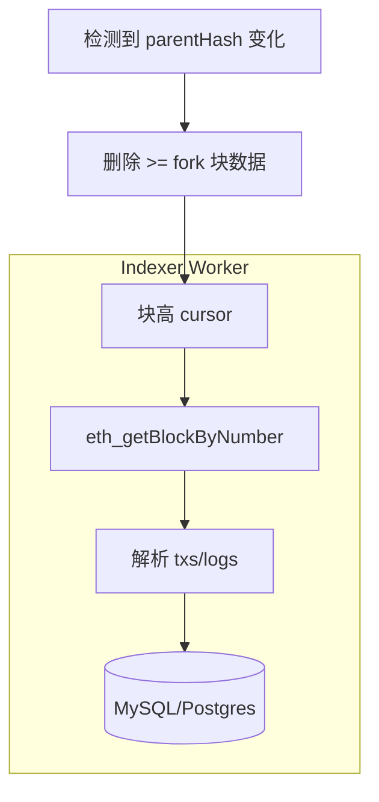

# 链上索引器：扫块、重组与幂等

!!! tip "⭐ 重点准备"
    Web3 交易所 / 钱包方向高频题，见 [重点准备题单](../../resume-focus-web3.md)。

## 30 秒版（开场）

> **索引器** = 持续同步链上数据到 DB，供 API 查询。必须处理 **链重组（reorg）**：回滚受影响块并重扫。生产关键词：**确认数、checkpoint、幂等写入、lag 监控**。

## 3 分钟版（一面深度）

1. **是什么**：Worker 从 `lastBlock+1` 扫到 latest，解析 tx/logs 写业务表。
2. **为什么**：RPC 不适合直接给 C 端高并发查；且需关联链下 userId。
3. **怎么做**：保留 **N 块确认** 才入账；存 `block_hash`；reorg 时对比 parent hash 不一致则回滚。

## 10 分钟版（原理 + 图示）



**表设计要点**

| 表 | 字段 |
|----|------|
| blocks | number, hash, parent_hash, processed_at |
| deposits | tx_hash, log_index, amount, status |
| cursor | chain_id, last_safe_block |

**幂等键**：`(chain_id, tx_hash, log_index)` UNIQUE — 与 [S-ARCH-04 幂等](../03-system-design/S-ARCH-04-idempotency.md) 同构。

**Reorg 处理伪代码**

```go
for {
    block, _ := client.BlockByNumber(ctx, big.NewInt(cursor))
    stored, _ := repo.GetBlock(cursor)
    if stored != nil && stored.Hash != block.Hash() {
        repo.RollbackFrom(cursor) // 删块及衍生业务
        cursor = stored.ParentNum
        continue
    }
    processLogs(block)
    if latest - cursor >= confirmations {
        repo.MarkSafe(cursor)
    }
    cursor++
}
```

## 生产场景

- **交易所充值**：12 确认后 credit；reorg 回滚余额
- **NFT 铸造索引**：metadata 链下 IPFS + 链上 tokenId
- **多链**：每链独立 cursor + worker 池

## 排查与工具

- 指标：`indexer_lag_blocks`、`reorg_count`、`rpc_errors`
- 告警：lag > 50 或 10min 不前进
- 对账：链上 balance vs 库内汇总抽样

## 架构取舍

| 确认数 0 | 确认数 12+ |
|----------|------------|
| 快 | 安全 |
| reorg 风险 | 用户体验慢 |

## 追问链

1. **浅重组多深？** → 通常 1～3；极端需监控 finalized。
2. **eth_getLogs 范围限制？** → 分片扫；归档节点。
3. **和 MQ？** → 索引后发 `DepositConfirmed` 事件驱动下游（[S-SOL-03](../11-solution-architecture/S-SOL-03-event-driven-cqrs.md)）。
4. **并发扫块？** → 单链单 cursor 串行；按段并行需严格顺序合并。

## 反模式与事故

- **只存 blockNumber 不存 hash** → reorg 无法检测
- **无 UNIQUE 约束** → 重复入账
- **catch-up 不设 sleep** → RPC 限流封禁

## 代码示例

Worker 用 `context` + graceful shutdown；见 [S-CODE-03 优雅退出](../08-coding-senior/S-CODE-03-graceful-shutdown.md)。

## 延伸阅读

- [PoS 与 finality](https://ethereum.org/en/developers/docs/consensus-mechanisms/pos/)
- [Handling reorgs](https://www.quicknode.com/guides/ethereum-development/transactions/how-to-handle-reorgs)
