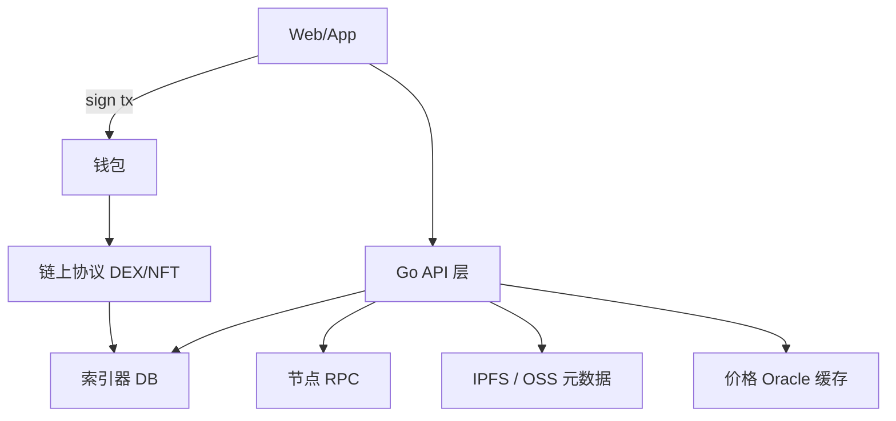

# DeFi / NFT 后端架构模式

## 30 秒版（开场）

> Web3 后端 = **链上结算 + 链下体验**：索引器、报价 API、元数据、风控。DeFi 重 **Oracle/滑点/MEV**；NFT 重 **元数据/IPFS/版税**。Go 常做 **聚合 API、任务队列、对账**。生产关键词：**链上链下一致性、价格延迟、合规 KYT**。

## 3 分钟版（一面深度）

1. **是什么**：用户通过前端签 tx；后端提供数据、缓存、业务规则，不替代链上清算。
2. **为什么**：架构师/Web3 后端面问「swap 报价怎么来」「NFT 图片存哪」。
3. **怎么做**：读路径走索引+RPC；写路径用户签或平台热钱包；Oracle 价格多源聚合。

## 10 分钟版（原理 + 图示）

**DeFi 后端组件**

| 组件 | 职责 |
|------|------|
| 报价服务 | 读 pool reserve / aggregator API |
| 交易构建 | 组装 router calldata，用户签 |
| 风控 | 滑点上限、黑名单、KYT |
| 对账 | 链上 swap event vs 订单 |

**NFT 后端组件**

| 组件 | 职责 |
|------|------|
| Metadata API | tokenURI 解析 JSON |
| 媒体 | IPFS CID + CDN 缓存 |
| 版税 | EIP-2981 / 市场约定 |
| 铸造队列 | 平台代 mint + Gas 管理 |

**Oracle 注意**

- Chainlink 等链上 feed + 链下缓存 TTL
- 滞后价格导致 **清算/报价** 偏差 — 架构上要有 staleness 检查

**跨链桥（简述）**

- 信任模型：官方桥 / 轻客户端 / 多签 — 面试说明 **额外信任假设**
- 后端记录 bridge tx 状态机，非即时 finality

## 生产场景

- **DEX 聚合器**：Go 调 1inch/0x API + 自建 pool 模拟
- **Launchpad**：白名单 Merkle proof 链下生成，用户 mint tx 上链
- **GameFi**：链下游戏态 + 周期性链上结算

## 排查与工具

- DeBank/Etherscan 对账
- Slither/Mythril 合约审计（后端懂结论即可）
- 合规：TRM/Chainalysis 地址风险 API

## 架构取舍

| 全链上游戏 | 链下状态 |
|------------|----------|
| 透明 | 体验好 |
| 贵 | 需信任运营方 |

与 [S-SOL-07 安全](../11-solution-architecture/S-SOL-07-security-audit-architecture.md)、[S-SOL-05 多租户](../11-solution-architecture/S-SOL-05-multi-tenant-saas.md) 在 SaaS 钱包场景交叉。

## 追问链

1. **MEV 是什么？** → 排序提取价值；后端可提示 slippage、私有 RPC。
2. **NFT 元数据中心化？** → IPFS 仍可能 gateway 挂；hash 上链锚定。
3. **和 CeFi 交易所区别？** → 托管 vs 非托管；本模块偏链上数据服务。
4. **L2 架构？** → 序列器、L1 结算、不同 finality；索引器需区分 chainId。

## 反模式与事故

- **后端替用户 unlimited approve**
- **Oracle 单源无 staleness 检查** → 错误清算
- **metadata 可篡改** → 未校验 CID 与链上 tokenURI

## 代码示例

报价 API 返回 `{to, data, value, gasEstimate}` 供前端 `eth_sendTransaction`，后端 **不持用户私钥**。

## 延伸阅读

- [DeFi 概述](https://ethereum.org/en/defi/)
- [NFT 概述](https://ethereum.org/en/nft/)
- [Chainlink](https://chain.link/)
- [14 DEX/CEX：聚合与 MEV](../14-dex-cex-engineering/S-EXCH-07-aggregator-slippage.md)
