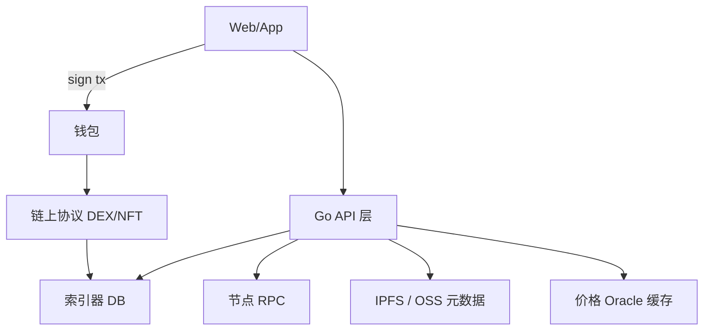

# DeFi / NFT 后端架构模式

## 30 秒版（开场）

> Web3 后端 = **链上结算 + 链下体验**：索引器、报价 API、元数据、风控。DeFi 重 **Oracle/滑点/MEV**；NFT 重 **元数据/IPFS/版税**。Go 常做 **聚合 API、任务队列、对账**。生产关键词：**链上链下一致性、价格延迟、合规 KYT**。

## 3 分钟版（一面深度）

1. **是什么**：用户通过前端签 tx；后端提供数据、缓存、业务规则，不替代链上清算。
2. **为什么**：架构师/Web3 后端面问「swap 报价怎么来」「NFT 图片存哪」。
3. **怎么做**：读路径走可回溯索引 + 指定 block 的 RPC；写路径由用户签名或受控平台钱包。报价与风控可组合多源数据，但链上结算最终以合约实际读取的 oracle/pool 状态为准。

## 10 分钟版（原理 + 图示）

```mermaid
flowchart TB
  FE[Web/App] -->|sign tx| Wallet[钱包]
  FE --> API[Go API 层]
  API --> Idx[索引器 DB]
  API --> RPC[节点 RPC]
  API --> IPFS[IPFS / OSS 元数据]
  API --> Oracle[价格 Oracle 缓存]
  Wallet --> Chain[链上协议 DEX/NFT]
  Chain --> Idx
```

**DeFi 后端组件**

| 组件 | 职责 |
|------|------|
| 报价服务 | 读 pool reserve / aggregator API |
| 交易构建 | 组装 router calldata，用户签 |
| 风控 | 滑点上限、黑名单、KYT |
| 对账 | 链上 swap event vs 订单 |

**NFT 后端组件**

| 组件 | 职责 |
|------|------|
| Metadata API | tokenURI 解析 JSON |
| 媒体 | IPFS CID + CDN 缓存 |
| 版税 | EIP-2981 仅表达 royalty 信息，是否执行取决于市场/协议 |
| 铸造队列 | 平台代 mint + Gas 管理 |

**Oracle 注意**

- Chainlink 等链上 feed 必须绑定明确的网络、feed 地址、资产对和版本，并校验 `answer`、`decimals`、`updatedAt` 及业务允许的范围。staleness 阈值要依据该 feed 公布的 heartbeat/deviation 与业务风险制定，不存在所有 feed 通用的秒数
- 在使用受支持 L2 的 feed 时，还要检查对应 sequencer uptime feed，并在 sequencer 恢复后执行 grace period；链下缓存不能把过期或停机期间的值重新包装成“新价格”
- 报价 API 还应带 quote block、expiry、slippage assumptions，并在发送前重新模拟

**跨链桥（简述）**

- 信任模型：官方桥 / 轻客户端 / 多签 — 说明 **额外信任假设**
- 后端记录 bridge tx 状态机，非即时 finality

## 生产场景

- **DEX 聚合器**：Go 调 1inch/0x API + 自建 pool 模拟
- **Launchpad**：白名单 Merkle proof 链下生成，用户 mint tx 上链
- **GameFi**：链下游戏态 + 周期性链上结算

## 排查与工具

- DeBank/Etherscan 对账
- Slither/Mythril 合约审计（后端懂结论即可）
- 合规：TRM/Chainalysis 地址风险 API

## 架构取舍

| 全链上游戏 | 链下状态 |
|------------|----------|
| 透明 | 体验好 |
| 贵 | 需信任运营方 |

与 [S-SOL-07 安全](../11-solution-architecture/S-SOL-07-security-audit-architecture.md)、[S-SOL-05 多租户](../11-solution-architecture/S-SOL-05-multi-tenant-saas.md) 在 SaaS 钱包场景交叉。

## 深挖问答

1. **MEV 是什么？** → 排序提取价值；后端可提示 slippage、私有 RPC。
2. **NFT 元数据中心化？** → IPFS 仍可能 gateway 挂；hash 上链锚定。
3. **和 CeFi 交易所区别？** → 托管 vs 非托管；本模块偏链上数据服务。
4. **L2 架构？** → 序列器、L1 结算、不同 finality；索引器需区分 chainId。

## 反模式与事故

- **后端替用户 unlimited approve**
- **Oracle 单源无 staleness 检查** → 错误清算
- 把 IPFS/CDN 当成天然不可变 → CID 内容寻址，但 tokenURI/baseURI、网关和合约本身仍可能升级；展示端要记录解析来源与版本

## 代码示例

报价 API 可返回 `{chainId, to, data, value, quoteBlock, expiresAt, gasEstimate}` 供钱包复核和签名；前端仍应校验目标地址、chain、模拟结果和最小输出，gas estimate 不是上限保证。

## 延伸阅读

- [DeFi 概述](https://ethereum.org/en/defi/)
- [NFT 概述](https://ethereum.org/en/nft/)
- [Chainlink](https://chain.link/)
- [14 DEX/CEX：聚合与 MEV](../14-dex-cex-engineering/S-EXCH-07-aggregator-slippage.md)
