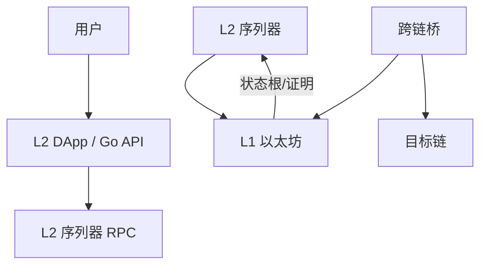

# L2 扩容与跨链桥架构

## 30 秒版（开场）

> **L2** 在以太坊外批量执行，把 **状态根/证明** 提交 L1 结算；分 **Optimistic Rollup**（欺诈证明）与 **ZK Rollup**（有效性证明）。**跨链桥** 是额外信任层，不是「官方 ETH 转账」。Go 后端关键词：**chainId、finality 差异、桥事件索引、L1↔L2 消息延迟**。

## 3 分钟版（一面深度）

1. **是什么**：L2 降低 Gas、提高 TPS；桥在链间锁定/铸造映射资产。
2. **为什么**：架构师/Web3 后端必须区分 **同一合约 L1/L2 地址不同、确认时间不同、RPC 不同**。
3. **怎么做**：每链独立索引器 cursor；桥充值/提现走 **状态机 + 足够 L1 确认**；UI 显示链名防钓鱼。

## 10 分钟版（原理 + 图示）



**Rollup 对比**

| 类型 | 代表 | 证明 | 提现延迟 |
|------|------|------|----------|
| Optimistic | Arbitrum, OP Mainnet | 欺诈证明挑战期 | 7 天级（标准桥） |
| ZK | zkSync, Starknet | 有效性证明 | 分钟～小时 |

**跨链桥信任模型（面试必分层）**

| 类型 | 信任假设 |
|------|----------|
| 官方/L2 标准桥 | L2 安全 + 合约正确 |
| 第三方流动性桥 | 多签/Oracle/外部验证者 |
| 轻客户端桥 | 链头验证（理想，复杂） |

**Go 后端注意**

- 环境变量：`ETH_L1_RPC`、`ARB_RPC`、`OP_RPC`，**禁止混用 chainId**
- 索引 [S-BC-05](./S-BC-05-indexer-reorg.md)：L2 也有 reorg（虽少于 L1）
- 充值检测：监听 L1 `DepositInitiated` + L2 侧 mint 事件，**两步对账**

## 生产场景

- **CEX 充提**：只认官方桥 + N 确认；第三方桥风险自担
- **多链 DApp**：`chainId` → RPC 路由表；余额 API 带 `chain` 字段
- **Fast bridge**：流动性提供商即时到账 vs 标准桥慢路径

## 排查与工具

- [L2BEAT](https://l2beat.com/) 看安全假设
- 区块浏览器分链：Arbiscan、Optimistic Etherscan
- 指标：各链 `indexer_lag`、桥队列深度

## 架构取舍

| 全 L2 | L1 锚定 |
|-------|---------|
| 便宜 | 最安全结算 |

**何时仍走 L1**：大额结算、合约升级、治理。

## 追问链

1. **L2 Gas 谁付？** → L2 原生 Gas（ETH 或 L2 token）；4337 Paymaster 可代付（[S-BC-08](./S-BC-08-erc4337-account-abstraction.md)）。
2. **序列器宕机？** → 强制 inclusion 队列（依协议）；后端降级只读。
3. **同地址跨链？** → CREATE2 可一致；默认部署地址不同。
4. **和 [S-BC-06 DeFi](./S-BC-06-defi-backend-patterns.md)？** → 跨链流动性是 DeFi 核心风险点。

## 反模式与事故

- **把 L2 当 L1 finality** → 桥攻击/重组损失
- **前端硬编码桥地址** → 钓鱼仿站
- **单 RPC 无链标识** → 签错 chainId 交易

## 代码示例

```go
type ChainConfig struct {
    ChainID int64
    RPC     string
    FinalityBlocks int
}
```

## 延伸阅读

- [Ethereum Scaling](https://ethereum.org/en/developers/docs/scaling/)
- [Blockchain Bridges](https://ethereum.org/en/developers/docs/bridges/)
