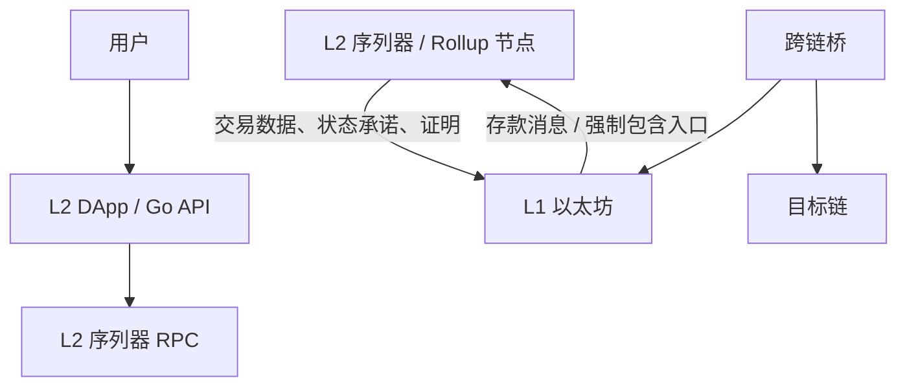

# L2 扩容与跨链桥架构

## 30 秒版（开场）

> Rollup 在 L2 执行并把数据/承诺提交到 L1；Optimistic 依赖挑战/fault proof 机制，
> ZK rollup 提交有效性证明。不同系统的数据可用性、升级密钥、sequencer、证明和退出
> 流程差异很大。**交易 finalized 不自动等于提现已经可领取**。桥是额外协议与信任面，
> 后端不能只用固定确认块数抽象所有链。

## 3 分钟版（一面深度）

1. **是什么**：L2 降低费用并提高吞吐；桥按协议可能采用 lock/release、burn/mint、流动性/solver 或消息传递，不应把所有桥都描述成“锁定后铸造映射资产”。
2. **为什么**：架构师/Web3 后端必须区分 **同一合约 L1/L2 地址不同、确认时间不同、RPC 不同**。
3. **怎么做**：每链独立索引器 cursor；桥状态机分别记录源链 canonical/finality、消息证明或挑战/验证、目标链执行与目标 finality。是否等待 L1 以及等待到哪一阶段由具体 rollup/桥协议决定；UI 显示链名、资产和桥合约防钓鱼。

## 10 分钟版（原理 + 图示）


```mermaid
flowchart TB
  User[用户] --> L2App[L2 DApp / Go API]
  L2App --> L2RPC[L2 序列器 RPC]
  L2Seq[L2 序列器 / Rollup 节点] -->|交易数据、状态承诺、证明| L1[L1 以太坊]
  L1 -->|存款消息 / 强制包含入口| L2Seq
  Bridge[跨链桥] --> L1
  Bridge --> L2Other[目标链]
```

**Rollup 对比**

| 类型 | 代表 | 证明 | 提现延迟 |
|------|------|------|----------|
| Optimistic | Arbitrum, OP Mainnet | 挑战期/欺诈证明 | 标准 L2→L1 退出受具体协议挑战期约束 |
| ZK | zkSync, Starknet | 有效性证明 | 受 proof 生成、batch 提交、L1 finality 与桥流程约束 |

**跨链桥信任模型（面试必分层）**

| 类型 | 信任假设 |
|------|----------|
| L2 标准桥 | Rollup 合约、证明/挑战系统、数据可用性、升级治理与 L1 安全 |
| 第三方流动性/意图桥 | solver/LP 可用性与流动性、结算合约；有些方案还依赖多签、oracle 或外部验证者，必须逐协议拆解 |
| 轻客户端桥 | 验证对端共识/状态证明；实现与运维复杂，仍需审查升级和漏洞风险 |

**Go 后端注意**

- 环境变量：`ETH_L1_RPC`、`ARB_RPC`、`OP_RPC`，**禁止混用 chainId**
- 索引 [S-BC-05](./S-BC-05-indexer-reorg.md)：区分 sequencer soft confirmation、L1 inclusion、safe/finalized 和 rollup protocol finality；L2 也会发生重组/批次重提
- 对 lock/mint 型桥，充值检测可把源链 deposit 事件与目标链 mint/执行事件 **两步对账**；其他桥应按其 message ID、证明和结算语义建模，不能硬编码事件名

## 生产场景

- **CEX 充提**：每条网络单独配置充值合约/地址、暂停条件与 finality policy；“标准桥”也要评估升级权限和安全状态，不能仅凭官方标签
- **多链 DApp**：`chainId` → RPC 路由表；余额 API 带 `chain` 字段
- **Fast bridge**：流动性提供商即时到账 vs 标准桥慢路径

## 排查与工具

- [L2BEAT](https://l2beat.com/) 看安全假设
- 区块浏览器分链：Arbiscan、Optimistic Etherscan
- 指标：各链 `indexer_lag`、safe-head/batch/proof lag、桥队列深度

## 架构取舍

| 优先在 L2 执行 | 等待 L1 锚定/结算阶段 |
|----------------|----------------------|
| 成本与延迟更低，但要接受 sequencer、DA、证明与升级风险 | 可继承更强的基础层共识保证，但桥合约、证明系统和治理风险仍然存在，不能简称为“绝对安全” |

**何时仍走 L1**：大额结算、合约升级、治理。

## 追问链

1. **L2 Gas 谁付？** → 通常包含 L2 execution fee 与 L1 data/proof 相关费用，支付资产和公式按链而异；4337 Paymaster 可在支持的链上赞助。
2. **序列器宕机？** → 部分 rollup 提供经 L1 的强制 inclusion/escape hatch，但延迟、可用性和操作流程各异；后端应暂停依赖即时排序的写操作并展示状态。
3. **同地址跨链？** → CREATE2 地址同时取决于部署者/工厂地址、salt 和 init-code hash；只有这些输入及链上部署条件一致时才可能得到同一地址，salt 相同本身不够。
4. **和 [S-BC-06 DeFi](./S-BC-06-defi-backend-patterns.md)？** → 跨链流动性是 DeFi 核心风险点。
5. **交易 finalized 就能提现？** → 不一定；还可能需要 withdrawal proof、挑战期和目标合约 claim。

## 反模式与事故

- **把 L2 当 L1 finality** → 桥攻击/重组损失
- **前端硬编码桥地址** → 钓鱼仿站
- **单 RPC 无链标识** → 签错 chainId 交易
- **只用 tx hash 标识跨链消息** → 一笔交易多事件时错误去重或错误 mint

## 代码示例

```go
type ChainConfig struct {
    ChainID      *big.Int
    RPC          string
    SafeTag      string
    FinalizedTag string
    BridgePolicy BridgeFinalityPolicy
}
```

## 延伸阅读

- [Ethereum Scaling](https://ethereum.org/developers/docs/scaling/)
- [Blockchain Bridges](https://ethereum.org/developers/docs/bridges)
- [S-BC-11 Rollup Finality、DA 与证明安全](./S-BC-11-rollup-finality-da-proof-security.md)
- [S-BC-12 跨链消息与桥安全](./S-BC-12-cross-chain-message-bridge-security.md)
