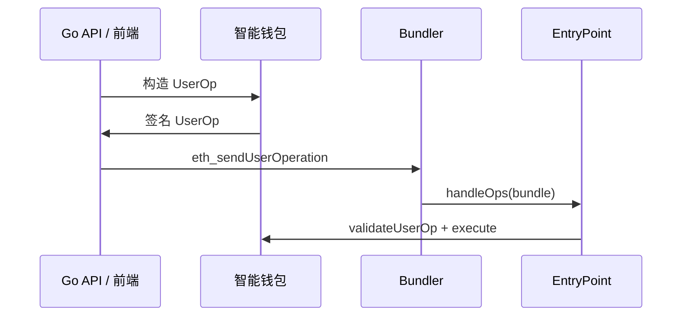

# Account Abstraction ERC-4337 与 Go 后端

## 30 秒版（开场）

> **ERC-4337** 在不改共识的前提下实现 **智能合约钱包**：用户提交 **UserOperation**，**Bundler** 打包上链，**Paymaster** 可代付 Gas，**EntryPoint** 统一入口。Go 后端关键词：**UserOp 构造、Bundler RPC、会话密钥、Gas 赞助策略**。

## 3 分钟版（一面深度）

1. **是什么**：AA = 账户逻辑在合约里；可批量交易、社交恢复、无 EOA 私钥单次签名模式。
2. **为什么**：Web3 用户体验（Gasless、一键登录）是后端+Bundler 协作；钱包类 JD  increasingly 考 4337。
3. **怎么做**：后端不替用户持主私钥；构建 UserOp → 用户/Session 签 → 调 Bundler `eth_sendUserOperation` → 监听 `UserOperationEvent`。

## 10 分钟版（原理 + 图示）



**核心组件**

| 组件 | 职责 |
|------|------|
| Smart Account | 验证签名、执行 callData |
| EntryPoint | 单例合约，验证+执行+计费 |
| Bundler | 收集 UserOp、模拟、提交 tx |
| Paymaster | 赞助 Gas，可设 allowlist/规则 |
| Aggregator | 可选，聚合签名验证 |

**UserOperation 关键字段（简）**

| 字段 | 含义 |
|------|------|
| sender | 智能钱包地址 |
| callData | 要执行的操作 |
| callGasLimit / verificationGasLimit | Gas 上限 |
| maxFeePerGas | EIP-1559 |
| paymasterAndData | 赞助数据 |
| signature | 对 UserOpHash 的签名 |

**与 EOA 交易区别**

| EOA tx | UserOp |
|--------|--------|
| 直接 `sendRawTransaction` | 经 Bundler 打包 |
| nonce 在协议层 | nonce 在 EntryPoint 账户内 |
| 固定 ECDSA | 可插件验证（Session key） |

## 生产场景

- **Gasless mint**：Paymaster 赞助，后端校验白名单 Merkle proof
- **Session key**：游戏内小额度操作，主密钥离线
- **批量操作**：一次 UserOp 多 call（approve+swap）

## 排查与工具

- Bundler：`eth_estimateUserOperationGas`、`debug_bundler_dumpMempool`
- Stackup / Alchemy / Pimlico 等 Bundler SaaS
- 失败：`AA21`、`AA23` 等 EntryPoint 错误码

## 架构取舍

| 自建 Bundler | SaaS Bundler |
|--------------|--------------|
| 可控 | 快 |
| 运维+质押 | 依赖第三方 |

**何时不用 4337**：纯 C 端 EOA 足够、Gas 不敏感、链不支持 EntryPoint 部署。

## 追问链

1. **Paymaster 如何防滥用？** → 后端签 `paymasterAndData` 含 expiry、limit、appId。
2. **和 [S-BC-03 签名](./S-BC-03-tx-signing-key-mgmt.md)？** → UserOpHash 签名域不同；仍要防泄漏 session key。
3. **L2 上 4337？** → 同框架，Bundler 跑在 L2（[S-BC-07](./S-BC-07-l2-cross-chain-bridge.md)）。
4. **Go 如何集成？** → HTTP 调 Bundler JSON-RPC；或用 go 社区 bundler client（生产以官方 spec 为准）。

## 反模式与事故

- **Paymaster 无额度上限** → 被刷 Gas
- **不模拟 UserOp** → 上链失败浪费 bundle 位
- **Session key 权限过大** → 等同热私钥

## 代码示例

```go
// 伪代码：提交 UserOp 到 Bundler
req := map[string]any{
    "jsonrpc": "2.0",
    "method":  "eth_sendUserOperation",
    "params":  []any{userOp, entryPointAddr},
    "id":      1,
}
```

## 延伸阅读

- [EIP-4337](https://eips.ethereum.org/EIPS/eip-4337)
- [erc4337.io](https://www.erc4337.io/)
