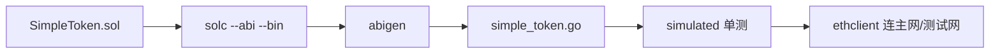

# go-ethereum abigen 完整合约调用实战

## 30 秒版（开场）

> 生产路径：**Solidity → solc 出 ABI/BIN → abigen 生成 Go → Deploy/Call/FilterLogs**。单测用 **simulated.Backend** 不上测试网。与 [S-BC-04 ABI 理论](./S-BC-04-contract-abi-events.md) 配套，本题是 **可运行闭环**。

## 3 分钟版（一面深度）

1. **是什么**：`abigen` 根据 ABI 生成类型安全的 `SimpleToken` Go 结构体，封装 `transfer`、`FilterTransfer` 等。
2. **为什么**：手写 RLP/ABI 易错；面试说「我们 abigen + simulated 单测覆盖」体现工程化。
3. **怎么做**：见本仓库 `examples/senior/erc20bind/`。

## 10 分钟版（流程 + 代码）



**生成命令（本仓库）**

```bash
cd examples/senior/erc20bind/contract
solc --evm-version paris --overwrite --abi --bin -o build SimpleToken.sol
abigen --abi build/SimpleToken.abi --bin build/SimpleToken.bin \
  --pkg erc20bind --type SimpleToken --out ../simple_token.go
```

> 使用 `--evm-version paris` 避免 `PUSH0` 与当前 geth simulated 不兼容。

**部署与转账（测试核心逻辑）**

```go
auth, _ := bind.NewKeyedTransactorWithChainID(key, big.NewInt(1337))
backend := simulated.NewBackend(types.GenesisAlloc{
    auth.From: {Balance: big.NewInt(1e18)},
})
defer backend.Close()

client := backend.Client()
_, _, token, err := erc20bind.DeploySimpleToken(auth, client, big.NewInt(1_000_000))
backend.Commit()

_, err = token.Transfer(auth, recipient, big.NewInt(100))
backend.Commit()

bal, _ := token.BalanceOf(&bind.CallOpts{}, recipient)
```

**监听事件**

```go
iter, _ := token.FilterTransfer(&bind.FilterOpts{},
    []common.Address{from}, []common.Address{to})
for iter.Next() {
    ev := iter.Event
    _ = ev.Value
}
```

**接真实 RPC**

```go
client, _ := ethclient.Dial(os.Getenv("SEPOLIA_RPC"))
token, _ := erc20bind.NewSimpleToken(tokenAddr, client)
bal, _ := token.BalanceOf(&bind.CallOpts{Context: ctx}, userAddr)
```

## 生产场景

- CI：`go test ./examples/senior/erc20bind/...` 无外部依赖
- 升级合约：重新 abigen，**版本化** package 或文件名 `token_v2.go`
- 只读调用：`CallOpts` + `context` 超时

## 排查与工具

- `bind.WaitMined` 等待上链
- `receipt.Status == 0` → revert，用 `eth_call` 预模拟
- abigen 失败：检查 ABI JSON 是否合法数组

## 架构取舍

| abigen | 手写 ABI pack |
|--------|----------------|
| 类型安全 | 灵活 |
| 合约变更需 regen | 适合一次性脚本 |

## 追问链

1. **如何测主网 fork？** → anvil/hardhat fork + go ethclient 指本地。
2. **MetaData.Bin 用途？** → `DeploySimpleToken` 链上创建合约。
3. **与 [S-BC-02 ethrpc](./S-BC-02-go-ethereum-rpc.md)？** → ethrpc 教 JSON-RPC；abigen 教合约层。
4. **WatchTransfer vs Filter？** → Watch 订阅；Filter 历史块范围。

## 反模式与事故

- **手改 simple_token.go** → 下次 abigen 覆盖；改 .sol 再生成
- **simulated 用默认 solc 0.8.20+ 无 paris** → PUSH0 报错
- **Deploy 不 Commit** → 后续 call 读空状态

## 代码示例

完整示例与测试：

```bash
go test ./examples/senior/erc20bind/...
```

见 [examples/senior/erc20bind](https://github.com/twodog-tt/Golang-development-manual/tree/master/examples/senior/erc20bind)。

## 延伸阅读

- [abigen 文档](https://geth.ethereum.org/docs/tools/abigen)
- [bind package](https://pkg.go.dev/github.com/ethereum/go-ethereum/accounts/abi/bind)
