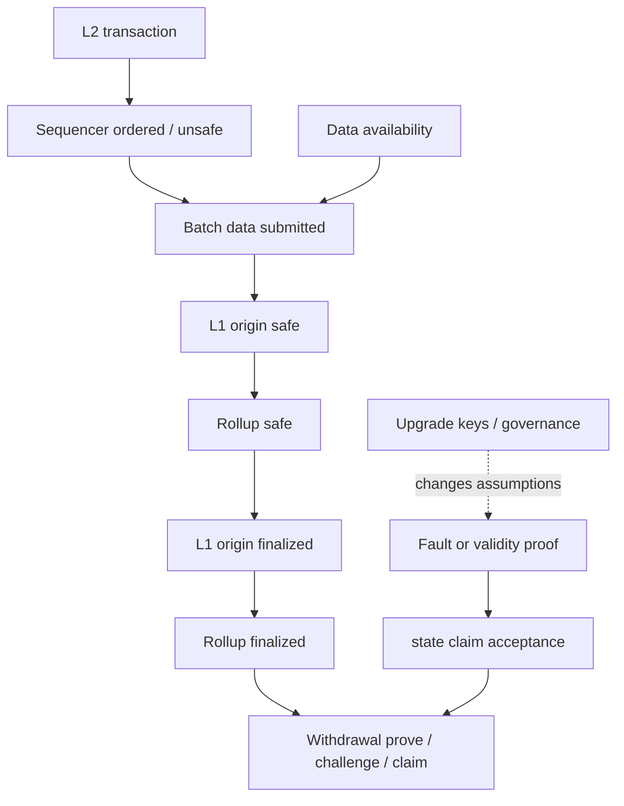

# Rollup 安全边界：Finality、数据可用性、证明与强制退出

## 30 秒版（开场）

> Rollup 不能只分“Optimistic 或 ZK”。我会逐层确认 **排序/执行、数据可用性、L1
> 发布、状态承诺、证明、升级权限和退出路径**。`unsafe/safe/finalized` 是协议定义的不同水位，
> L2 交易 finalized 也不自动等于提现已经可领取。外部 DA、中心化 sequencer、proof
> 延迟、升级委员会和逃生舱都会改变真实安全边界，所以后端必须按具体网络做状态机，
> 不能统一成固定 N 个 L2 块。

## 3 分钟版（一面深度）

1. **执行/排序**：sequencer 接收并排序交易；快速回执通常只是较弱水位。
2. **数据可用性**：重建 L2 状态所需数据发布在哪里，谁能取到，发生 withholding 如何退出。
3. **结算/承诺**：batch 和 state root 何时进入 L1，依赖哪个 L1 block。
4. **证明**：Optimistic 依赖挑战与 fault proof；ZK 依赖 validity proof，但都仍有实现和升级风险。
5. **可用性**：sequencer 宕机时是否有 L1 forced inclusion，普通用户能否实际使用。
6. **治理**：合约升级、proof system、sequencer key 和安全委员会能否改变资产安全。

## 10 分钟版（原理 + 图示）



### 不要混淆四种“完成”

| 水位 | 可以表达什么 | 不能自动推出什么 |
|------|--------------|------------------|
| Sequencer accepted / unsafe | 已被当前 sequencer 排序 | 不会因重组或重发消失 |
| Safe | 数据/批次已锚定到协议定义的 L1 水位 | 已达到 L1 finalized |
| Finalized | 依赖的 L1 origin 已最终确定等协议条件满足 | L2→L1 提现已可 claim |
| Withdrawal ready | 证明、挑战期、目标链执行条件完成 | 应用账本已完成对账 |

以 OP Stack 为例，官方明确区分 unsafe、safe、finalized；safe head 仍可能因 L1 reorg
降级。还要特别避免把 OP 的 fault-proof challenge period 与 L2 block finality 混为一谈：
fault proof 约束用于 L1 提款的 state/output claim，不决定 OP L2 `finalized` head。其他
rollup 名称和条件可能不同，不能照抄标签。

### Optimistic 与 ZK 的正确比较

| 维度 | Optimistic | ZK / validity |
|------|------------|---------------|
| 状态正确性 | 默认接受，争议时执行 fault proof | 验证 validity proof |
| 主要延迟 | batch、挑战/证明和 L1 finality | proof 生成、提交、验证和 L1 finality |
| 仍需审计 | challenger 可用性、游戏实现、升级与 DA | prover、circuit/VM、升级与 DA |

“有 ZK proof”不代表 sequencer 永不宕机，也不代表数据一定可用；“有 fault proof”也不
代表任何用户都能在所有故障下无摩擦退出。

### Rollup 与 Validium/外部 DA

如果交易数据不按该 rollup 的 L1 DA 模式发布，安全性就不再只继承 L1 共识。应明确
DA provider、委员会或其他层的 withholding 风险与恢复路径，不要仍笼统称为“和
Ethereum 一样安全”。

### 后端状态模型

建议至少保存：

```text
tx_hash, l2_block, l1_origin, batch_ref,
unsafe_at, safe_at, finalized_at,
withdrawal_proven_at, withdrawal_claimable_at,
protocol_version, evidence
```

水位只能向前推进的假设并不总成立；在 finalized 前应允许因 L1/L2 reorg 回退，并让
账本 credit policy 与展示 policy 分离。

## 生产场景

- 充值小额可在 safe 后展示 pending credit，大额结算等待 finalized/额外风险策略。
- L2→L1 提现由独立状态机跟踪 prove、challenge、finalize/claim，而不是复用普通交易确认。
- 监控 sequencer outage、safe-head lag、batch submission lag、proof lag、L1 origin reorg。
- 升级窗口提高确认阈值或暂停高风险路由，并保存升级前后的协议版本。

## 排查与工具

从交易所在 L2 block 开始，依次查询 sequencer 状态、batch/L1 origin、L1 safe/finalized、
proof/challenge 和桥合约状态。不要只看一个浏览器显示的绿色 “Success”。

## 架构取舍

更早入账改善体验但承担 sequencer/L1 reorg 风险；等待完整 finalized/withdrawal ready
降低风险但增加资金占用。应按资产、金额、网络健康和交易方向制定 policy，不应硬编码
一个全链通用确认数。

## 深挖问答

1. **L2 finalized 后为何还不能提现？** → 提现还有消息证明、挑战期和目标合约 claim 流程。
2. **Sequencer 宕机会丢资产吗？** → 安全与可用性要分开；可能不能及时排序，强制包含能力按协议而异。
3. **ZK rollup 是否没有信任假设？** → 仍有 DA、实现、prover 可用性、升级和治理边界。
4. **外部 DA 还是 rollup 吗？** → 名称依项目而异；安全分析必须明确数据不在 L1 时新增的假设。
5. **safe 能回退吗？** → 取决于协议；例如 OP 文档说明 L1 reorg 可影响 safe head。

## 反模式与事故

- 把 sequencer RPC 返回成功当作最终结算。
- 把 L2 finalized 和 bridge withdrawal ready 合成一个布尔值。
- 说“OP Stack 要等 fault-proof 挑战期结束，L2 block 才 finalized”。
- 只写“Optimistic 7 天、ZK 立即到账”，忽略具体协议和批次/证明/L1 延迟。
- 宣称外部 DA 方案无条件继承 L1 数据可用性安全。
- 忽略 upgrade keys 和 emergency council，只比较证明类型。

## 代码示例

```go
type RollupObservation struct {
    TxHash          string
    L2Block         uint64
    L1Origin        uint64
    ProtocolStatus  string // 保留原始 unsafe/safe/finalized
    WithdrawalState string // proven/challenge/claimable/claimed
    ProtocolVersion string
}
```

领域层可归一水位，但必须同时保留协议原始状态和证据，避免 adapter 错误映射后无法审计。

## 延伸阅读

- [OP Stack transaction finality](https://docs.optimism.io/op-stack/transactions/transaction-finality)
- [OP Stack outages](https://docs.optimism.io/op-stack/protocol/outages)
- [OP fault proofs](https://docs.optimism.io/op-stack/fault-proofs/explainer)
- [Arbitrum Nitro whitepaper](https://docs.arbitrum.io/nitro-whitepaper.pdf)
- [S-BC-07 L2 扩容与跨链桥架构](./S-BC-07-l2-cross-chain-bridge.md)
