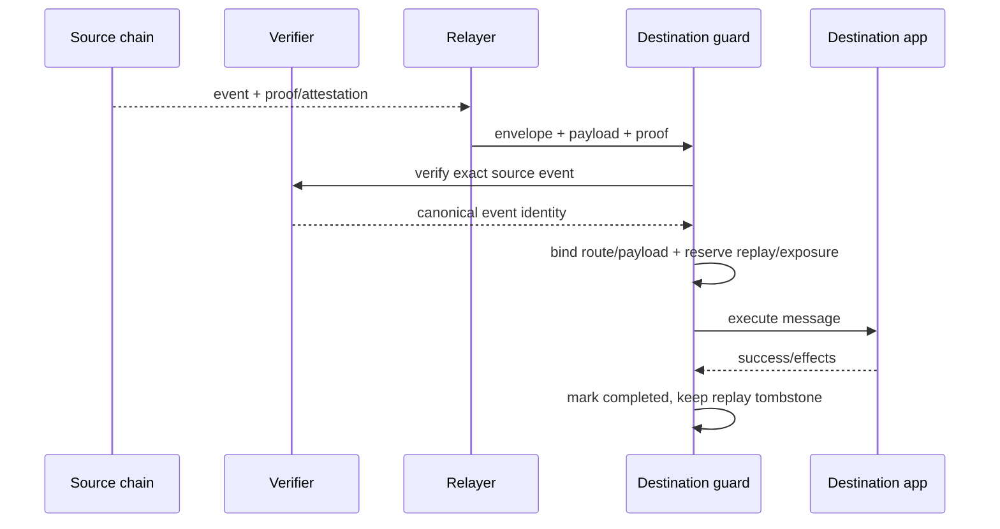

# 跨链消息与桥安全：认证、重放、限额与故障恢复

## 30 秒版（开场）

> 跨链桥不是“监听源链 tx hash 后在目标链 mint”。必须验证 **准确的源事件或状态证明**，
> 并把 source/destination domain、emitter、destination app、nonce、asset、recipient、
> amount、payload hash 和版本绑定进消息。若验证、replay consume 与业务执行都在同一个
> 目标链事务中，应依赖其原子回滚；若跨越链下协调器和外部交易，则要先持久化 reservation，
> 在结果未知时保留 pending，而不是删除 replay 记录。Relayer 只影响传递可用性，不应获得
> 伪造消息的权限；源链完成、证明可用、目标执行成功是三个独立状态。

## 3 分钟版（一面深度）

1. **验证模型**：原生 rollup bridge、轻客户端/共识证明、外部验证者/attestation 的信任假设不同。
2. **事件身份**：仅用 tx hash 不够，一笔交易可发多个事件；至少要 canonical event ID 或协议 nonce。
3. **域分离**：签名/证明必须绑定源域、目标域、发送者、接收应用和 payload，防跨链/跨应用重放。
4. **原子 replay protection**：验证后在目标侧先占用唯一消息 ID；失败重试要查询协议消费状态。
5. **损失控制**：每消息、每路由、时间窗口和总 pending exposure 限额，异常时可 pause。

可运行的应用层 guard 位于 `examples/senior/bridgeguard/`：

```bash
go test -race ./examples/senior/bridgeguard/...
```

## 10 分钟版（原理 + 图示）



### 三类验证模型

| 模型 | 目标链验证什么 | 主要风险 |
|------|----------------|----------|
| 原生 rollup bridge | L1/L2 协议消息与证明 | rollup、升级和退出机制 |
| 轻客户端桥 | 对端共识 header/validator 与状态证明 | 客户端实现、共识变化、成本 |
| 外部 attestation/quorum | 验证者签名或服务 attestation | key/quorum、治理、观察延迟 |

不要把 “relayer 去中心化” 当成证明安全；关键是目标合约拒绝伪造消息所依赖的验证规则。

### 消息必须绑定的字段

```text
version
source domain + source emitter
destination domain + destination app
canonical source event / protocol nonce
asset + recipient + amount
payload hash
```

内部 message ID 要采用无歧义编码（如 ABI/BCS/Protobuf 或长度前缀），不能直接拼字符串。
协议自己的 message digest 仍是权威依据；内部 ID 只是应用幂等键。

### 状态机不是一个 success

```text
SOURCE_OBSERVED
  -> SOURCE_FINAL
  -> PROOF_OR_ATTESTATION_READY
  -> DESTINATION_RESERVED
  -> DESTINATION_SUBMITTED
  -> DESTINATION_EXECUTED | DESTINATION_FAILED_RETRYABLE
```

目标交易提交超时后，先查 protocol nonce/message digest 是否已消费，以及目标效果是否出现。
不能因为 RPC timeout 就生成一个不同 payload 再 mint。

要区分两种原子性：

- **同一目标链调用**：合约在一个交易里验证、消费 nonce 并执行；若整个交易 revert，消费位
  通常也回滚，应按协议用同一消息重试；
- **链下 reservation + 链上提交**：两者无法形成普通数据库事务。链下状态要保留
  `RESERVED/SUBMITTED`，通过目标链事实完成或释放，不能把 RPC timeout 当成未执行。

### 限额与暂停

证明验证正确仍可能遇到上游协议漏洞、错误配置或升级风险。应用层应有：

- route allowlist 与代码/合约版本；
- 单笔、滚动窗口和总 pending exposure；
- 资产与 recipient policy；
- 可审计 pause 和恢复流程；
- 多 provider/observer 差异告警。

## 生产场景

- CEX 跨链充值：credit policy 同时考虑源链 finality、桥验证完成和目标资产可用性。
- 稳定币原生跨链：按协议 nonce/message 状态重试；不把 burn tx success 当成 mint success。
- 升级或验证者轮换：冻结新路由，验证新 domain/emitter/attester 配置后灰度恢复。
- 大额消息：分层审批并限制同一路由未完成敞口，避免单次故障耗尽热钱包。

## 排查与工具

从源事件的 block/hash/log index 或协议 event ID 开始，核对 finality、消息编码、proof/
attestation、目标合约消费位、目标 tx receipt/effects 和应用账本。每一层保存原始证据，
不要只保留聚合后的 `bridge_status=success`。

## 架构取舍

轻客户端可减少外部签名信任，但实现、升级和 gas 成本高；外部 attestation 更易跨异构链，
却增加 key/quorum 风险；流动性桥改善到账速度但引入 LP 与再平衡风险。应按金额和路由
组合，而不是寻找一个“万能最安全桥”。

## 追问链

1. **tx hash 能否作为 replay key？** → 不够；一笔 tx 可有多个消息，且协议可能跨链映射不同 ID。
2. **Relayer 作恶能否偷钱？** → 正确设计下只能延迟/审查；若能伪造，说明验证边界给了它过大权限。
3. **目标执行失败能否重试？** → 先按协议查询 nonce/message 是否消费；重试必须保持协议允许的幂等语义。
4. **为什么 proof 正确还要限额？** → 防未知漏洞、配置错误、升级风险和运营误操作扩大损失。
5. **源链 reorg 怎么办？** → 未达到策略 finality 不进入不可逆 credit；已发生风险事件走暂停与冲正。

## 反模式与事故

- 只检查 `sourceTxHash`，不绑定 log/event 与目标域。
- 签名只覆盖 payload，不覆盖 source/destination domain 和接收应用。
- replay record 在失败后删除，允许同消息再次执行。
- 把目标合约交易 revert 和“nonce 已永久消费”画等号，不查询协议实际消费状态。
- 把跨链总敞口藏在各 worker 内存中，无法原子限额。
- 把教学 `Verifier` mock 宣称为已经实现轻客户端或 attestation 密码学验证。

## 代码示例

```go
reservation, err := guard.Reserve(ctx, envelope, payload, proof)
if err != nil {
    return err
}
if err := executeDestination(reservation.MessageID); err != nil {
    return err // 保留 reservation，恢复流程查询目标事实
}
return guard.Complete(reservation.MessageID)
```

`examples/senior/bridgeguard/` 只实现 **证明验证后的应用层防线**：它要求 verifier 返回
已认证的 canonical event identity 和完整 message digest，再做 route/payload 绑定、
replay reservation、单笔和 pending 限额。具体 light client、quorum signature 或 validity
proof 必须由协议 adapter 真正实现。

## 延伸阅读

- [Ethereum bridge security overview](https://ethereum.org/developers/docs/bridges)
- [Ethereum light clients](https://ethereum.org/developers/docs/nodes-and-clients/light-clients/)
- [Circle CCTP technical guide](https://developers.circle.com/cctp/references/technical-guide)
- [Circle attestation verification](https://developers.circle.com/cctp/references/attestation-verification)
- [S-BC-11 Rollup 安全边界](./S-BC-11-rollup-finality-da-proof-security.md)
