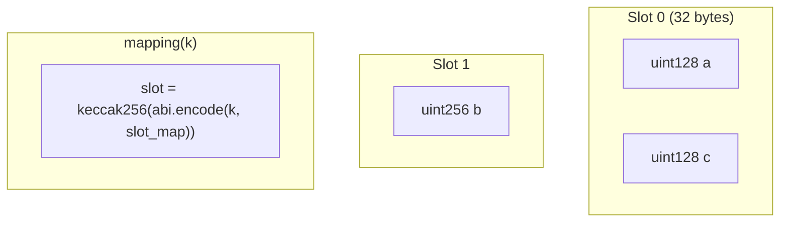

# Solidity 语言基础与 storage 布局

## 30 秒版（开场）

> Solidity 运行在 **EVM** 上：数据分 **storage**（持久、贵）、**memory**（临时）、**calldata**（只读入参）。架构师要懂 **storage 槽位、打包、继承线性化**，否则升级合约会 **存储冲突**。与 [S-BC-01 EVM 账户](../12-blockchain-web3/S-BC-01-blockchain-evm-basics.md) 衔接。

## 3 分钟版（一面深度）

1. **是什么**：静态类型、面向合约语言；0.8+ 默认溢出检查。
2. **为什么**：Gas 与安全问题多源于 **错误的数据位置** 和 **storage 布局变更**。
3. **怎么做**：按访问模式设计 storage layout；只读外部参数优先考虑
   `calldata`，但是否更省 Gas 要以编译器版本、参数类型和调用路径实测。

## 10 分钟版（原理 + 图示）

**数据位置**

| 位置 | 生命周期 | Gas | 典型用途 |
|------|----------|-----|----------|
| storage | 链上永久 | 高 | 余额、配置 |
| memory | 函数内 | 中 | 临时数组 |
| calldata | 本次调用携带、只读 | 通常避免 memory 拷贝，但 calldata 本身也有交易数据成本 | 外部函数入参 |

**storage 槽（slot）规则（面试高频）**

- 每个 slot 32 字节
- 相邻小类型可 **打包**（如 `uint128 + uint128` 占 1 slot）；但只更新其中
  一个字段时可能需要读-改-写，不能只按“槽更少”判断实际 Gas
- `mapping` 与动态数组各保留一个不能和相邻变量共享的基准槽；mapping 元素、动态数组数据分别从哈希计算的位置开始。数组/struct 的元素仍按类型规则紧密排列，小于 32 字节的数组元素可能共享一个 slot，不能概括成“不 packing”
- 继承：按 **C3 线性化中从最 base-ward 合约开始**排列状态变量；若打包规则允许，基类与派生类变量也可能共享同一 slot



```solidity
// 优化前：3 slots
uint128 a;
uint256 b;
uint128 c;

// 优化后：2 slots
uint128 a;
uint128 c;
uint256 b;
```

**可见性**

| 关键字 | 含义 |
|--------|------|
| public | 自动生成 getter |
| external | 仅外部调用，参数可用 calldata |
| internal | 合约+继承 |
| private | 仅限制 Solidity 代码访问；链上 storage 仍可被节点/API 读取，不是保密机制 |

## 生产场景

- 升级合约前 **冻结 storage layout**（见 [S-SOLID-04](./S-SOLID-04-upgradeable-proxy.md)）
- 大数组循环 → Gas 超限，改 mapping 或分页
- 与 Go 交互：public mapping 无 key 枚举，需 **事件索引**（[S-BC-05](../12-blockchain-web3/S-BC-05-indexer-reorg.md)）

## 架构取舍

| 链上存全量 | 链下存数据、链上存承诺/哈希 |
|------------|----------------------------|
| 贵；当前状态可清零，但历史链数据仍可能被读取 | 便宜，但要保证可用性，并明确哈希只能证明完整性而不能自动证明内容真实 |

## 追问链

1. **memory vs storage 引用？** → `storage` 局部引用会别名到状态变量，
   修改它会改链上状态；从 storage 赋给 memory 通常产生拷贝，不能把 memory
   引用当作持久引用返回。
2. **constant/immutable？** → 都不占普通 storage slot；`constant` 的值在编译期替换，
   `immutable` 在构造阶段赋值后嵌入 deployed bytecode。
3. **delete 语义？** → 把值恢复为类型零值；某些非零到零的 storage 变更可能产生
   refund，但退款规则与上限会随 EVM fork 变化，不能把 `delete` 当作稳定的返现手段。
   mapping 无法枚举，`delete` mapping 或删除包含 mapping 的复合对象不会遍历并清除
   历史键值；数组长度/可见状态被清零也不代表嵌套 mapping 数据被逐项擦除。
4. **Solidity 0.8+ 溢出？** → 自动 revert；仍用 SafeCast 显式转换。

## 反模式与事故

- **升级时插入新状态变量到中间** → 存储错位，资产逻辑崩溃
- **unbounded loop** → DoS
- **用无界数组维护全量用户并依赖 public getter 枚举** → getter 通常按下标返回元素，
  不会自动提供可扩展的全量分页；链上遍历还可能因 Gas 上限形成 DoS

## 代码示例

本仓库 [SimpleToken.sol](https://github.com/twodog-tt/Golang-development-manual/blob/master/examples/senior/erc20bind/contract/SimpleToken.sol)：`mapping` 存余额。

## 延伸阅读

- [Solidity Docs](https://docs.soliditylang.org/)
- [Layout in Storage](https://docs.soliditylang.org/en/latest/internals/layout_in_storage.html)
