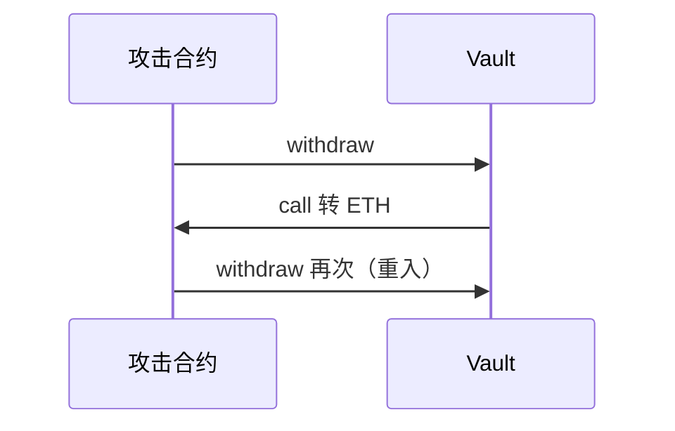

# 合约安全：重入、权限与 OWASP

## 30 秒版（开场）

> 智能合约 **不可篡改、资产即代码**；架构师必须掌握 **Checks-Effects-Interactions、ReentrancyGuard、最小权限**。经典：**The DAO 重入**。Go 层不能替代链上校验（[S-SOLID-08](./S-SOLID-08-contract-go-boundary.md)）。

## 3 分钟版（一面深度）

1. **是什么**：SWC 注册表列常见漏洞；Slither/Mythril 静态分析。
2. **为什么**：一次漏洞 = 全额损失；Review 是架构师核心职责。
3. **怎么做**：CEI 顺序；`nonReentrant`；OpenZeppelin `AccessControl`；Pull over Push 支付。

## 10 分钟版（原理 + 图示）



**Checks-Effects-Interactions（CEI）**

```solidity
function withdraw(uint256 amount) external nonReentrant {
    require(balances[msg.sender] >= amount); // Checks
    balances[msg.sender] -= amount;            // Effects
    (bool ok,) = msg.sender.call{value: amount}(""); // Interactions
    require(ok);
}
```

本仓库示例：[ReentrancyGuard.sol](https://github.com/twodog-tt/Golang-development-manual/blob/master/examples/solidity/ReentrancyGuard.sol)

**高频漏洞清单**

| SWC | 名称 | 缓解 |
|-----|------|------|
| SWC-107 | 重入 | CEI + 锁 |
| SWC-105 | 未保护函数 | onlyOwner / RBAC |
| SWC-101 | 整数溢出 | 0.8+ / SafeMath |
| SWC-104 | 未检查 call 返回值 | require(ok) |
| SWC-115 | 授权滥用 | 最小 approve |

**权限模型**

- `Ownable`：单管理员
- `AccessControl`：角色 `bytes32` + `onlyRole`
- **Timelock + Multisig** 管升级与参数

## 生产场景

- 外部 call：`transfer` vs `call`（ERC20 非标准返回值）
- 闪电贷攻击：单 tx 内价格操纵（见 [S-SOLID-07](./S-SOLID-07-defi-patterns.md)）
- 代理 admin 误留 implementation 函数

## 排查与工具

- Slither、Aderyn、Mythril
- Echidna 模糊测试属性
- 主网 fork 测试（Foundry）

## 追问链

1. **read-only reentrancy？** → 跨合约视图在 callback 中读 stale 价格。
2. **tx.origin 为何禁用？** → 钓鱼中间合约。
3. **delegatecall 风险？** → 在错误 context 执行，storage 错乱。
4. **Go 后端如何配合？** → 链下风控 + 链上硬规则；见 S-SOLID-08。

## 反模式与事故

- **先转账后改余额** → 重入
- **owner = msg.sender 无转移** → 单点
- **selfdestruct**（已受限）→ 历史坑

## 延伸阅读

- [SWC Registry](https://swcregistry.io/)
- [Consensys Best Practices](https://consensys.github.io/smart-contract-best-practices/)
