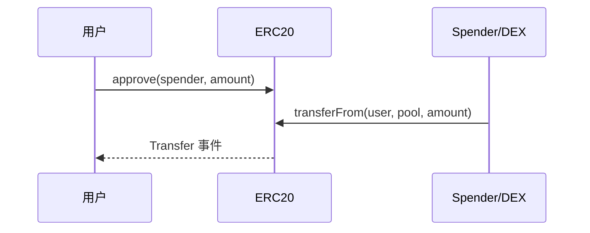

# ERC-20 / 721 / 1155 标准与实现

## 30 秒版（开场）

> **ERC-20** 同质化代币；**ERC-721** 在单个合约内标识唯一 token id；**ERC-1155** 在同一合约管理多种可同质化或非同质化 token 类型并支持批量操作。架构师选型 + Review **approve/transferFrom、回调、元数据**。Go 索引靠 **Transfer/TransferSingle 事件**（[S-BC-04](../12-blockchain-web3/S-BC-04-contract-abi-events.md)）。

## 3 分钟版（一面深度）

1. **是什么**：EIP 接口约定，非强制但生态互操作依赖。
2. **为什么**：交易所/钱包只认标准；非标 token 导致 Go 后端解析失败。
3. **怎么做**：生产用 OpenZeppelin；注意 `decimals`、mint/burn、权限。

## 10 分钟版（对比表）

| 标准 | 模型 | 核心方法 | 典型场景 |
|------|------|----------|----------|
| ERC-20 | 同质化 | transfer, approve, allowance | USDT, 平台币 |
| ERC-721 | 唯一 id | safeTransferFrom + onERC721Received | 艺术品 NFT |
| ERC-1155 | id + 数量 | safeBatchTransferFrom | 游戏道具 |



**ERC-20 要点**

```solidity
function transfer(address to, uint256 amount) external returns (bool);
function approve(address spender, uint256 amount) external returns (bool);
function transferFrom(address from, address to, uint256 amount) external returns (bool);
event Transfer(address indexed from, address indexed to, uint256 value);
```

- **allowance 竞态**：直接把非零 allowance 改成另一个非零值时，spender 可能在修改
  前后各消费一次。`approve(0)` 再设新值是常见兼容流程，但需要两笔交易，也不能消除
  第一笔确认前的竞态；应结合精确额度、及时消费、应用级交易编排或带 nonce/deadline
  的 permit 设计
- **fee-on-transfer**：实际到账 < amount，DEX 需特殊处理
- **非标准返回值**：部分历史 token 的 `transfer/approve` 不返回 bool，另一些会返回
  `false`。合约侧常用 OpenZeppelin `SafeERC20` 兼容“无返回值”，但明确返回 `false`
  仍视为失败；Go 后端也不能假设所有 token ABI/行为完全标准
- ERC-20 的 `name`、`symbol`、`decimals` 在原始标准中都是可选方法。钱包/交易所应以
  受控资产 registry 为准并准备调用失败/异常值 fallback，不能因主流实现常见就假设
  方法一定存在或 decimals 一定是 18

**ERC-721 safeTransfer**

- `safeTransferFrom` 在接收方是合约时会检查 `onERC721Received`，用于降低误转黑洞风险；
  `transferFrom` 不做该回调，只有在明确知道接收方能力时才应使用
- token ID 只在该 ERC-721 合约范围内唯一；跨链/跨集合身份至少要绑定
  `chainId + contract + tokenId`。metadata 扩展是可选的，且标准允许 `tokenURI`
  变化；需要不可变内容时应额外使用内容哈希/CID并约束 URI 或升级权限

**ERC-1155 批量**

- 一次调用可转多个 id/数量，通常比多次独立调用更省开销，但实际 Gas 仍取决于
  接收回调、存储更新和实现

## 生产场景

- 平台币 + NFT：20 作 Gas/积分，721 作凭证
- 元数据：`tokenURI` → IPFS JSON（[S-BC-06](../12-blockchain-web3/S-BC-06-defi-backend-patterns.md)）
- Go abigen 绑定： [S-BC-09](../12-blockchain-web3/S-BC-09-abigen-contract-bindings.md)

## 架构取舍

| 自研 token | OZ 继承 |
|------------|---------|
| 灵活 | 审计省心 |

## 深挖问答

1. **721 vs 1155 何时选？** → 唯一 vs 可堆叠同类资产。
2. **ERC-4626？** → 收益型 vault token，DeFi 标准化。
3. **Permit (EIP-2612)？** → 用户离线签授权，任何提交者可在 deadline 前调用
   `permit`；通常由 relayer 或后续业务交易代提交。签名必须绑定 domain、owner、
   spender、value、nonce、deadline，且 token 必须实现该扩展。
4. **双代币模型？** → 治理 token + 质押 receipt token。
5. **ERC-2981 版税能强制执行吗？** → 不能。它是版税信息查询标准，市场是否支付
   仍取决于交易协议或市场规则。

## 反模式与事故

- **无限 approve 给不可信合约**
- **721 向未知合约使用 `transferFrom` 而非 `safeTransferFrom`** → 不触发接收回调，资产可能被永久锁在不支持 NFT 的合约中；不是“交易没有到账”
- **decimals 假设 18** → USDC 6 位
- **把事件当作唯一成功依据** → 非标准 token 可能有特殊行为；资金系统还应校验
  receipt、合约地址、余额差额和最终性策略

## 代码示例

[SimpleToken.sol](https://github.com/twodog-tt/Golang-development-manual/blob/master/examples/senior/erc20bind/contract/SimpleToken.sol) — 教学用最小实现；生产用 OZ `ERC20`.

## 延伸阅读

- [EIP-20](https://eips.ethereum.org/EIPS/eip-20)
- [OpenZeppelin Contracts](https://docs.openzeppelin.com/contracts/)
