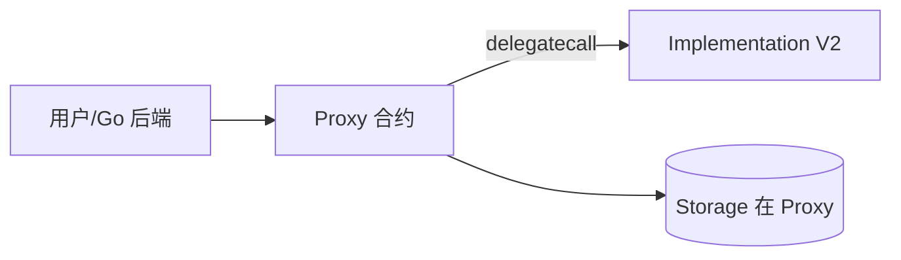

# 可升级合约：Proxy / UUPS / 存储槽

## 30 秒版（开场）

> **代理模式**：用户调 **Proxy 地址**（不变），`delegatecall` 到 **Implementation**（可升级）。架构师必讲 **EIP-1967 槽位、存储冲突、初始化器 disable**。模式：**Transparent vs UUPS**。

## 3 分钟版（一面深度）

1. **是什么**：逻辑与数据分离；Proxy 存 state，Implementation 存 code。
2. **为什么**：链上 bug 不能 patch；升级是生产必需，但引入 **admin 信任**。
3. **怎么做**：OpenZeppelin Upgrades 插件；`initializer` 替代 constructor；`__gap` 预留槽。

## 10 分钟版（原理 + 图示）



**Transparent vs UUPS**

| 模式 | 升级函数位置 | 特点 |
|------|--------------|------|
| Transparent | Proxy Admin 合约 | Admin 用户不能调业务函数 |
| UUPS | Implementation 内 | 更省 Gas；impl 必须保留升级逻辑 |

**EIP-1967 标准槽**

- `implementation`：`0x360894a13ba1a3210667c828492db98dca3e2076cc3735a920a3ca505d382bbc`
- `admin`：透明代理用

**存储冲突（面试必考）**

- Implementation 的 **状态变量布局** 必须与 Proxy 侧历史一致
- **只能在末尾追加** 变量；不能改顺序/类型
- 用 `uint256[50] __gap` 预留

```solidity
/// @custom:oz-upgrades-unsafe-allow constructor
constructor() {
    _disableInitializers();
}

function initialize(address admin) public initializer {
    __Ownable_init(admin);
}
```

## 生产场景

- 多签 + Timelock 管 `upgradeTo`
- 升级前 **存储布局 diff** 工具（OZ upgrades validate）
- Go 始终调 **Proxy 地址**，impl 地址仅内部

## 架构取舍

| 不可升级 | 可升级 |
|----------|--------|
| 信任最小 | 需信任 admin |
| DeFi 核心偏好 | 业务迭代快 |

## 追问链

1. **constructor 为何不能用？** → Implementation 的 constructor 改的是 impl 自身 storage，非 Proxy。
2. **selector clash？** → 透明代理 admin 与 impl 函数冲突 → 分离 Admin。
3. **如何验证升级安全？** → 布局检查 + 双审计 + 渐进迁移。
4. **Beacon Proxy？** → 多实例共享升级指向。

## 反模式与事故

- **升级改 storage 顺序** → 余额错乱
- **impl 自毁或留 delegatecall 后门**
- **未 disable initializer** → 被劫持初始化

## 延伸阅读

- [EIP-1967](https://eips.ethereum.org/EIPS/eip-1967)
- [OZ Proxies](https://docs.openzeppelin.com/contracts/4.x/api/proxy)
