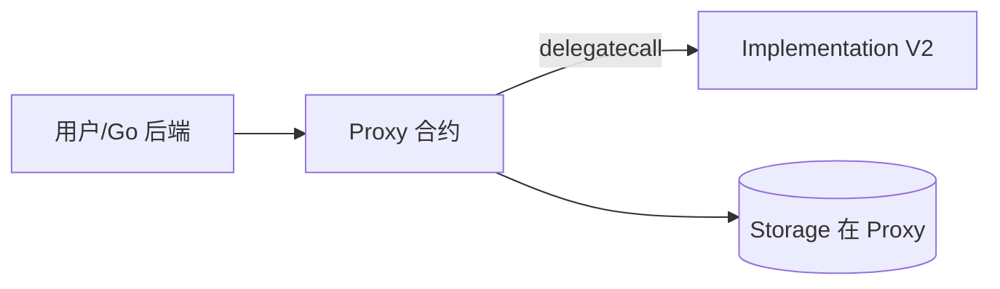

# 可升级合约：Proxy / UUPS / 存储槽

## 30 秒版（开场）

> **代理模式**：用户调用稳定的 Proxy 地址，Proxy 用 `delegatecall` 执行 Implementation 代码，状态保存在 Proxy。架构师必讲 **EIP-1967、原子初始化、`_disableInitializers()`、升级鉴权和存储布局兼容**。现代 OpenZeppelin 还应了解 ERC-7201 namespaced storage。

## 3 分钟版（一面深度）

1. **是什么**：逻辑与数据分离；Proxy 存 state，Implementation 存 code。
2. **为什么**：链上 bug 不能 patch；升级是生产必需，但引入 **admin 信任**。
3. **怎么做**：用 OpenZeppelin Upgrades 做 upgrade-safety/layout 校验；状态初始化放在 `initializer/reinitializer`，部署 Proxy 时原子调用；旧式线性布局用 append/gap，OZ Contracts Upgradeable 5.x 使用 ERC-7201 namespaced storage。

## 10 分钟版（原理 + 图示）


```mermaid
flowchart LR
  User[用户/Go 后端] --> Proxy[Proxy 合约]
  Proxy -->|delegatecall| Impl[Implementation V2]
  Proxy --> Storage[(Storage 在 Proxy)]
```

**Transparent vs UUPS**

| 模式 | 升级函数位置 | 特点 |
|------|--------------|------|
| Transparent | 独立 `ProxyAdmin` 管理 Proxy | Proxy admin 不能 fallback 到业务函数；升级面集中在 Admin |
| UUPS | Implementation 内的升级逻辑，Proxy 通常是 `ERC1967Proxy` | Proxy 更轻；必须正确实现 `_authorizeUpgrade` 并保持 UUPS 兼容 |

**EIP-1967 标准槽**

- `implementation`：`0x360894a13ba1a3210667c828492db98dca3e2076cc3735a920a3ca505d382bbc`
- `admin`：透明代理用

**存储布局（必掌握）**

- **传统线性布局**：不能改变已有变量的类型/顺序、在已有变量前插入、删除后复用槽，也要谨慎改变继承顺序和父合约变量
- 新变量通常追加到末尾；父合约需扩展时可消耗预留的 `__gap`，但要按 Solidity slot packing 精确减少，不能机械地永远写 `uint256[50]`
- **ERC-7201 namespaced storage**：把模块状态放入带唯一 namespace 的 struct，降低继承布局互相影响；namespace 内部升级仍必须满足布局兼容
- OpenZeppelin Contracts Upgradeable 5.x 已使用 ERC-7201；Upgrades 插件验证 namespaced layout 时要求 Solidity 0.8.20+

```solidity
/// @custom:oz-upgrades-unsafe-allow constructor
constructor() {
    _disableInitializers();
}

function initialize(address initialOwner) public initializer {
    __Ownable_init(initialOwner);
}

function _authorizeUpgrade(address) internal override onlyOwner {
}
```

以上按当前 OpenZeppelin Contracts 5.x：`UUPSUpgradeable` 标记为 stateless，不提供
`__UUPSUpgradeable_init()`，公开升级入口是 `upgradeToAndCall`；ProxyAdmin 5.x 对
Transparent Proxy 使用 `upgradeAndCall`。旧版本曾有不同生成 API，讲解和代码都应
先声明并固定依赖版本，不能把 `upgradeTo`/initializer 名称跨版本混用。

Proxy 应在部署交易中通过 constructor `_data` 原子执行 `initialize`，不能先部署一个未初始化 Proxy 再等待下一笔交易，否则可能被抢先初始化。Implementation 自身则用 constructor 中的 `_disableInitializers()` 锁死。

## 生产场景

- 多签 + Timelock 管具体版本暴露的升级入口（OZ 5.x UUPS 为 `upgradeToAndCall`）
- 升级前运行 `validateUpgrade`/storage layout diff，并做 fork 回放与不变量测试
- Go 始终调 **Proxy 地址**，impl 地址仅内部
- 升级事件、implementation 地址、代码 hash 和治理提案要可监控、可审计

## 架构取舍

| 方案 | 优点 | 代价 |
|------|------|------|
| 不可升级 | 治理信任面最小、行为稳定 | 漏洞修复与迁移困难 |
| 可升级 | 可修复和迭代 | 引入升级密钥、治理、存储兼容与流程风险 |
| 可升级后永久冻结 | 前期可修复，成熟后降低信任 | 冻结时点和迁移方案需提前设计 |

## 深挖问答

1. **constructor 为何不能初始化业务状态？** → constructor 在 Implementation 部署上下文执行，不会写 Proxy storage；常量可以，immutable 会固化在 implementation code 并被所有 Proxy 共享，需非常谨慎。
2. **selector clash？** → Transparent pattern 通过 admin/fallback 规则缓解；不要随意给 Proxy 本体新增外部函数，否则仍可能冲突。
3. **如何验证升级安全？** → 升级安全检查 + 布局 diff + fork/invariant 测试 + 独立审计 + Timelock；数据迁移要设计可重复、分批和失败恢复。
4. **Beacon Proxy？** → 多实例共享升级指向。

## 反模式与事故

- **升级改 storage 顺序** → 余额错乱
- **任意 delegatecall / 危险升级后门** → Proxy 上下文资产与存储可被接管
- **未 disable initializer** → 被劫持初始化
- **Proxy 部署后另发 initialize** → 抢跑初始化
- **只测新部署、不测 V1 状态升级到 V2** → 漏掉真实布局和迁移问题

## 延伸阅读

- [EIP-1967](https://eips.ethereum.org/EIPS/eip-1967)
- [ERC-7201 Namespaced Storage Layout](https://eips.ethereum.org/EIPS/eip-7201)
- [OpenZeppelin 5.x Proxy API](https://docs.openzeppelin.com/contracts/5.x/api/proxy)
- [OpenZeppelin：Writing Upgradeable Contracts](https://docs.openzeppelin.com/upgrades-plugins/writing-upgradeable)
