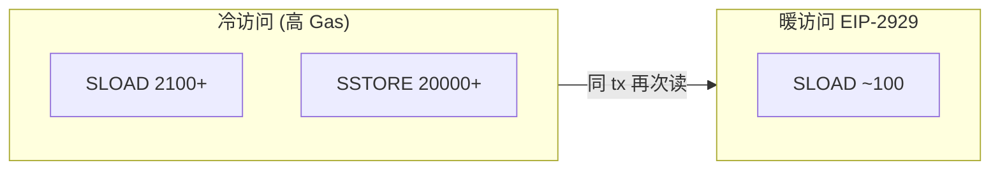

# Gas 优化与设计模式

## 30 秒版（开场）

> Gas = 链上 CPU+存储计费。架构师在 **可读 vs 成本** 间权衡：storage packing、calldata、`immutable`、事件代替 storage、批量操作。过度优化牺牲审计性时不值得。

## 3 分钟版（一面深度）

1. **是什么**：EIP-1559 后 baseFee+tip；优化降用户成本与 DoS 面。
2. **为什么**：高频协议（DEX、mint）Gas 差 20% 即竞争力差。
3. **怎么做**：先 profile（`forge test --gas-report`）；热路径优化；冷路径可读优先。

## 10 分钟版（优化清单）

| 技巧 | 说明 |
|------|------|
| 变量打包 | 多个 uint128 同 slot |
| calldata | external 参数用 calldata 非 memory |
| immutable/constant | 编译期嵌入 |
| 事件索引 | 链下索引代替链上数组 |
| unchecked | 0.8+ 循环内已证明安全处 |
| 短路 | 便宜检查放前 |
| 自定义 error | 比 revert string 省 Gas |
| 克隆 minimal proxy | EIP-1167 批量部署 |

**设计模式**

| 模式 | 用途 |
|------|------|
| Pull Payment | 用户自提，防 push 失败 |
| Checks-Effects-Interactions | 安全序 |
| Diamond (EIP-2535) | 超大合约分 facet |
| Factory + CREATE2 | 确定性地址 |

**何时不优化**

- 安全关键路径 clarity > 省 2k Gas
- 过早 inline assembly

## 生产场景

- NFT 批量 mint：ERC-1155 + merkle allowlist
- 存储迁移：链下 Merkle root 上链验证

## 追问链

1. **SLOAD vs MLOAD 成本？** → storage 贵 orders of magnitude。
2. **cold vs warm access？** → EIP-2929 首次访问更贵。
3. **assembly 何时用？** → 库级优化；需双审计。
4. **L2 Gas 差异？** → 计价不同但相对优化仍有效（[S-BC-07](../12-blockchain-web3/S-BC-07-l2-cross-chain-bridge.md)）。

## 反模式

- **链上存大字符串/JSON**
- **O(n) 遍历全用户** → 不可扩展

## 延伸阅读

- [evm.codes](https://www.evm.codes/)
