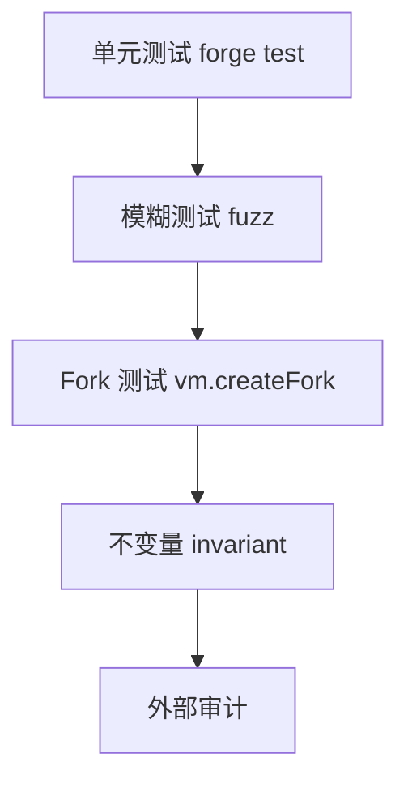

# Foundry 测试与审计清单

## 30 秒版（开场）

> **Foundry**（forge）是 Solidity 原生测试框架：**单元测试、fuzz、fork 主网、invariant**。架构师交付前跑 **Slither + 测试覆盖 + 审计 checklist**。与 Go 的 `go test` 文化对称（[S-BC-09](../12-blockchain-web3/S-BC-09-abigen-contract-bindings.md) 用 Go 测绑定）。

## 3 分钟版（一面深度）

1. **是什么**：`forge test`、`forge script`、Solidity 写测试（cheatcodes）。
2. **为什么**：链上不可 rollback；测试是最后防线。
3. **怎么做**：单测 + fuzz + 主网 fork 集成 + 外部审计。

## 10 分钟版（测试金字塔）



**Foundry 示例**

```solidity
function testWithdraw() public {
    vault.deposit{value: 1 ether}();
    vault.withdraw(1 ether);
    assertEq(address(vault).balance, 0);
}

function testFuzz_Deposit(uint96 amount) public {
    vm.assume(amount > 0);
    vault.deposit{value: amount}();
    assertEq(vault.balances(address(this)), amount);
}
```

**Cheatcodes 常用**

| 命令 | 用途 |
|------|------|
| vm.prank | 模拟 msg.sender |
| vm.deal | 给 ETH |
| vm.roll / warp | 块高/时间 |
| vm.createFork | 主网状态 |

**架构师审计清单（发布前）**

- [ ] Slither 无 critical/high
- [ ] 100% 关键路径单测 + fuzz
- [ ] 升级布局 validate（若 proxy）
- [ ] 权限与 pause 机制
- [ ] 事件完整供 Go 索引
- [ ] 文档：部署地址、角色、参数范围

## 生产场景

- CI：`forge test --via-ir` 与 solc 版本 pin
- 部署 script：`forge script` + multisig 执行

## 追问链

1. **Hardhat vs Foundry？** → Foundry 快、Solidity 测；Hardhat TS 生态。
2. **invariant 测试？** → handler 随机调函数，assert 全局性质（如总供应守恒）。
3. **如何测 reentrancy？** → 攻击合约 mock 在 fallback 再入。
4. **Go 与 Foundry 分工？** → 合约 Foundry；集成 Go+simulated/abigen。

## 反模式

- **仅 happy path 测试**
- **主网未 fork 测 DeFi 组合**

## 代码示例

本仓库 ERC20 可用 Foundry 另建 `test/`（与 `go test` 并行）；SimpleToken 见 `examples/senior/erc20bind/contract/`。

## 延伸阅读

- [Foundry Book](https://book.getfoundry.sh/)
