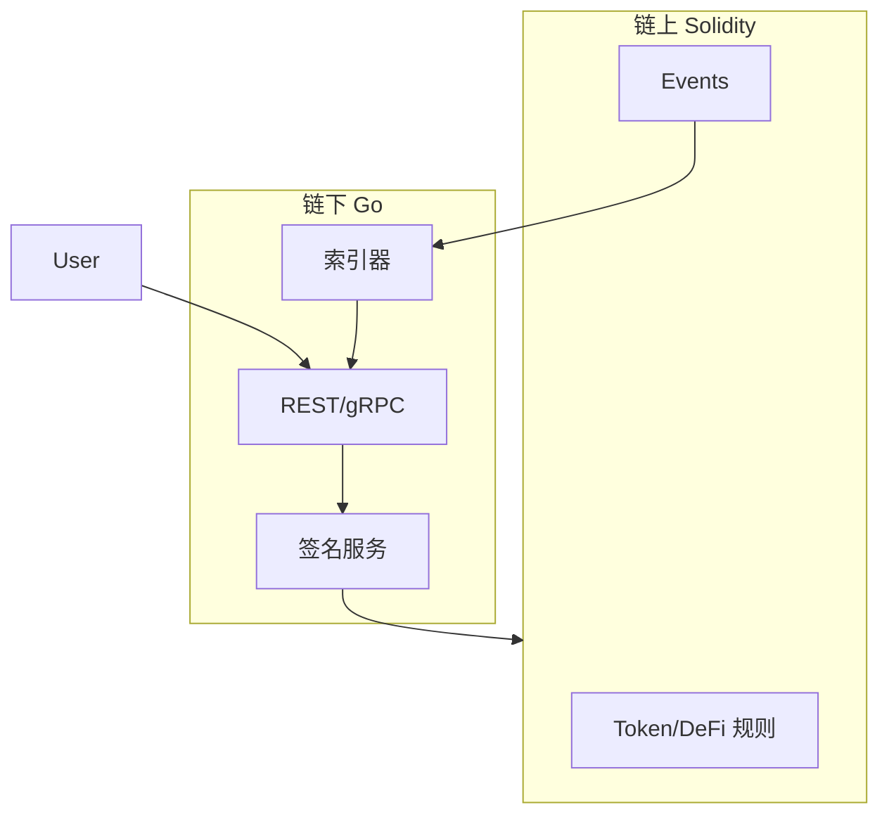

# 合约与 Go 后端架构边界

## 30 秒版（开场）

> **区块链架构师**划分：**链上 = 资产规则与不变量**；**Go = 编排、索引、UX、风控、密钥流程**。忌「链下算完链上只存结果无校验」。本题串联 [13 Solidity](./index.md) 与 [12 Web3 Go](../12-blockchain-web3/index.md)。

## 3 分钟版（一面深度）

1. **是什么**：全栈 Web3 系统的责任分界与接口契约（ABI + 事件 schema）。
2. **为什么**：面试考察能否带 **合约+后端** 团队，而非只会其一。
3. **怎么做**：合约 emit 完整事件；Go 索引幂等；敏感逻辑 **链上 duplicate 校验**。

## 10 分钟版（分工矩阵）

| 职责 | Solidity 合约 | Go 后端 |
|------|---------------|---------|
| 余额/转账规则 | ✅ 权威 | 索引展示 |
| 访问控制 | ✅ onlyRole | API JWT + 业务 RBAC |
| 价格发现 | ✅ AMM/Oracle | 聚合缓存 API |
| 订单簿撮合 | 可选链上 | 通常链下 CLOB |
| 元数据/image | tokenURI 锚定 | IPFS/CDN 托管 |
| 邮件/通知 | ❌ | ✅ |
| 复杂查询 | 事件+The Graph/自研索引 | ✅ [S-BC-05](../12-blockchain-web3/S-BC-05-indexer-reorg.md) |
| 密钥 | 用户自持/4337 | 热钱包/KMS [S-BC-03](../12-blockchain-web3/S-BC-03-tx-signing-key-mgmt.md) |



**接口契约（架构师必交付）**

1. **ABI 版本化** + 部署地址 registry（多链）
2. **事件 schema** 文档：indexed 字段、幂等键
3. **错误码** mapping：revert reason → 用户文案
4. **确认策略**：块数 per chain（[S-BC-07](../12-blockchain-web3/S-BC-07-l2-cross-chain-bridge.md)）

**协作流程**

```
Solidity PR → Foundry 测试 → Slither
     ↓ abigen
Go PR → 绑定更新 → integration test (simulated/fork)
     ↓
联合 testnet 演练 → 主网 multisig 部署
```

## 生产场景

- **Mint 活动**：Merle proof 链下生成，**链上 verify**；Go 防刷接口限流
- **提现**：Go 审核 → 签名 tx；合约 **无** 后门 mint
- **升级**：Solidity 布局评审 + Go 改 **Proxy 地址** 配置

## 架构师面试叙事

「我负责定义链上链下边界：ERC20 转账与额度在合约；平台展示与 KYT 在 Go；通过 Transfer 事件对账，reorg 回滚由索引器处理。」

## 追问链

1. **能否链下签名链上验？** → EIP-712 typed data；合约 `ecrecover`。
2. **The Graph vs 自研 Go 索引？** → 子图快；Go 控定制与私有链。
3. **4337 谁构造 UserOp？** → 前端/Go 组装，Bundler 提交（[S-BC-08](../12-blockchain-web3/S-BC-08-erc4337-account-abstraction.md)）。
4. **与 [S-SOL-01 限界上下文](../11-solution-architecture/S-SOL-01-bounded-context-ddd.md)？** → 「链上域」与「链下域」是不同 bounded context，ACL 翻译。

## 反模式

- **Go 改余额数据库无链上依据**
- **合约存 HTTP URL 无 hash**
- **abi 变更不版本化** → 生产解析失败

## 代码示例

- 合约：[ReentrancyGuard.sol](https://github.com/twodog-tt/Golang-development-manual/blob/master/examples/solidity/ReentrancyGuard.sol)
- Go 绑定：[erc20bind](https://github.com/twodog-tt/Golang-development-manual/blob/master/examples/senior/erc20bind)

## 延伸阅读

- [Consensys: On-chain vs Off-chain](https://consensys.github.io/smart-contract-best-practices/development-recommendations/offensive/)
