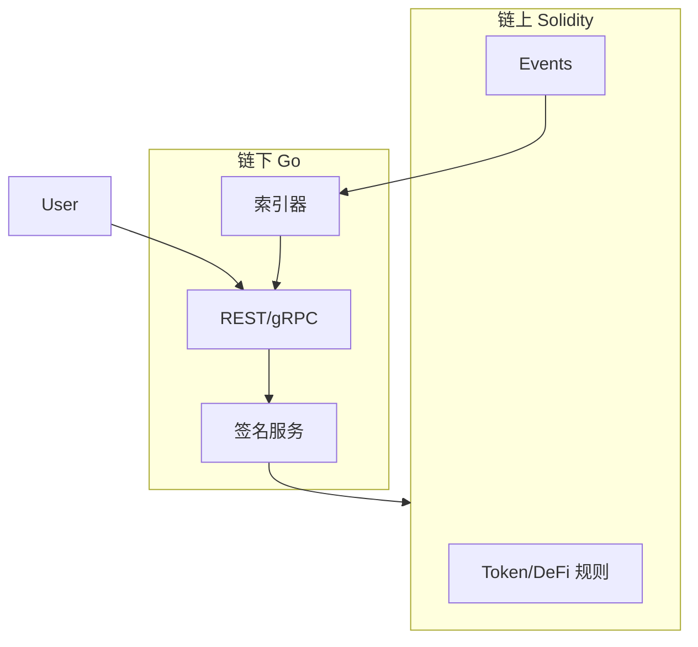

# 合约与 Go 后端架构边界

## 30 秒版（开场）

> **区块链架构师**划分：**链上 = 资产规则与不变量**；**Go = 编排、索引、UX、风控、密钥流程**。忌「链下算完链上只存结果无校验」。本题串联 [13 Solidity](./index.md) 与 [12 Web3 Go](../12-blockchain-web3/index.md)。

## 3 分钟版（一面深度）

1. **是什么**：全栈 Web3 系统的责任分界与接口契约（ABI + 事件 schema）。
2. **为什么**：面试考察能否带 **合约+后端** 团队，而非只会其一。
3. **怎么做**：合约把关键状态变化设计成稳定、可索引的事件接口；Go 索引幂等并
   能处理 reorg。事件服务链下读模型，但合约状态与交易执行结果才是链上权威，
   合约不能读取历史事件来执行规则。

## 10 分钟版（分工矩阵）

| 职责 | Solidity 合约 | Go 后端 |
|------|---------------|---------|
| 余额/转账规则 | ✅ 权威 | 索引展示 |
| 访问控制 | 链上角色/签名/治理必须独立成立 | API JWT + 业务 RBAC 只保护后端入口，不能替代合约权限 |
| 价格发现 | AMM 状态或经过验证的链上 Oracle 接口 | 聚合、监控、缓存；不能把未验证的链下报价直接当链上权威 |
| 订单簿撮合 | 可选链上 | 通常链下 CLOB |
| 元数据/image | 可选的 tokenURI/内容承诺与变更权限；URI 本身不保证不可变 | IPFS/CDN 托管、hash/CID 校验与版本记录 |
| 邮件/通知 | ❌ | ✅ |
| 复杂查询 | 事件+The Graph/自研索引 | ✅ [S-BC-05](../12-blockchain-web3/S-BC-05-indexer-reorg.md) |
| 密钥 | 用户自持、智能账户验证或链上多签 | 仅托管/relayer 流程使用隔离 signer、MPC/KMS [S-BC-03](../12-blockchain-web3/S-BC-03-tx-signing-key-mgmt.md) |


```mermaid
flowchart TB
  subgraph onchain[链上 Solidity]
    Token[Token/DeFi 规则]
    Events[Events]
  end
  subgraph offchain[链下 Go]
    Indexer[索引器]
    API[REST/gRPC]
    Signer[签名服务]
  end
  User --> API
  API --> Signer
  Signer --> onchain
  Events --> Indexer
  Indexer --> API
```

**接口契约（架构师必交付）**

1. **ABI 版本化** + 部署地址 registry（多链）；代理地址不变时，还要按 implementation
   生效区块/升级事件选择当时 ABI，不能用最新 ABI 回解全部历史日志
2. **事件 schema** 文档：indexed 字段、幂等键、合约版本与 canonical/finality 语义
3. **错误分类** mapping：custom error selector、`Error(string)`、`Panic(uint256)`、空返回或
   provider 包装错误 → 可观察错误类。模拟结果和 revert 文案不是跨版本稳定的业务错误码
4. **确认/最终性策略**：按链的共识最终性、reorg 风险、L2 批次/证明状态和业务金额
   分层，不能只写死一个确认块数（[S-BC-07](../12-blockchain-web3/S-BC-07-l2-cross-chain-bridge.md)）

**协作流程**

```
Solidity PR → Foundry 测试 → Slither
     ↓ abigen
Go PR → 绑定更新 → integration test (simulated/fork)
     ↓
联合 testnet 演练 → 主网 multisig 部署
```

## 生产场景

- **Mint 活动**：Merkle proof 链下生成，**链上 verify**；Go 防刷接口限流
- **提现**：Go 审核 → 签名 tx；合约 **无** 后门 mint
- **升级**：Solidity 布局与权限评审；原 Proxy 地址通常保持不变，Go 更新并版本化
  实现 ABI/事件解码规则。只有部署新 Proxy/迁移合约时才更新地址 registry

## 架构师面试叙事

「我负责定义链上链下边界：ERC20 转账与额度在合约；平台展示与 KYT 在 Go；通过 Transfer 事件对账，reorg 回滚由索引器处理。」

## 追问链

1. **能否链下签名链上验？** → 可用 EIP-712 typed data 与安全签名库验证；domain
   应绑定 chainId/verifyingContract，业务消息还要有 nonce、deadline/有效期并在链上
   消费 nonce，避免跨链、跨合约和重复执行。合约钱包还要考虑 ERC-1271。
2. **The Graph vs 自研 Go 索引？** → 子图快；Go 控定制与私有链。
3. **4337 谁构造 UserOp？** → 前端/Go 组装，Bundler 提交（[S-BC-08](../12-blockchain-web3/S-BC-08-erc4337-account-abstraction.md)）。
4. **与 [S-SOL-01 限界上下文](../11-solution-architecture/S-SOL-01-bounded-context-ddd.md)？** →
   链上/链下是部署与信任边界，不天然等于两个 bounded context；应先按业务语言和
   一致性边界划分上下文，再用 ACL/adapter 隔离链 RPC、ABI 与索引模型。

## 反模式

- **Go 改余额数据库无链上依据**
- **合约存 HTTP URL 无 hash**
- **abi 变更不版本化** → 生产解析失败
- **把 tokenURI 当成天然不可变锚点** → URI/代理/元数据服务都可能变化；不可变要求必须由内容哈希和权限/升级约束共同实现
- **认为 API RBAC 能保护 public 合约函数** → 攻击者可绕过 Go API 直接发链上交易

## 代码示例

- 合约：[ReentrancyGuard.sol](https://github.com/twodog-tt/Golang-development-manual/blob/master/examples/solidity/ReentrancyGuard.sol)
- Go 绑定：[erc20bind](https://github.com/twodog-tt/Golang-development-manual/blob/master/examples/senior/erc20bind)

## 延伸阅读

- [Consensys Diligence 合约安全指南](https://github.com/ConsensysDiligence/smart-contract-best-practices)
