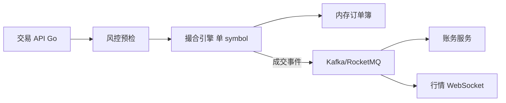

# CEX 撮合引擎与订单簿架构

## 30 秒版（开场）

> CEX 核心 = **订单簿 + 撮合引擎**：价格优先、时间优先（Pro-Rata 等变体）。Go 负责 **API 接入、风控预检、持久化、行情推送**；撮合环可 **单线程 per symbol** 或 Rust/C++ 内核 + Go 编排。生产关键词：**幂等订单 ID、串行撮合、WAL 恢复**。

## 3 分钟版（一面深度）

1. **是什么**：买卖挂单在内存订单簿匹配，产生成交与持仓变更。
2. **为什么**：交易所面试必考；延迟与正确性直接决定资金。
3. **怎么做**：`symbol` 维度单写者；限价/市价/IOC/FOK；成交事件发 MQ 驱动账务（[S-EXCH-03](./S-EXCH-03-account-ledger.md)）。

## 10 分钟版（原理 + 图示）



**订单类型**

| 类型 | 行为 |
|------|------|
| Limit | 指定价，未成交可挂单 |
| Market | 吃对手盘，可能滑点 |
| IOC | 立即成交剩余取消 |
| FOK | 全部成交否则取消 |
| Post-only | 只做 maker |

**撮合规则（现货）**

- 价格优先：买价高者优先；卖价低者优先
- 同价时间优先：先到先得
- 部分成交：剩余挂簿或按类型取消

**Go 架构要点**

| 组件 | 设计 |
|------|------|
| 订单入口 | `clientOrderId` 幂等（[S-ARCH-04](../03-system-design/S-ARCH-04-idempotency.md)） |
| 撮合 | 避免锁竞争：每 symbol 一个 goroutine/channel |
| 持久化 | 先 WAL/日志再异步刷库；崩溃重放 |
| 行情 | 增量 depth + trade tick；WebSocket 扇出 |

**延迟优化**

- 热路径无 GC 压力：对象池、预分配 slice
- 撮合与 IO 分离：撮合只写 ring buffer
- 跨机房：撮合机靠近内存，API 层水平扩展

## 生产场景

- **开盘爆量**：队列削峰 + 熔断暂停市价单
- **自成交检测**：同一 user 买卖对敲 → 风控拒单
- **精度**：`decimal` 库，禁止 float 算价格

## 追问链

1. **撮合与账务谁先做？** → 撮合产生成交事实；账务消费事件 **至少一次** + 幂等。
2. **分库分 symbol？** → 热门币独立实例；冷门合并。
3. **与 DEX 区别？** → CEX 链下撮合链下账本；DEX 链上 AMM（[S-EXCH-06](./S-EXCH-06-dex-amm-liquidity.md)）。
4. **Go 够快吗？** → 中低频现货够用；超高频核心可用 Rust，Go 做外围。

## 反模式与事故

- **多 goroutine 改同一订单簿** → race、双成交
- **无 clientOrderId 幂等** → 重复下单
- **撮合结果先通知用户再落库** → 丢单争议

## 代码示例

```go
type MatchEvent struct {
    TradeID   string
    Symbol    string
    Price     decimal.Decimal
    Quantity  decimal.Decimal
    BuyOrder  string
    SellOrder string
    Ts        int64
}
```

## 延伸阅读

- 本手册 [S-ARCH-02 秒杀](../03-system-design/S-ARCH-02-seckill.md)（削峰思路可类比开盘）
