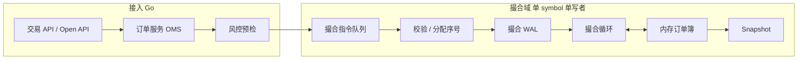
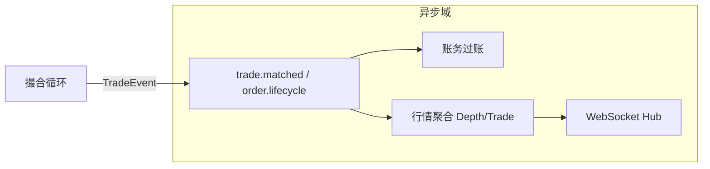
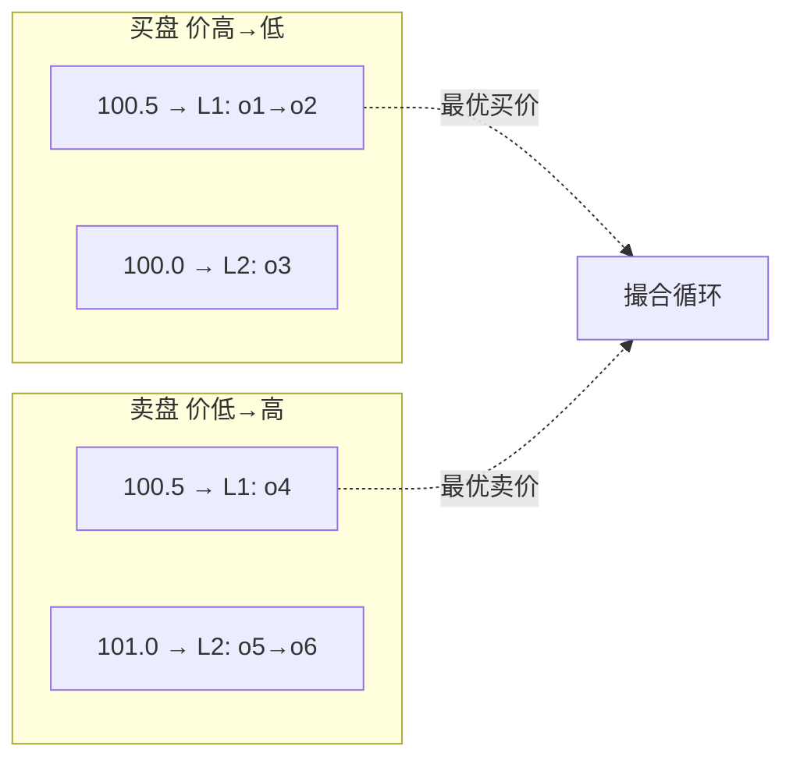
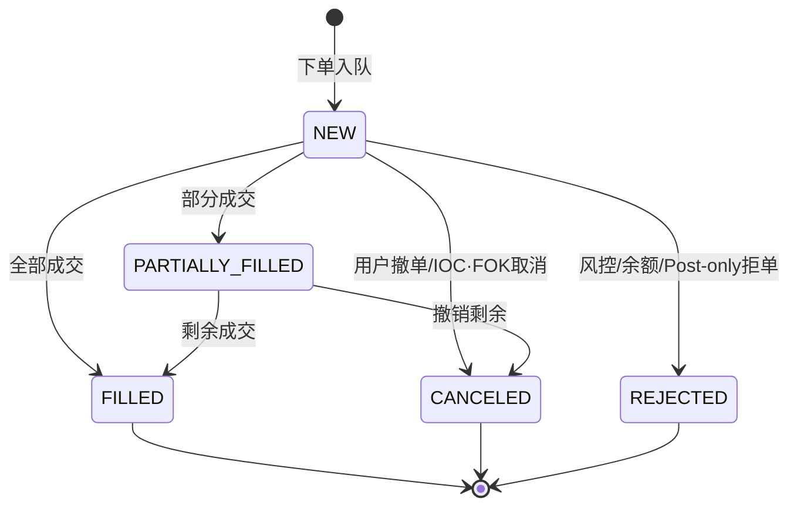
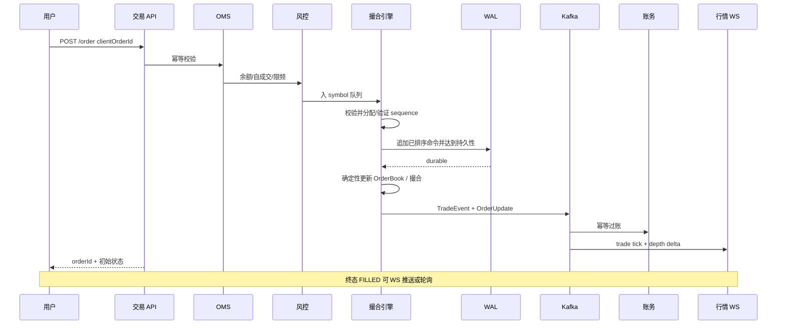

# CEX 撮合引擎与订单簿架构

## 30 秒版（开场）

> CEX 现货核心通常是 **内存订单簿 + 每个订单簿一个确定性单写者**：
> 常见规则为价格优先、时间优先，也可能采用 pro-rata 等市场规则。一个进程可承载
> 多个 symbol，但同一本簿不能被多个写者并发修改。生产关键词：
> **clientOrderId 幂等、输入全序、可恢复日志、事件序号、账务与行情异步派生**。

## 3 分钟版（一面深度）

1. **是什么**：买卖挂单在内存按价格档位排队，撮合引擎按规则匹配产生成交，输出不可变成交事实（Trade）。
2. **为什么**：交易所收入与口碑直接取决于撮合 **正确性（不超卖、不重复成交）** 与 **延迟（P99 下单确认）**；架构师面必画订单簿数据结构与单写者边界。
3. **怎么做**：按 order book 建立单写者和单调序号；订单经 OMS 幂等接入、权限与
   风控/资金预留后进入同一命令序列。撮合日志必须在返回不可撤销的 accepted/fill
   结果前达到既定持久性，再由日志/事件发布器驱动账务
   （[S-EXCH-03](./S-EXCH-03-account-ledger.md)）与行情
   （[S-EXCH-11](./S-EXCH-11-websocket-market-hub.md)）。

## 10 分钟版（原理 + 图示）

### 交易域在 CEX 中的位置

#### 同步接单与可恢复撮合


```mermaid
flowchart LR
  subgraph Ingress[接入 Go]
    API[交易 API / Open API]
    OMS[订单服务 OMS]
    Risk[风控预检]
  end
  subgraph ME域[撮合域 单 symbol 单写者]
    Q[撮合指令队列]
    Validate[校验 / 分配序号]
    WAL[撮合 WAL]
    OB[内存订单簿]
    Match[撮合循环]
    Snap[Snapshot]
    Q --> Validate --> WAL --> Match
    Match <--> OB
    OB --> Snap
  end
  API --> OMS --> Risk --> Q
```

#### 成交事实异步扇出


```mermaid
flowchart LR
  Match[撮合循环]
  subgraph Async[异步域]
    MQ[trade.matched / order.lifecycle]
    Ledger[账务过账]
    MD[行情聚合 Depth/Trade]
    WS[WebSocket Hub]
  end
  Match -->|TradeEvent| MQ
  MQ --> Ledger
  MQ --> MD --> WS
```

与全链路关系见 [S-EXCH-13 CEX 端到端架构](./S-EXCH-13-cex-end-to-end-architecture.md)。**撮合只产出成交事实，不直接改用户余额**——余额变更由账务服务幂等消费事件完成。

### 订单簿（Order Book）数据结构

订单簿 = **买盘（Bids）+ 卖盘（Asks）**，每侧按 **价格档位（Price Level）** 组织。

| 结构选型 | 实现 | 适用 |
|----------|------|------|
| 价格索引 | `map[price]*PriceLevel` 配合有序价格结构，或跳表/红黑树等 | map 可 O(1) 找已知档位；寻找/更新最优价仍需要有序结构 |
| 价格排序 | Bids：**价高优先**（降序）；Asks：**价低优先**（升序） | 撮合取最优对手价 |
| 同价排队 | 每档位 **FIFO 双向链表**（按 `orderId` / 入场时间） | 时间优先 |
| 订单索引 | `map[orderId]*Order` | O(1) 撤单、改单 |


```mermaid
flowchart LR
  subgraph Bids[买盘 价高→低]
    B1["100.5 → L1: o1→o2"]
    B2["100.0 → L2: o3"]
  end
  subgraph Asks[卖盘 价低→高]
    A1["100.5 → L1: o4"]
    A2["101.0 → L2: o5→o6"]
  end
  B1 -.最优买价.-> Match[撮合循环]
  A1 -.最优卖价.-> Match
```

**常见深挖**：为什么不用 MySQL 做订单簿？→ 热路径要 **微秒～毫秒级** 更新，内存结构 + WAL 才能扛开盘洪峰；MySQL 做 **订单历史、审计、冷查询**。

### 撮合规则（现货标准）

| 规则 | 说明 |
|------|------|
| **价格优先** | 买单：出价高者优先成交；卖单：出价低者优先成交 |
| **时间优先** | 同价档位内，先进入订单簿者优先（FIFO） |
| **Pro-Rata** | 部分大宗/合约市场按挂单量比例分配（现货场景提一句即可） |
| **可成交条件** | 最高买价 ≥ 最低卖价时发生撮合 |

**限价买单撮合伪流程**（简化）：

1. 取卖盘最优价（最低 Ask）
2. 若 `buyPrice < bestAsk` → 无法成交，剩余挂入买盘（Limit GTC）
3. 若 `buyPrice >= bestAsk` → 与最优卖档成交 `min(buyQty, levelQty)`
4. 卖档耗尽则删档，继续下一档，直至买单量归零或价格不满足

### 订单类型（必背表）

| 类型 | 行为 | 未成交部分 | 典型用途 |
|------|------|------------|----------|
| **Limit GTC** | 指定价，可挂单 | 挂入订单簿 | 常规限价 |
| **Market** | 吃对手盘最优价 | 可能部分成交后取消（看交易所规则） | 快速成交 |
| **IOC** | 立即成交 | **剩余立即取消**，不挂单 | 吃单不挂单 |
| **FOK** | 全部立即成交 | **否则整单取消** | 大宗不暴露 |
| **Post-only** | 只做 Maker | 若会立即吃单，按 venue 规则拒绝、取消或改价；必须在接单协议中明确 | 控制 maker/taker 身份 |
| **GTX** | 常被用作 Post-only 的 time-in-force 名称 | 具体拒绝/取消语义依交易所 API | 币圈常见命名 |

FOK 必须先验证可成交数量，或在同一确定性命令内以可回滚的临时状态完成匹配；
不能先产生外部可见的部分成交再“撤回”。

**Stop / Stop-Limit**（触发单）：价格触发后转为市价/限价进入撮合。触发源可能是
last/index/mark price，必须由产品规则定义并版本化；未激活前通常不进入公开订单簿。

### 订单状态机


```mermaid
stateDiagram-v2
  [*] --> NEW: 下单入队
  NEW --> PARTIALLY_FILLED: 部分成交
  NEW --> FILLED: 全部成交
  NEW --> CANCELED: 用户撤单/IOC·FOK取消
  NEW --> REJECTED: 风控/余额/Post-only拒单
  PARTIALLY_FILLED --> FILLED: 剩余成交
  PARTIALLY_FILLED --> CANCELED: 撤销剩余
  FILLED --> [*]
  CANCELED --> [*]
  REJECTED --> [*]
```

| 状态 | 含义 | 是否占订单簿 |
|------|------|--------------|
| NEW | 已接受，待撮合或已挂簿 | 限价挂单后占簿 |
| PARTIALLY_FILLED | 部分成交 | 剩余占簿 |
| FILLED | 完全成交 | 否 |
| CANCELED | 已撤销 | 否 |
| REJECTED | 拒绝，未进簿 | 否 |

撤单与下单 **必须进同一 symbol 队列**，保证与撮合循环 **全序**，避免「撤单先到但撮合已成交」的竞态由业务层乱序导致。

### 端到端时序（下单 → 成交 → 行情）


```mermaid
sequenceDiagram
  participant U as 用户
  participant API as 交易 API
  participant OMS as OMS
  participant Risk as 风控
  participant ME as 撮合引擎
  participant WAL as WAL
  participant MQ as Kafka
  participant Ledger as 账务
  participant WS as 行情 WS

  U->>API: POST /order clientOrderId
  API->>OMS: 幂等校验
  OMS->>Risk: 余额/自成交/限频
  Risk->>ME: 入 symbol 队列
  ME->>ME: 校验并分配/验证 sequence
  ME->>WAL: 追加已排序命令并达到持久性
  WAL-->>ME: durable
  ME->>ME: 确定性更新 OrderBook / 撮合
  ME->>MQ: TradeEvent + OrderUpdate
  MQ->>Ledger: 幂等过账
  MQ->>WS: trade tick + depth delta
  API-->>U: orderId + 初始状态
  Note over U,WS: 终态 FILLED 可 WS 推送或轮询
```

### 撮合引擎内部架构（Go 常见落地）

| 组件 | 职责 | 要点 |
|------|------|------|
| **SymbolRouter** | 按 `symbol` 哈希到撮合实例 | 热门币独立 Pod/进程 |
| **CommandQueue** | 单消费者 channel / ring buffer | 下单、撤单、管理指令 **全序** |
| **OrderBook** | 内存簿 | 热路径优先用按 tick/step 归一化的定点整数；禁止用 `float64` 表示金额 |
| **MatchLoop** | 处理指令 + 触发撮合 | **单 goroutine**，无 mutex |
| **WAL Writer** | 顺序写本地盘/专用存储 | 崩溃恢复重放 |
| **Publisher** | 异步发 MQ | 与撮合循环解耦，避免阻塞热路径 |

**与账务边界**：接单前必须在权威资金模型中完成足额预留，可能是同一交易账户
聚合内的本地 reservation，也可能是账务服务的幂等同步 reserve。成交后账务以
append-only 复式分录做借贷、扣费和释放；“流水只追加”不等于“余额只加不减”。
失败事件要隔离、告警并可重放，不能简单跳过后继续处理相关账户
（[S-EXCH-03](./S-EXCH-03-account-ledger.md)）。

### WAL 与快照恢复

| 机制 | 说明 |
|------|------|
| **WAL 条目** | 可记录已排序命令，也可记录确定性结果/事件；必须定义唯一事实格式与 schema 版本 |
| **写入顺序** | 在向外确认 accepted/fill 前，输入命令或结果必须达到约定持久性；随后应用状态并发布派生事件。不能只在内存修改后异步“尽力写盘” |
| **快照** | 定时或每 N 条 WAL 打 OrderBook 快照，重启时 **快照 + 增量重放** |
| **恢复目标** | 订单簿与订单状态与宕机前 **一致**，`tradeId` 单调不重 |

讲解提纲：「撮合日志是订单执行事实源，账务流水是资产余额事实源；两者通过
`tradeId`、序号和对账关联。不能把其中任何一方称为全部资金的唯一真相。」

完整可运行实现见
[S-EXCH-17 确定性撮合引擎](./S-EXCH-17-runnable-deterministic-matching-engine.md) 与
[S-EXCH-18 WAL、快照与回放](./S-EXCH-18-wal-snapshot-replay.md)。其中明确区分
结构校验失败与已进入全序后的业务拒绝，并验证 torn tail、checksum 损坏和快照后缀重放。

### 行情输出（与撮合耦合点）

| 输出 | 内容 | 消费者 |
|------|------|--------|
| **Trade Tick** | 每笔成交价、量、方向、taker 侧 | K 线、WS、风控 |
| **Depth Delta** | 档位增减（非全量快照） | WS、Redis 缓存 |
| **Depth Snapshot** | 带 `lastUpdateSeq` 的当前 N 档快照 | 新连接初始化、断线恢复 |

常见恢复协议是：先缓存 delta，读取带序号的当前快照，再丢弃旧 delta 并连续应用
后续增量；发现序号缺口就重新同步。对象存储适合历史归档，不应默认承担低延迟的
当前盘口快照（[S-EXCH-11](./S-EXCH-11-websocket-market-hub.md)）。

### Maker / Taker 与费率

| 角色 | 定义 | 费率 |
|------|------|------|
| **Maker** | 挂单提供流动性（成交前已在簿上） | 通常更低或为负（返佣） |
| **Taker** | 吃单拿走流动性 | 通常更高 |

Post-only 的意义：保证订单 **不会以 Taker 身份成交**，适合做市策略。撮合循环内需在 **匹配前** 判断是否会立即成交，若是则拒单。

### Symbol 分片与扩展

| 策略 | 说明 |
|------|------|
| **一币对一实例** | BTC/USDT、ETH/USDT 独立撮合进程 |
| **冷门合并** | 多小币对同进程 **多队列** 仍保证每 symbol 单写者 |
| **水平扩展** | 增加 symbol 分片，**不能**多实例写同一订单簿 |
| **跨 symbol** | 无共享状态；组合单由 OMS 拆单 |

### Go 实现要点

| 主题 | 实践 |
|------|------|
| **幂等** | `clientOrderId` + `userId` 唯一（[S-ARCH-04](../03-system-design/S-ARCH-04-idempotency.md)） |
| **精度** | `shopspring/decimal` 或整数最小单位（satoshis） |
| **GC** | 先用 profile 控制分配与对象生命周期；`sync.Pool` 只在 benchmark 证明收益且不会长期保留大对象时使用 |
| **延迟** | 撮合循环 **禁止** RPC、DB；IO 放异步 goroutine |
| **可观测** | 每 symbol：队列深度、撮合耗时 histogram、WAL lag |

永续合约的订单簿规则可与现货相似，但风险、仓位、资金费率和强平需要与成交流
建立可证明的顺序与一致性边界。它们可以共用一个确定性状态机，也可以拆成独立
服务消费有序事件；并不存在“必须与撮合同一线程”的通用结论
（见 [S-EXCH-16](./S-EXCH-16-perpetual-matching-position.md)）。

## 生产场景

| 场景 | 策略 |
|------|------|
| **开盘/上新币爆量** | 市价单熔断、队列积压告警、临时扩容 symbol 实例 |
| **自成交保护（STP）** | 按账户、主账户或受控账户组识别；按 venue 规则 cancel maker/taker/both。STP 能防意外自成交，但不等于完整的 wash-trading 监测 |
| **价格偏离** | 限价相对标记价偏离 > X% 拒单（防错价单） |
| **精度与最小变动** | `tickSize`、`stepSize` 校验，拒不合规订单 |
| **维护窗口** | 停撮合前 flush WAL、打快照、拒新单 |

## 深挖问答

1. **撮合与账务谁先做？** → 撮合产生 **成交事实**；账务异步幂等消费，至少一次 + `tradeId` 去重。
2. **撤单如何保证有效？** → 撤单指令进 **同一 symbol 队列**，序号在撮合前则取消，之后则已成交（返回实际状态）。
3. **分库分 symbol？** → 订单历史按 `symbol` 分表；撮合内存 **按 symbol 分进程**，非 DB 分片能替代。
4. **与 DEX 区别？** → CEX 的订单接纳和排序由平台控制；DEX 可以是 AMM，也可以是
   链上或链下排序、链上结算的 CLOB。核心差异是托管、排序权、结算与可验证性，
   不能简化成“DEX 都没有订单簿”（[S-EXCH-06](./S-EXCH-06-dex-amm-liquidity.md)）。
5. **Go 够快吗？** → 取决于延迟预算、订单类型、持久化策略、硬件和尾延迟目标；
   应用 benchmark/回放压测证明，而不是承诺一个通用 QPS。极低延迟内核常用
   C++/Rust/FPGA，Go 也可用于确定性撮合及周边服务。
6. **如何保证不乱序？** → 撮合入口单写者 + 单调序号 + 可恢复日志。行情可按
   `symbol` 分区；账务若按 account 分片，还需保证一笔交易的复式分录原子落账，
   不能仅靠一个 Kafka key 同时获得 symbol 与所有账户的顺序。
7. **深度 100 档怎么推？** → 增量 delta + 周期快照；新连接先拉 snapshot 再订阅 delta。

## 反模式与事故

| 反模式 | 后果 |
|--------|------|
| 多 goroutine 并发改同一 OrderBook | data race、双花成交 |
| 无 `clientOrderId` 幂等 | 重试导致重复挂单 |
| 撮合用 `float64` 算价格 | 精度漂移、账务对不上 |
| 先推 WS 成交再写 WAL | 宕机丢成交，用户已看到假成交 |
| 账务与撮合同一事务 | 拖慢热路径，锁竞争 |
| 市价单无深度保护 | 插针时用户爆仓式成交 |

## 代码示例

### 订单簿核心结构（示意）

```go
type Order struct {
    ID        string
    UserID    string
    Side      Side // Buy / Sell
    Price     decimal.Decimal
    Qty       decimal.Decimal
    Remaining decimal.Decimal
    Type      OrderType
    Timestamp int64
}

type PriceLevel struct {
    Price  decimal.Decimal
    Orders []*Order // FIFO
    Total  decimal.Decimal
}

type OrderBook struct {
    Symbol string
    Bids   map[string]*PriceLevel // key = price string
    Asks   map[string]*PriceLevel
    BidPrices []decimal.Decimal   // 降序
    AskPrices []decimal.Decimal   // 升序
    Orders    map[string]*Order
}
```

上述 `map + 有序 slice` 是示意；在大量新增/删除价格档时维护 slice 可能是 O(n)，
生产实现应按档位规模和访问模式选择树、跳表、分段数组或定制结构并压测。

### 撮合循环（单 goroutine）

```go
func (e *Engine) Run() {
    for cmd := range e.cmdCh {
        seq, err := e.wal.AppendAndSync(cmd)
        if err != nil {
            e.halt(err) // 不能跳过日志继续接受订单
            return
        }
        var events []Event
        switch c := cmd.(type) {
        case *PlaceOrder:
            events = e.match(c.Order)
        case *CancelOrder:
            events = e.cancel(c.OrderID)
        }
        e.publisher.Enqueue(seq, events) // 可由 WAL 重放，发布允许重复、下游须幂等
    }
}
```

示例选择“先持久化已排序命令，再确定性应用”。也可以持久化结果事件，但不能把
`Append` 错误和 fsync/replication 策略省略后仍声称已经具备崩溃一致性。

### 成交事件（下游账务消费）

```go
type TradeEvent struct {
    TradeID    string          `json:"trade_id"`
    MatchSeq   uint64          `json:"match_seq"`
    Symbol     string          `json:"symbol"`
    Price      decimal.Decimal `json:"price"`
    Quantity   decimal.Decimal `json:"quantity"`
    TakerSide  Side            `json:"taker_side"`
    MakerAcct  string          `json:"maker_account_id"`
    TakerAcct  string          `json:"taker_account_id"`
    MakerOrdID string          `json:"maker_order_id"`
    TakerOrdID string          `json:"taker_order_id"`
    Ts         int64           `json:"ts"`
}
```

生产事件还应版本化，并明确 base/quote 数量、maker/taker fee 规则、资产精度和
事件产生时间；账务不能依赖模糊字段自行猜测舍入。

## 延伸阅读

- [S-EXCH-13 CEX 端到端架构](./S-EXCH-13-cex-end-to-end-architecture.md) — 45min 白板全链路
- [S-EXCH-03 账户与复式记账](./S-EXCH-03-account-ledger.md) — 成交后账务
- [S-EXCH-16 永续撮合与仓位引擎](./S-EXCH-16-perpetual-matching-position.md) — 合约差异
- [S-EXCH-17 可运行确定性撮合引擎](./S-EXCH-17-runnable-deterministic-matching-engine.md)
- [S-EXCH-18 WAL、快照与确定性回放](./S-EXCH-18-wal-snapshot-replay.md)
- [S-EXCH-11 WebSocket 行情 Hub](./S-EXCH-11-websocket-market-hub.md) — depth/trade 推送
- [S-ARCH-04 幂等设计](../03-system-design/S-ARCH-04-idempotency.md)
- [S-KAFKA-03 交易事件总线](../middleware/kafka/S-KAFKA-03-trade-event-bus.md)
- [Coinbase Matching Engine](https://docs.cdp.coinbase.com/exchange/concepts/matching-engine)
