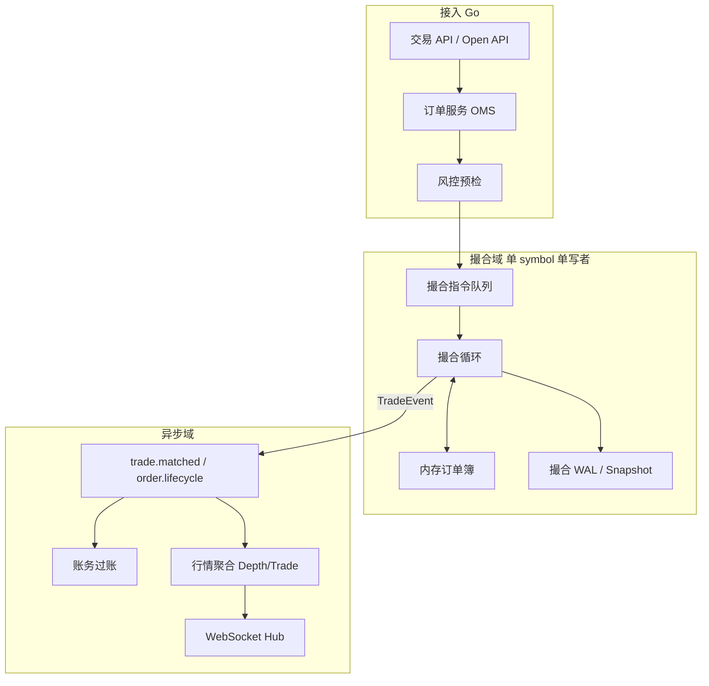
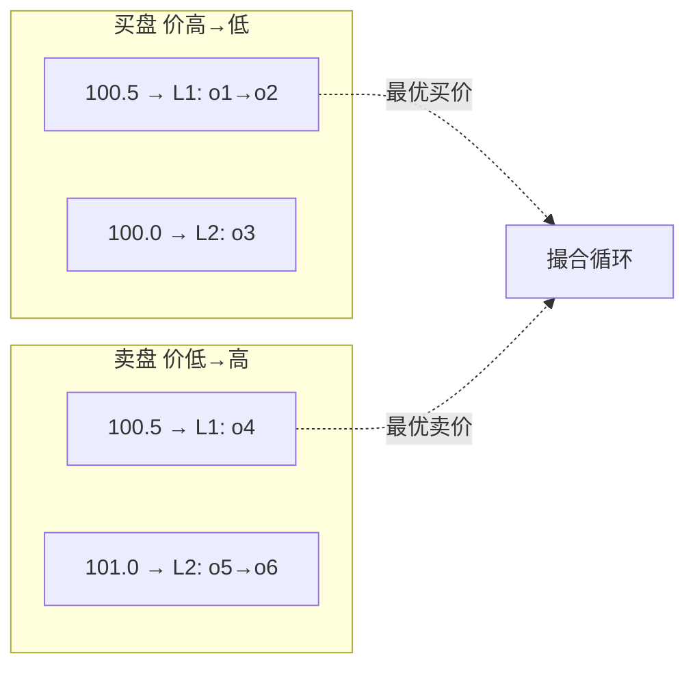
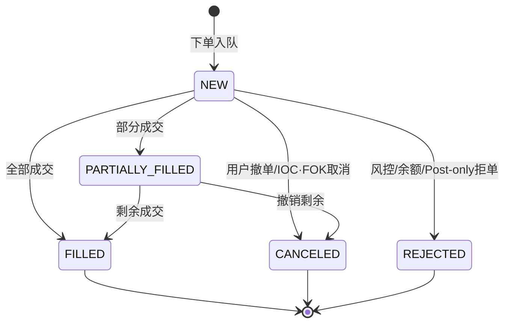
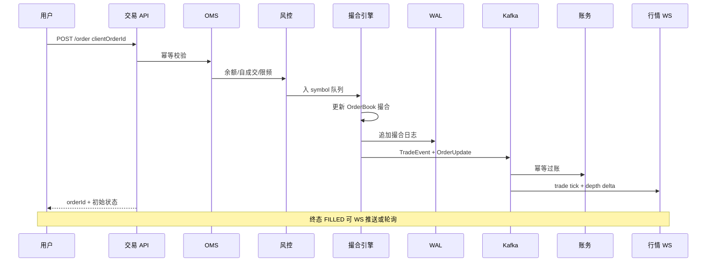

# CEX 撮合引擎与订单簿架构

## 30 秒版（开场）

> CEX 现货核心 = **内存订单簿（Order Book）+ 单 symbol 单写者撮合循环**：**价格优先、时间优先**；支持限价/市价/IOC/FOK/Post-only 等。Go 常做 **OMS、风控预检、WAL 持久化、行情 fan-out**；撮合热路径 **无锁单线程 per symbol**（或 Rust/C++ 内核 + Go 编排）。生产关键词：**clientOrderId 幂等、串行撮合、先 WAL 再异步账务、depth 增量推送**。

## 3 分钟版（一面深度）

1. **是什么**：买卖挂单在内存按价格档位排队，撮合引擎按规则匹配产生成交，输出不可变成交事实（Trade）。
2. **为什么**：交易所收入与口碑直接取决于撮合 **正确性（不超卖、不重复成交）** 与 **延迟（P99 下单确认）**；架构师面必画订单簿数据结构与单写者边界。
3. **怎么做**：`symbol` 维度一个撮合实例（单 goroutine/单线程）；订单经 OMS 幂等入库 → 风控 → 入撮合队列 → 更新 OrderBook → 写 WAL → 发 `trade.matched` 事件驱动账务（[S-EXCH-03](./S-EXCH-03-account-ledger.md)）与行情（[S-EXCH-11](./S-EXCH-11-websocket-market-hub.md)）。

## 10 分钟版（原理 + 图示）

### 交易域在 CEX 中的位置


```mermaid
flowchart TB
  subgraph Ingress[接入 Go]
    API[交易 API / Open API]
    OMS[订单服务 OMS]
    Risk[风控预检]
  end
  subgraph ME域[撮合域 单 symbol 单写者]
    Q[撮合指令队列]
    OB[内存订单簿]
    Match[撮合循环]
    WAL[撮合 WAL / Snapshot]
    Q --> Match
    Match <--> OB
    Match --> WAL
  end
  subgraph Async[异步域]
    MQ[trade.matched / order.lifecycle]
    Ledger[账务过账]
    MD[行情聚合 Depth/Trade]
    WS[WebSocket Hub]
  end
  API --> OMS --> Risk --> Q
  Match -->|TradeEvent| MQ
  MQ --> Ledger
  MQ --> MD --> WS
```

与全链路关系见 [S-EXCH-13 CEX 端到端架构](./S-EXCH-13-cex-end-to-end-architecture.md)。**撮合只产出成交事实，不直接改用户余额**——余额变更由账务服务幂等消费事件完成。

### 订单簿（Order Book）数据结构

订单簿 = **买盘（Bids）+ 卖盘（Asks）**，每侧按 **价格档位（Price Level）** 组织。

| 结构选型 | 实现 | 适用 |
|----------|------|------|
| 价格索引 | `map[price] *PriceLevel` 或有序树（跳表/红黑树） | O(1) 或 O(log n) 找档位 |
| 价格排序 | Bids：**价高优先**（降序）；Asks：**价低优先**（升序） | 撮合取最优对手价 |
| 同价排队 | 每档位 **FIFO 双向链表**（按 `orderId` / 入场时间） | 时间优先 |
| 订单索引 | `map[orderId]*Order` | O(1) 撤单、改单 |


```mermaid
flowchart LR
  subgraph Bids[买盘 价高→低]
    B1["100.5 → L1: o1→o2"]
    B2["100.0 → L2: o3"]
  end
  subgraph Asks[卖盘 价低→高]
    A1["100.5 → L1: o4"]
    A2["101.0 → L2: o5→o6"]
  end
  B1 -.最优买价.-> Match[撮合循环]
  A1 -.最优卖价.-> Match
```

**面试常问**：为什么不用 MySQL 做订单簿？→ 热路径要 **微秒～毫秒级** 更新，内存结构 + WAL 才能扛开盘洪峰；MySQL 做 **订单历史、审计、冷查询**。

### 撮合规则（现货标准）

| 规则 | 说明 |
|------|------|
| **价格优先** | 买单：出价高者优先成交；卖单：出价低者优先成交 |
| **时间优先** | 同价档位内，先进入订单簿者优先（FIFO） |
| **Pro-Rata** | 部分大宗/合约市场按挂单量比例分配（现货面试提一句即可） |
| **可成交条件** | 最高买价 ≥ 最低卖价时发生撮合 |

**限价买单撮合伪流程**（简化）：

1. 取卖盘最优价（最低 Ask）
2. 若 `buyPrice < bestAsk` → 无法成交，剩余挂入买盘（Limit GTC）
3. 若 `buyPrice >= bestAsk` → 与最优卖档成交 `min(buyQty, levelQty)`
4. 卖档耗尽则删档，继续下一档，直至买单量归零或价格不满足

### 订单类型（必背表）

| 类型 | 行为 | 未成交部分 | 典型用途 |
|------|------|------------|----------|
| **Limit GTC** | 指定价，可挂单 | 挂入订单簿 | 常规限价 |
| **Market** | 吃对手盘最优价 | 可能部分成交后取消（看交易所规则） | 快速成交 |
| **IOC** | 立即成交 | **剩余立即取消**，不挂单 | 吃单不挂单 |
| **FOK** | 全部立即成交 | **否则整单取消** | 大宗不暴露 |
| **Post-only** | 只做 Maker | 若会立即吃单则 **拒单** | 赚 maker 费率 |
| **GTX** | 同 Post-only 变体 | 拒单而非挂单 | 币圈常见命名 |

**Stop / Stop-Limit**（触发单）：价格触发后转为市价/限价进入撮合——通常由 **OMS 或独立触发服务** 监听最新价，触发后再送撮合队列，**不在订单簿内**直到激活。

### 订单状态机


```mermaid
stateDiagram-v2
  [*] --> NEW: 下单入队
  NEW --> PARTIALLY_FILLED: 部分成交
  NEW --> FILLED: 全部成交
  NEW --> CANCELED: 用户撤单/IOC·FOK取消
  NEW --> REJECTED: 风控/余额/Post-only拒单
  PARTIALLY_FILLED --> FILLED: 剩余成交
  PARTIALLY_FILLED --> CANCELED: 撤销剩余
  FILLED --> [*]
  CANCELED --> [*]
  REJECTED --> [*]
```

| 状态 | 含义 | 是否占订单簿 |
|------|------|--------------|
| NEW | 已接受，待撮合或已挂簿 | 限价挂单后占簿 |
| PARTIALLY_FILLED | 部分成交 | 剩余占簿 |
| FILLED | 完全成交 | 否 |
| CANCELED | 已撤销 | 否 |
| REJECTED | 拒绝，未进簿 | 否 |

撤单与下单 **必须进同一 symbol 队列**，保证与撮合循环 **全序**，避免「撤单先到但撮合已成交」的竞态由业务层乱序导致。

### 端到端时序（下单 → 成交 → 行情）


```mermaid
sequenceDiagram
  participant U as 用户
  participant API as 交易 API
  participant OMS as OMS
  participant Risk as 风控
  participant ME as 撮合引擎
  participant WAL as WAL
  participant MQ as Kafka
  participant Ledger as 账务
  participant WS as 行情 WS

  U->>API: POST /order clientOrderId
  API->>OMS: 幂等校验
  OMS->>Risk: 余额/自成交/限频
  Risk->>ME: 入 symbol 队列
  ME->>ME: 更新 OrderBook 撮合
  ME->>WAL: 追加撮合日志
  ME->>MQ: TradeEvent + OrderUpdate
  MQ->>Ledger: 幂等过账
  MQ->>WS: trade tick + depth delta
  API-->>U: orderId + 初始状态
  Note over U,WS: 终态 FILLED 可 WS 推送或轮询
```

### 撮合引擎内部架构（Go 常见落地）

| 组件 | 职责 | 要点 |
|------|------|------|
| **SymbolRouter** | 按 `symbol` 哈希到撮合实例 | 热门币独立 Pod/进程 |
| **CommandQueue** | 单消费者 channel / ring buffer | 下单、撤单、管理指令 **全序** |
| **OrderBook** | 内存簿 | `decimal` 计价，禁止 `float64` |
| **MatchLoop** | 处理指令 + 触发撮合 | **单 goroutine**，无 mutex |
| **WAL Writer** | 顺序写本地盘/专用存储 | 崩溃恢复重放 |
| **Publisher** | 异步发 MQ | 与撮合循环解耦，避免阻塞热路径 |

**与账务边界**：撮合前 OMS/风控做 **余额冻结**（或账务同步 gRPC 预扣）；成交后账务 **只加不减** 地按 Trade 过账，失败进 DLQ 人工补（[S-EXCH-03](./S-EXCH-03-account-ledger.md)）。

### WAL 与快照恢复

| 机制 | 说明 |
|------|------|
| **WAL 条目** | `PlaceOrder` / `CancelOrder` / `Trade` / `SnapshotMarker` |
| **写入顺序** | 撮合状态变更 **先写 WAL 再对外发事件**（或可证明等效顺序） |
| **快照** | 定时或每 N 条 WAL 打 OrderBook 快照，重启时 **快照 + 增量重放** |
| **恢复目标** | 订单簿与订单状态与宕机前 **一致**，`tradeId` 单调不重 |

面试话术：「丢 WAL 比丢账务更严重——撮合是资金事实源，必须可重放审计。」

### 行情输出（与撮合耦合点）

| 输出 | 内容 | 消费者 |
|------|------|--------|
| **Trade Tick** | 每笔成交价、量、方向、taker 侧 | K 线、WS、风控 |
| **Depth Delta** | 档位增减（非全量快照） | WS、Redis 缓存 |
| **Depth Snapshot** | 定时全量 N 档 | 新 WS 连接初始化 |

全量深度过大时：**快照走对象存储，WS 只推 delta**（[S-EXCH-11](./S-EXCH-11-websocket-market-hub.md)）。

### Maker / Taker 与费率

| 角色 | 定义 | 费率 |
|------|------|------|
| **Maker** | 挂单提供流动性（成交前已在簿上） | 通常更低或为负（返佣） |
| **Taker** | 吃单拿走流动性 | 通常更高 |

Post-only 的意义：保证订单 **不会以 Taker 身份成交**，适合做市策略。撮合循环内需在 **匹配前** 判断是否会立即成交，若是则拒单。

### Symbol 分片与扩展

| 策略 | 说明 |
|------|------|
| **一币对一实例** | BTC/USDT、ETH/USDT 独立撮合进程 |
| **冷门合并** | 多小币对同进程 **多队列** 仍保证每 symbol 单写者 |
| **水平扩展** | 增加 symbol 分片，**不能**多实例写同一订单簿 |
| **跨 symbol** | 无共享状态；组合单由 OMS 拆单 |

### Go 实现要点

| 主题 | 实践 |
|------|------|
| **幂等** | `clientOrderId` + `userId` 唯一（[S-ARCH-04](../03-system-design/S-ARCH-04-idempotency.md)） |
| **精度** | `shopspring/decimal` 或整数最小单位（satoshis） |
| **GC** | 热路径对象池、`sync.Pool` 复用 Order/Trade 结构 |
| **延迟** | 撮合循环 **禁止** RPC、DB；IO 放异步 goroutine |
| **可观测** | 每 symbol：队列深度、撮合耗时 histogram、WAL lag |

永续合约在订单簿规则上 **与现货相似**，但必须 **撮合+仓位同线程**——见 [S-EXCH-16](./S-EXCH-16-perpetual-matching-position.md)，不要与现货混实例。

## 生产场景

| 场景 | 策略 |
|------|------|
| **开盘/上新币爆量** | 市价单熔断、队列积压告警、临时扩容 symbol 实例 |
| **自成交（Wash Trade）** | 同 user 买卖对敲检测 → 拒单或强制 cancel |
| **价格偏离** | 限价相对标记价偏离 > X% 拒单（防错价单） |
| **精度与最小变动** | `tickSize`、`stepSize` 校验，拒不合规订单 |
| **维护窗口** | 停撮合前 flush WAL、打快照、拒新单 |

## 追问链

1. **撮合与账务谁先做？** → 撮合产生 **成交事实**；账务异步幂等消费，至少一次 + `tradeId` 去重。
2. **撤单如何保证有效？** → 撤单指令进 **同一 symbol 队列**，序号在撮合前则取消，之后则已成交（返回实际状态）。
3. **分库分 symbol？** → 订单历史按 `symbol` 分表；撮合内存 **按 symbol 分进程**，非 DB 分片能替代。
4. **与 DEX 区别？** → CEX 链下中央限价簿；DEX 链上 AMM 无传统订单簿（[S-EXCH-06](./S-EXCH-06-dex-amm-liquidity.md)）。
5. **Go 够快吗？** → 中低频现货、QPS 万级内常见 Go 单线程撮合；微秒级 HFT 核心多用 C++/Rust，Go 做 OMS/网关/运维面。
6. **如何保证不乱序？** → 单写者 + WAL 全序；MQ 分区键用 `symbol` 保成交事件有序。
7. **深度 100 档怎么推？** → 增量 delta + 周期快照；新连接先拉 snapshot 再订阅 delta。

## 反模式与事故

| 反模式 | 后果 |
|--------|------|
| 多 goroutine 并发改同一 OrderBook | data race、双花成交 |
| 无 `clientOrderId` 幂等 | 重试导致重复挂单 |
| 撮合用 `float64` 算价格 | 精度漂移、账务对不上 |
| 先推 WS 成交再写 WAL | 宕机丢成交，用户已看到假成交 |
| 账务与撮合同一事务 | 拖慢热路径，锁竞争 |
| 市价单无深度保护 | 插针时用户爆仓式成交 |

## 代码示例

### 订单簿核心结构（示意）

```go
type Order struct {
    ID        string
    UserID    string
    Side      Side // Buy / Sell
    Price     decimal.Decimal
    Qty       decimal.Decimal
    Remaining decimal.Decimal
    Type      OrderType
    Timestamp int64
}

type PriceLevel struct {
    Price  decimal.Decimal
    Orders []*Order // FIFO
    Total  decimal.Decimal
}

type OrderBook struct {
    Symbol string
    Bids   map[string]*PriceLevel // key = price string
    Asks   map[string]*PriceLevel
    BidPrices []decimal.Decimal   // 降序
    AskPrices []decimal.Decimal   // 升序
    Orders    map[string]*Order
}
```

### 撮合循环（单 goroutine）

```go
func (e *Engine) Run() {
    for cmd := range e.cmdCh {
        switch c := cmd.(type) {
        case *PlaceOrder:
            e.wal.Append(c)
            e.match(c.Order)
        case *CancelOrder:
            e.wal.Append(c)
            e.cancel(c.OrderID)
        }
        e.publishEvents() // 异步或批量刷出
    }
}
```

### 成交事件（下游账务消费）

```go
type TradeEvent struct {
    TradeID    string          `json:"trade_id"`
    Symbol     string          `json:"symbol"`
    Price      decimal.Decimal `json:"price"`
    Quantity   decimal.Decimal `json:"quantity"`
    TakerSide  Side            `json:"taker_side"`
    MakerOrdID string          `json:"maker_order_id"`
    TakerOrdID string          `json:"taker_order_id"`
    Ts         int64           `json:"ts"`
}
```

## 延伸阅读

- [S-EXCH-13 CEX 端到端架构](./S-EXCH-13-cex-end-to-end-architecture.md) — 45min 白板全链路
- [S-EXCH-03 账户与复式记账](./S-EXCH-03-account-ledger.md) — 成交后账务
- [S-EXCH-16 永续撮合与仓位引擎](./S-EXCH-16-perpetual-matching-position.md) — 合约差异
- [S-EXCH-11 WebSocket 行情 Hub](./S-EXCH-11-websocket-market-hub.md) — depth/trade 推送
- [S-ARCH-04 幂等设计](../03-system-design/S-ARCH-04-idempotency.md)
- [S-KAFKA-03 交易事件总线](../middleware/kafka/S-KAFKA-03-trade-event-bus.md)
- [LMAX 订单类型参考](https://docs.lmaxexchange.com/projects/lmax-exchange-manual/en/latest/Orders.html)
