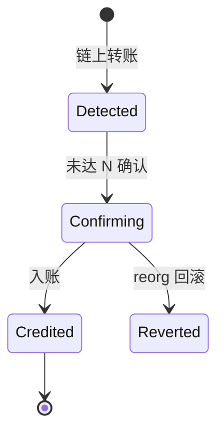

# 充值、提现与链上钱包体系

!!! tip "⭐ 重点准备"
    Web3 交易所 / 钱包方向高频题，见 [重点准备题单](../../resume-focus-web3.md)。

## 30 秒版（开场）

> CEX 充提 = **链上监听 + 内部账务入账 + 提现审核 + 热冷钱包签名广播**。架构师要讲清 **确认数、memo/tag、链重组回滚、提现状态机**。与 [S-BC-05 索引器](../12-blockchain-web3/S-BC-05-indexer-reorg.md) 同源，但多 **人工审核与风控**。

## 3 分钟版（一面深度）

1. **是什么**：用户链上转入平台地址 → 平台记账；提现反向：扣账 → 签名 tx → 广播。
2. **为什么**：资金入口/出口是盗币与合规重点。
3. **怎么做**：每链独立索引；`deposit_id` 幂等；提现多状态 + 2FA/白名单。

## 10 分钟版（状态机 + 架构）

**提现状态机**

| 状态 | 说明 |
|------|------|
| Pending | 用户申请 |
| RiskReview | 风控/大额人工 |
| Signing | 热钱包排队签名 |
| Broadcasting | 已广播 |
| Confirmed | 链上成功 |
| Failed | 失败退款账务 |

**钱包架构**

| 类型 | 用途 |
|------|------|
| 用户充值地址 | HD 派生或 memo（EOS/XRP） |
| 热钱包 | 日常提现，低余额 |
| 温/冷钱包 | 大额存储，离线签名 |
| Gas 钱包 | 专门补 ETH 作 Gas |

**多链注意**

- ERC20：监 `Transfer` 到平台地址（[S-BC-04](../12-blockchain-web3/S-BC-04-contract-abi-events.md)）
- 原生币：监 tx value
- **合约误充**：无法找回，前端强提示
- L2：不同 finality（[S-BC-07](../12-blockchain-web3/S-BC-07-l2-cross-chain-bridge.md)）

## 生产场景

- **小额快速充值**：N=1 测试网；主网 12+ 可配置 per 链
- **提现拥堵**：动态提 Gas fee；队列 + 用户可选快/慢
- **地址黑名单**：KYT 拦截（[S-EXCH-05](./S-EXCH-05-risk-reconciliation.md)）

## 追问链

1. **memo 币怎么充？** → 用户必须填 memo；索引按 (address, memo) 映射 userId。
2. **热钱包被盗？** → 限额、多签、延迟提现、保险基金。
3. **内部转账 vs 链上？** → 站内划转只改账务，无链上 tx。
4. **Go 签名在哪？** → 独立 Signer 服务（[S-BC-03](../12-blockchain-web3/S-BC-03-tx-signing-key-mgmt.md)）。

## 反模式与事故

- **0 确认入账** → 双花
- **提现扣账与广播非原子** → 重复出金需账务锁
- **链上地址无校验** → 错链充值丢失

## 延伸阅读

- [S-BC-05 索引器与 reorg](../12-blockchain-web3/S-BC-05-indexer-reorg.md)
