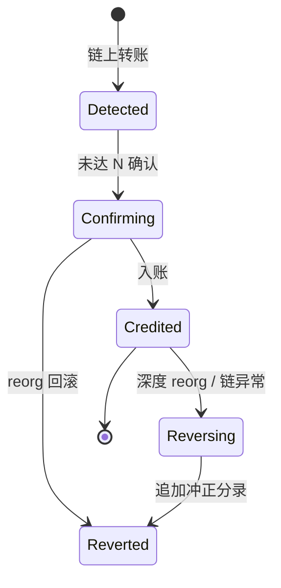

# 充值、提现与链上钱包体系

!!! tip "⭐ 重点准备"
    Web3 交易所 / 钱包方向高频题，见 [重点专题](../../web3-exchange-wallet-focus.md)。

## 30 秒版（开场）

> CEX 充提 = **canonical 链上索引 + 内部账务入账 + 提现审批/签名/广播状态机**。
> 架构师要讲清链的最终性模型、memo/tag、reorg 冲正、nonce/UTXO 预留和
> “广播结果未知”状态。与 [S-BC-05 索引器](../12-blockchain-web3/S-BC-05-indexer-reorg.md)
> 同源，但增加托管、风控与审计边界。

## 3 分钟版（一面深度）

1. **是什么**：用户链上转入平台地址 → 平台记账；提现反向：扣账 → 签名 tx → 广播。
2. **为什么**：资金入口/出口是盗币与合规重点。
3. **怎么做**：每链独立索引；`deposit_id` 幂等；提现多状态 + 2FA/白名单。

## 10 分钟版（状态机 + 架构）

```mermaid
stateDiagram-v2
  [*] --> Detected: 链上转账
  Detected --> Confirming: 未达 N 确认
  Confirming --> Credited: 入账
  Confirming --> Reverted: reorg 回滚
  Credited --> Reversing: 深度 reorg / 链异常
  Reversing --> Reverted: 追加冲正分录
  Credited --> [*]
```

**提现状态机**

| 状态 | 说明 |
|------|------|
| Pending | 用户申请 |
| RiskReview | 风控/大额人工 |
| Signing | 热钱包排队签名 |
| BroadcastUnknown | RPC 超时，尚不能确定节点是否已接收 |
| Broadcasted | 已获得 tx hash，等待打包/最终性 |
| Confirmed | 链上成功 |
| OnchainFailed | receipt 明确失败或交易按策略判定不可恢复 |
| Refunded | 在确认没有有效出金交易后，追加解冻/退款分录 |

**钱包架构**

| 类型 | 用途 |
|------|------|
| 用户充值地址 | HD 派生或 memo（EOS/XRP） |
| 热钱包 | 日常提现，低余额 |
| 温/冷钱包 | 大额存储，离线签名 |
| Gas 钱包 | 专门补 ETH 作 Gas |

**多链注意**

- ERC-20：只处理资产 allowlist 中合约的 canonical `Transfer`，同时校验 receipt、
  log identity、token decimals/行为与 reorg（[S-BC-04](../12-blockchain-web3/S-BC-04-contract-abi-events.md)）
- 原生币：仅扫描顶层 `tx.value` 会漏掉合约内部转账；应按链能力使用 traces、
  专用充值合约事件或受控地址余额/流水对账
- **误链/误资产/转入合约**：能否找回取决于地址控制权、token/链能力与平台政策；
  不应一概承诺“可找回”或“绝对无法找回”
- L2：不同 finality（[S-BC-07](../12-blockchain-web3/S-BC-07-l2-cross-chain-bridge.md)）

## 生产场景

- **小额快速充值**：可先展示 provisional 状态，但入账/可提现阈值应按链的概率或
  经济最终性、金额、资产风险和 reorg 历史分层；不存在通用的“主网 12+”
- **提现拥堵**：动态提 Gas fee；队列 + 用户可选快/慢
- **地址黑名单**：KYT 拦截（[S-EXCH-05](./S-EXCH-05-risk-reconciliation.md)）

## 深挖问答

1. **memo 币怎么充？** → 用户必须填 memo；索引按 (address, memo) 映射 userId。
2. **热钱包被盗？** → MPC/HSM/多签（按链能力）、最小热余额、分层额度、
   独立审批与 signer、异常熔断、冷资产隔离；保险不能替代预防控制。
3. **内部转账 vs 链上？** → 站内划转只改账务，无链上 tx。
4. **Go 签名在哪？** → 独立 Signer 服务（[S-BC-03](../12-blockchain-web3/S-BC-03-tx-signing-key-mgmt.md)）。

## 反模式与事故

- **把未最终确认充值直接变为可提现余额** → 暴露于 reorg、双花或链异常风险
- **试图用分布式锁把账务与链上广播“做成原子事务”** → 外部链无法加入本地事务；
  应使用账务 reservation + 持久化状态机 + payload 幂等 + nonce/UTXO reservation，
  并显式处理 RPC 超时后的 unknown 状态
- **链上地址无校验** → 错链充值丢失

## 延伸阅读

- [S-BC-05 索引器与 reorg](../12-blockchain-web3/S-BC-05-indexer-reorg.md)
