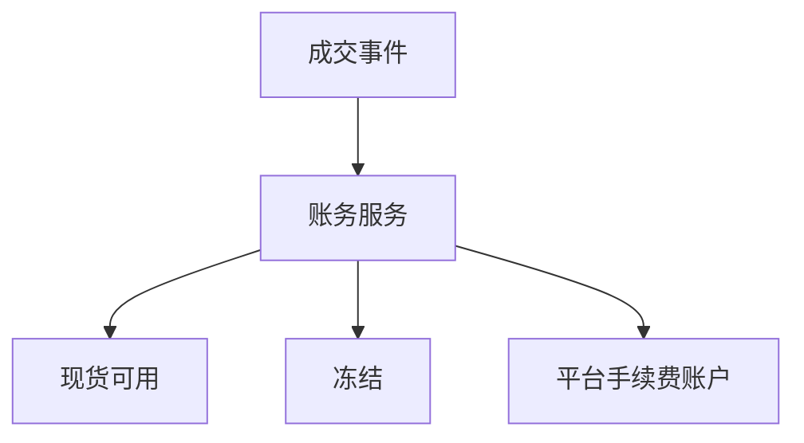

# 账户体系与资金账务（复式记账）

## 30 秒版（开场）

> 交易所资金 **不能** 只改 `users.balance` 一行：需 **复式记账**（借贷平衡）+ **账户类型**（现货/合约/冻结/手续费）。撮合成交、充提、强平都产生 **账务流水**。生产关键词：**不可变流水、TCC/本地事务、对账不平零容忍**。

## 3 分钟版（一面深度）

1. **是什么**：每笔业务生成借贷两条（或多条）流水，总和为零。
2. **为什么**：审计、监管、排障；面试考察是否懂「钱从哪来到哪去」。
3. **怎么做**：账户表 + `ledger_entry` 只 INSERT；余额 = 流水聚合或冗余字段+校验。

## 10 分钟版



**账户类型（常见）**

| 账户 | 说明 |
|------|------|
| SPOT_AVAILABLE | 现货可用 |
| SPOT_FROZEN | 挂单冻结 |
| MARGIN | 合约保证金 |
| INTEREST | 理财/借贷 |

**成交一笔示例（买方 USDT 买 BTC）**

| 账户 | 借(-) | 贷(+) |
|------|-------|-------|
| 用户 USDT 可用 | 1000 | |
| 用户 BTC 可用 | | 0.01 |
| 卖方 BTC | 0.01 | |
| 卖方 USDT | | 1000 |
| 平台手续费 | | fee |

**Go 实现要点**

```go
func (s *LedgerService) Post(ctx context.Context, bizID string, entries []Entry) error {
    return s.db.Transaction(func(tx *gorm.DB) error {
        if exists(bizID) { return nil } // 幂等
        for _, e := range entries {
            if err := insertEntry(tx, e); err != nil { return err }
            if err := updateBalance(tx, e); err != nil { return err }
        }
        return nil
    })
}
```

- `biz_id` = `trade_id` / `withdraw_id` UNIQUE
- 金额 `decimal.Decimal`
- 热点账户：异步汇总 + 日终对账

## 生产场景

- **站内划转**：现货 → 合约，双边账务
- **活动赠币**：平台营销账户 → 用户
- **差错调整**：需审批 + 审计留痕

## 追问链

1. **余额与流水不一致？** → 以流水为准重建；告警。
2. **与撮合顺序？** → 撮合先发事件；账务消费失败重试，不能丢。
3. **分布式事务？** → 单服务本地事务优先；跨服务用 Saga（[S-DIST-05](../middleware/distributed/S-DIST-05-distributed-transaction.md)）。
4. **冻结怎么实现？** → 可用→冻结转移，非直接减可用。

## 反模式

- **UPDATE balance 无流水** → 无法审计
- **float 记账** → 精度纠纷
- **并发扣款无锁** → 超卖余额

## 延伸阅读

- 本手册 [S-ARCH-04 幂等](../03-system-design/S-ARCH-04-idempotency.md)
