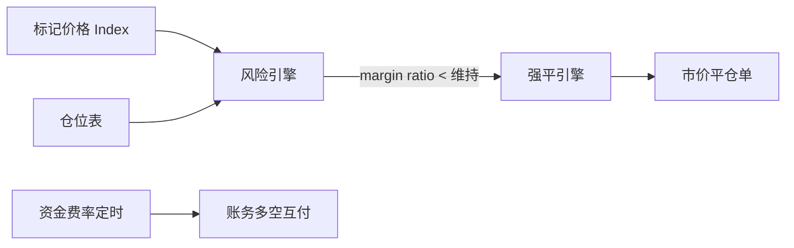

# 合约交易：保证金、强平、资金费率

## 30 秒版（开场）

> **永续合约** = 杠杆仓位 + **标记价格** 算盈亏 + **资金费率** 多空平衡 + **强平** 防穿仓。Go 后端：**标记价服务、风险引擎、强平队列、保险基金**。面试关键词：**逐仓/全仓、维持保证金、ADL 自动减仓**。

## 3 分钟版（一面深度）

1. **是什么**：不交割的衍生品；仓位、保证金、未实现盈亏实时变化。
2. **为什么**：CEX 合约团队核心考点；与现货撮合分离。
3. **怎么做**：标记价 Index（多交易所现货）；定时算 funding；保证金率低于阈值触发强平。

## 10 分钟版

**核心公式（简）**

- 未实现盈亏（多）≈ `(markPrice - entryPrice) * size`
- 保证金率 = `(walletBalance + unrealizedPnL) / positionValue`
- 维持保证金率 < 阈值 → 强平

**逐仓 vs 全仓**

| 模式 | 风险隔离 |
|------|----------|
| 逐仓 | 单仓位保证金 |
| 全仓 | 账户余额共享 |

**资金费率**

- 永续锚定现货：多空定期支付
- `fundingRate > 0` → 多付空
- 每 8h（或 1h）结算一次账务

**强平流程**

1. 风险引擎扫描（或事件驱动）
2. 取消用户挂单释放保证金
3. 下市价减仓单
4. 仍不足 → 保险基金接管 / ADL 减仓对手盈利方

## 生产场景

- **插针**：标记价用 Index 而非最新成交价
- **极端行情**：熔断、仅减仓模式、上调维持保证金率
- **Go 实现**：标记价 Redis + 广播；强平 worker 串行 per user

## 追问链

1. **标记价操纵？** → 多源加权、异常剔除。
2. **穿仓谁亏？** → 保险基金；再 ADL。
3. **交割合约？** → 有到期日，结算价交割。
4. **与 DEX 永续？** → 链上 vault + keeper 强平（[S-EXCH-06](./S-EXCH-06-dex-amm-liquidity.md) 不同范式）。

## 反模式

- **用最新成交价强平** → 插针误杀
- **强平与账务不同步** → 负余额

## 延伸阅读

- [S-SOLID-07 DeFi 模式](../13-solidity-contracts/S-SOLID-07-defi-patterns.md)（链上清算对比）
