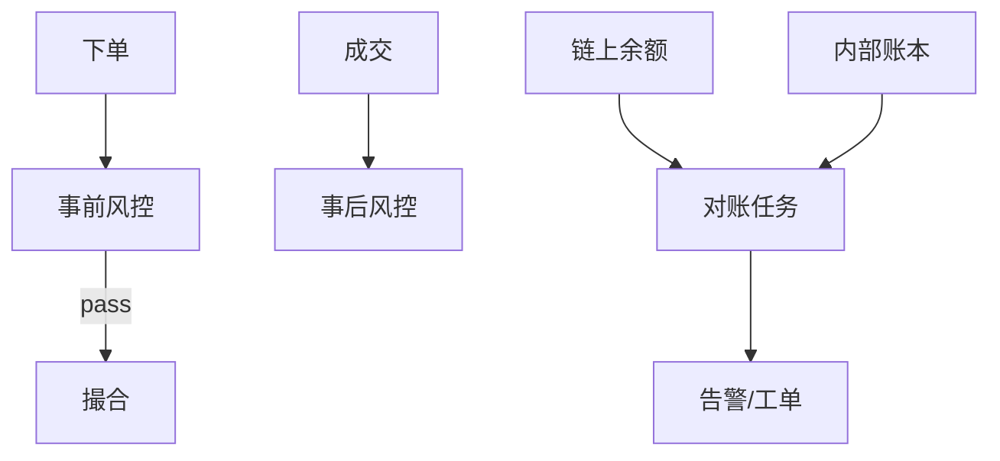

# 风控、反洗钱与对账体系

## 30 秒版（开场）

> 交易所风控 = **交易前（限额/频率/自成交）+ 交易后（异常盈利/对敲）+ 资金（充提 KYT/AML）+ 对账（链上 vs 内部账本）**。架构师要讲 **规则引擎可配置、实时+离线、审计留痕**。

## 3 分钟版（一面深度）

1. **是什么**：防欺诈、合规、资金一致性。
2. **为什么**：监管与资损双驱动；面试常问「如何发现内部账与链上不一致」。
3. **怎么做**：规则 DSL/配置中心；实时 Flink/流式；日终批对账。

## 10 分钟版

**事前规则示例**

| 规则 | 动作 |
|------|------|
| 单笔 > 限额 | 拒单 |
| 1min 撤单率过高 | 限频 |
| 同 IP 多账户 | 标记 |
| 提现地址黑名单 | 拦截 |

**对账维度**

| 对账 | 方法 |
|------|------|
| 用户总余额 vs 流水 | 日终 SUM(entries) |
| 热钱包链上 vs 平台负债 | 链上查询 + 内部汇总 |
| 成交 vs 账务 | trade_id 逐笔勾对 |
| 充提 vs 链上 tx | deposit_id/tx_hash |

**KYT/AML**

- 充提地址链上风险评分（Chainalysis 等）
- 大额提现人工 + 来源说明
- KYC 等级与限额绑定

## 生产场景

- **对账差 0.0001**：精度/遗漏入账；自动暂停提现
- **羊毛党**：设备指纹 + 行为模型
- **市场操纵**：拉盘检测、虚假深度

## 追问链

1. **规则热更新？** → 配置中心 + 版本号；撮合侧本地缓存 TTL。
2. **误杀申诉？** → 工单 + 人工 override 留痕。
3. **Go 风控服务？** → 低延迟 RPC；规则并行评估 timeout。
4. **DEX 风控？** → 链上无法拒单；前端警告 + 协议层限额（[S-EXCH-08](./S-EXCH-08-mev-sandwich.md)）。

## 反模式

- **对账只告警不熔断** → 小差累积成大案
- **风控与撮合同进程** → 规则拖垮撮合

## 延伸阅读

- [S-ARCH-08 限流](../03-system-design/S-ARCH-08-rate-limiting.md)
