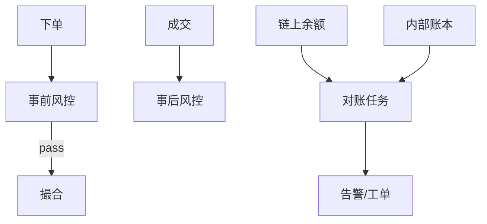

# 风控、反洗钱与对账体系

## 30 秒版（开场）

> 交易所风控 = **交易前（限额/频率/自成交）+ 交易后（异常盈利/对敲）+ 资金（充提 KYT/AML）+ 对账（链上 vs 内部账本）**。架构师要讲 **规则引擎可配置、实时+离线、审计留痕**。

## 3 分钟版（一面深度）

1. **是什么**：防欺诈、合规、资金一致性。
2. **为什么**：监管与资损双驱动；面试常问「如何发现内部账与链上不一致」。
3. **怎么做**：规则 DSL/配置中心；实时 Flink/流式；日终批对账。

## 10 分钟版

```mermaid
flowchart TB
  Order[下单] --> PreRisk[事前风控]
  PreRisk -->|pass| ME[撮合]
  Trade[成交] --> PostRisk[事后风控]
  Chain[链上余额] --> Recon[对账任务]
  Ledger[内部账本] --> Recon
  Recon --> Alert[告警/工单]
```

**事前规则示例**

| 规则 | 动作 |
|------|------|
| 单笔 > 限额 | 拒单 |
| 1min 撤单率过高 | 限频 |
| 同 IP 多账户 | 标记 |
| 提现地址黑名单 | 拦截 |

**对账维度**

| 对账 | 方法 |
|------|------|
| 账务内部试算平衡 | 每个 journal 借贷平衡；由期初 + append-only 分录重算余额并核对快照 |
| 托管资产 vs 客户负债 | 汇总所有受控热/温/冷地址、在途资产和明确调整项，再与分资产客户负债核对；不能只看一个热钱包 |
| 成交 vs 账务 | trade_id 逐笔勾对 |
| 充提 vs 链上 tx | deposit_id/tx_hash |

**KYT/AML**

- 充提地址链上风险评分（Chainalysis 等）
- 大额提现人工 + 来源说明
- KYC 等级与限额绑定

## 生产场景

- **出现差异**：先按资产精度、链费、在途交易和 materiality 分类；超过风险阈值或
  无法解释时按资产/链分域暂停相关操作，避免用固定 `0.0001` 套所有资产
- **羊毛党**：设备指纹 + 行为模型
- **市场操纵**：拉盘检测、虚假深度

## 追问链

1. **规则热更新？** → 配置中心 + 签名/审批 + 版本号 + 原子切换；关键资金规则应
   明确配置不可用时 fail-closed 还是沿用 last-known-good，不能只依赖 TTL 自然过期。
2. **误杀申诉？** → 工单 + 人工 override 留痕。
3. **Go 风控服务？** → 低延迟 RPC；规则可并行评估，但超时策略按风险等级设计：
   资金/权限规则通常 fail-closed，非关键画像可降级并留痕。
4. **DEX 风控？** → 已部署的 permissionless 协议无法由中心后端任意拦截用户，但
   合约本身仍可按设计 revert、限额、pause 或做 allowlist；前端风控不是链上安全控制
   （[S-EXCH-08](./S-EXCH-08-mev-sandwich.md)）。

## 反模式

- **任何微小差异都全站熔断，或任何差异都只告警** → 应按资产、链、账户和
  materiality 分级隔离，同时保留人工升级路径
- **风控与撮合同进程** → 规则拖垮撮合

## 延伸阅读

- [S-ARCH-08 限流](../03-system-design/S-ARCH-08-rate-limiting.md)
