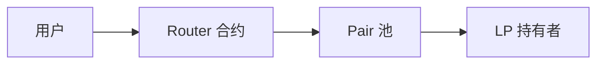

# DEX AMM、流动性池与 LP 收益

## 30 秒版（开场）

> DEX 无订单簿撮合（AMM 类）= **x·y=k 恒定乘积**（或 Curve 稳定币曲线）+ **LP 代币** 代表池份额。工程师要懂 **swap 公式、滑点、无常损失、手续费分配**。链上合约见 [S-SOLID-07](../13-solidity-contracts/S-SOLID-07-defi-patterns.md)；Go 侧做 **索引、报价 API、路由**。

## 3 分钟版（一面深度）

1. **是什么**：用户与池子交易；价格由储备量决定。
2. **为什么**：DEX 面试核心；与 CEX 订单簿对比必考。
3. **怎么做**：监听 `Swap`/`Mint`/`Burn`；链下算报价；前端 Router 调合约。

## 10 分钟版

**Uniswap V2 swap（含 0.3% 手续费）**

- `amountOut = (amountIn * 997 * reserveOut) / (reserveIn * 1000 + amountIn * 997)`
- 无手续费简化版：`amountOut = amountIn * reserveOut / (reserveIn + amountIn)`

**无常损失（IL）**

- 价格偏离初始比例时，LP 组合价值 < 单纯持有币
- 面试能说：**手续费收益 vs IL 权衡**

**V3 集中流动性**

- 流动性集中在 `[tickLower, tickUpper]`
- 资本效率更高；Go 索引需解析 tick 与 position NFT

**Go 后端职责**

| 职责 | 说明 |
|------|------|
| 池子索引 | 储备、TVL、24h volume |
| 报价服务 | 链下模拟 swap（eth_call） |
| LP 收益 | 累计手续费 per LP share |
| 新池监听 | Factory `PairCreated` |

## 生产场景

- **低流动性池**：大额 swap 高滑点 → 前端预警
- **假池钓鱼**：校验 Factory 地址与 init code hash
- **Reorg**：索引延迟确认（[S-BC-05](../12-blockchain-web3/S-BC-05-indexer-reorg.md)）

## 追问链

1. **CEX 深度 vs AMM？** → 订单簿人为挂单；AMM 算法定价。
2. **闪电贷攻击？** → 单笔 tx 内借还操纵价格（[S-SOLID-07](../13-solidity-contracts/S-SOLID-07-defi-patterns.md)）。
3. **稳定币池？** → Curve `A` 参数曲线，低滑点。
4. **链下订单簿 DEX？** → dYdX 等 hybrid，接近 CEX 体验。

## 反模式

- **报价用缓存储备过久** → 与实际池不同步
- **忽略 fee tier** → V3 多 fee 池同 pair

## 延伸阅读

- [S-SOLID-07 DeFi 模式](../13-solidity-contracts/S-SOLID-07-defi-patterns.md)
