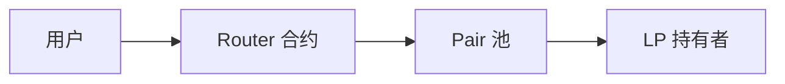

# DEX AMM、流动性池与 LP 收益

## 30 秒版（开场）

> **AMM 类 DEX** 让用户与流动性池交易；经典 V2 池可用 `x·y=k` 描述，
> 稳定币池和集中流动性使用不同曲线。V2 常用可替代 LP token 表示份额，V3
> 集中流动性仓位通常是带区间的非同质化 position。DEX 也可以采用订单簿，
> 所以不要把“DEX”与“AMM”画等号。

## 3 分钟版（一面深度）

1. **是什么**：用户与池子交易；边际价格与执行价格由曲线、当前流动性、费用和
   交易规模共同决定，不只是简单读取一个储备比例。
2. **为什么**：DEX 协议核心；与 CEX 订单簿对比必考。
3. **怎么做**：监听 `Swap`/`Mint`/`Burn`；链下算报价；前端 Router 调合约。

## 10 分钟版

**经典 Uniswap V2 swap（输入费率 0.3%，标准 token 的简化公式）**

- `amountOut = (amountIn * 997 * reserveOut) / (reserveIn * 1000 + amountIn * 997)`
- 无手续费简化版：`amountOut = amountIn * reserveOut / (reserveIn + amountIn)`

该公式使用 swap 前储备；不同 fee、fee-on-transfer/rebasing token、V3/V4 或其他
曲线不能直接套用。

```mermaid
flowchart LR
  User[用户] --> Router[Router 合约]
  Router --> Pool[Pair 池]
  Pool --> LP[LP 持有者]
```

**无常损失（IL）**

- “无常损失”通常指忽略费用等收益时，AMM LP 相对按初始数量持有资产的价值差；
  净收益还要叠加手续费、激励、再平衡和 gas，不能直接断言 LP 最终一定亏损

**V3 集中流动性**

- 流动性集中在 `[tickLower, tickUpper]`
- 资本效率更高；Go 索引需解析 tick 与 position NFT

**Go 后端职责**

| 职责 | 说明 |
|------|------|
| 池子索引 | 储备、TVL、24h volume |
| 报价服务 | 基于最新 canonical 状态做路径计算/`eth_call`；结果是快照，不保证提交时仍成立 |
| LP 收益 | V2 通常通过储备增长体现在 LP 份额价值；V3 需按 position、tick 和 fee growth 计算，不能统一成一个 `fee per LP share` |
| 新池监听 | Factory `PairCreated` |

## 生产场景

- **低流动性池**：大额 swap 高滑点 → 前端预警
- **假池钓鱼**：校验 Factory 地址与 init code hash
- **交易保护**：链上调用仍要设置可接受的 `amountOutMinimum`/价格边界和 deadline；
  后端报价或 `eth_call` 成功不是成交保证
- **Reorg**：保存区块 lineage，识别 orphaned 事件并重算，而不只是统一“延迟 N 块”
  （[S-BC-05](../12-blockchain-web3/S-BC-05-indexer-reorg.md)）

## 深挖问答

1. **CEX 深度 vs AMM？** → 订单簿人为挂单；AMM 算法定价。
2. **闪电贷攻击？** → 闪电贷提供原子资金，会放大依赖可操纵 spot price 或错误
   会计不变量的漏洞；应说清被攻击的具体协议假设
   （[S-SOLID-07](../13-solidity-contracts/S-SOLID-07-defi-patterns.md)）。
3. **稳定币池？** → Curve `A` 参数曲线，低滑点。
4. **订单簿 DEX？** → 可采用链上订单簿，或链下传播/排序、链上验证与结算的混合
   模型；需继续追问信任假设、撤单语义、数据可用性和 MEV。

## 反模式

- **报价用缓存储备过久** → 与实际池不同步
- **忽略 fee tier** → V3 多 fee 池同 pair

## 延伸阅读

- [S-EXCH-30 Uniswap V2/V3 协议深挖](./S-EXCH-30-uniswap-v2-v3-protocol.md)
- [S-EXCH-29 Staking / LM / Farm](./S-EXCH-29-defi-staking-liquidity-mining-yield.md)
- [S-SOLID-07 DeFi 模式](../13-solidity-contracts/S-SOLID-07-defi-patterns.md)
