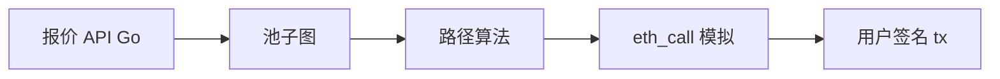

# DEX 聚合路由、滑点与 Gas 优化

## 30 秒版（开场）

> **聚合器**（1inch、Paraswap）在多个池/路径间找最优 **amountOut** 或 **amountIn**，可能 **多跳 split**。Go 后端：**路径搜索、链下模拟、Gas 估算、slippage 保护参数**。用户设 `amountOutMin` 防滑点；`deadline` 防挂单过久。

## 3 分钟版（一面深度）

1. **是什么**：一笔 swap 可能经 WETH→USDC→TOKEN 多池。
2. **为什么**：单池流动性不足；面试考路由与链上执行差异。
3. **怎么做**：图搜索 + 动态规划 split；`eth_call` 验证；Router 合约原子执行。

## 10 分钟版

**滑点控制**

| 参数 | 作用 |
|------|------|
| `amountOutMin` | 最少收到量 |
| `sqrtPriceLimitX96` | V3 价格边界 |
| `deadline` | 超时 revert |

**路由算法（简）**

- 节点：代币；边：池子 swap 函数
- 小图：Dijkstra / BFS 单路径
- 大图：启发式 + 预计算热门路径缓存
- Split：多路径按比例分配 input（线性近似迭代）

**Gas 优化**

- 批量 `multicall`
- 优先 L2（[S-BC-07](../12-blockchain-web3/S-BC-07-l2-cross-chain-bridge.md)）
- 私有 RPC / Flashbots 降低失败 tx 浪费（[S-EXCH-08](./S-EXCH-08-mev-sandwich.md)）

## 生产场景

- **报价 3s 过期**：池子变化导致 tx revert
- **税币 / 转账限制**：模拟与实发不一致 → token 黑名单
- **MEV**：公开 tx 被夹 → 私有通道

## 追问链

1. **链下最优 ≠ 链上最优？** → 同区块其他人先成交改变储备。
2. **CEX 聚合？** → 多交易所 API 最优价，无 Gas，有提现延迟。
3. **Go 性能？** → 热门 pair 预计算；全图搜索限 depth。
4. **限价单 DEX？** → CoW、Uniswap X 等 off-chain 匹配。

## 反模式

- **不设 amountOutMin** → 三明治吃大滑点
- **路由不校验池合法性** → 恶意池偷币

## 延伸阅读

- [S-EXCH-08 MEV 与三明治](./S-EXCH-08-mev-sandwich.md)
