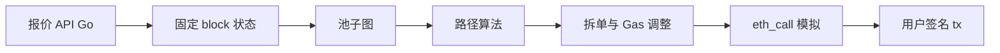

# DEX 聚合路由、滑点与 Gas 优化

## 30 秒版（开场）

> **聚合器**在多个池和路径间搜索，目标不是名义报价最大，而是 **扣除 Gas 后的可执行最优结果**，并可能把输入拆到多条路径。AMM 的边权随交易量和池状态变化，不能直接把它当固定权重图跑普通 Dijkstra。用户侧必须有 `amountOutMin`/`amountInMax`、截止条件和交易模拟。

## 3 分钟版（一面深度）

1. **是什么**：一笔 swap 可能经 WETH→USDC→TOKEN 多池。
2. **为什么**：单池流动性不足；面试考路由与链上执行差异。
3. **怎么做**：在固定区块状态上枚举并裁剪候选路径，按真实 AMM quote 计算结果，再用边际收益迭代或离散 DP 优化拆单；把 Gas 换算成目标资产后比较，最后用 `eth_call` 模拟 Router 的原子执行。

## 10 分钟版

```mermaid
flowchart LR
  API[报价 API Go] --> Snapshot[固定 block 状态]
  Snapshot --> Graph[池子图]
  Graph --> Path[路径算法]
  Path --> Split[拆单与 Gas 调整]
  Split --> Sim[eth_call 模拟]
  Sim --> Tx[用户签名 tx]
```

**滑点控制**

| 参数 | 作用 |
|------|------|
| `amountOutMin` | 最少收到量 |
| `amountInMax` | exact-output 模式最多支付量 |
| `sqrtPriceLimitX96` | V3 单池价格边界，不能代替整条路由的最小到账保护 |
| `deadline` / blockhash 条件 | 防止旧报价长期有效 |

**路由算法（正确表述）**

- 节点：代币；边：池子 swap 函数
- 边的输出是 `quote(poolState, amountIn)`，存在价格冲击、V3 tick 跨越和手续费；它不是与输入规模无关的常数权重
- 先按最大 hop、白名单中间币、池深度和流动性等条件枚举/beam-search 候选，避免环路和组合爆炸
- 在同一个 block number/tag 上读取池状态并报价；单路径可比较真实 `amountOut`
- 多路径拆单时按“再分配一小份输入的边际输出”迭代，或把输入离散成份额做 DP；不能用一次线性比例近似代表最终最优
- exact-input 的常见目标：最大化 `amountOut - gasCostInQuoteToken`；exact-output 则最小化输入与 Gas 成本
- 最终 calldata 必须整体模拟；链下报价即使正确，也可能因上链前状态变化而失效

普通 BFS 可以用于枚举 hop 数受限的候选路径；只有在构造了满足算法假设的近似权重后才谈 Dijkstra，不能直接说“Dijkstra 就能求 AMM 最优路由”。

**Gas 优化**

- 报价读取可批量 RPC/Multicall；执行侧应生成一笔原子 Router 交易，减少无用 hop、外部 call 和 calldata
- 比较路由时使用 gas-adjusted quote；“少一跳”不一定胜过更深流动性的多跳路径
- Permit/Permit2 可减少独立 approve 交易，但必须限制 spender、额度、deadline 和签名域
- L2 是部署与用户成本选择，不是同一条链上算法的通用“Gas 优化开关”（[S-BC-07](../12-blockchain-web3/S-BC-07-l2-cross-chain-bridge.md)）
- 私有提交主要降低抢跑/夹单和泄露风险，不等于保证更低 Gas 或一定成交（[S-EXCH-08](./S-EXCH-08-mev-sandwich.md)）

## 生产场景

- **报价过期**：返回 quote block、TTL 与保护参数；池状态变化可能让交易 revert 或只拿到 `amountOutMin`
- **税币 / rebasing / hook / 转账限制**：标准 AMM 公式可能失真，需按真实 calldata 模拟并配置 token/pool 风险策略
- **MEV**：公开 tx 被夹 → 私有通道

## 追问链

1. **链下最优 ≠ 链上最优？** → 同区块其他人先成交改变储备。
2. **CEX 聚合？** → 多交易所 API 最优价，无 Gas，有提现延迟。
3. **Go 性能？** → 热门池状态缓存 + 增量更新；搜索限 hop/候选数/计算预算，并在指定 block 版本下保证快照一致。
4. **限价单 DEX？** → CoW、Uniswap X 等 off-chain 匹配。

## 反模式

- **不设 amountOutMin** → 三明治吃大滑点
- **路由不校验池合法性** → 恶意池偷币
- **把池当固定权重边跑 Dijkstra** → 忽略交易规模导致的价格冲击
- **只比较 amountOut 不比较 Gas** → 小额交易选出经济上更差的复杂路径

## 延伸阅读

- [S-EXCH-08 MEV 与三明治](./S-EXCH-08-mev-sandwich.md)
- [Uniswap Smart Order Router](https://github.com/Uniswap/smart-order-router)
- [Uniswap Routing API 的 gas-adjusted quote](https://github.com/Uniswap/routing-api)
