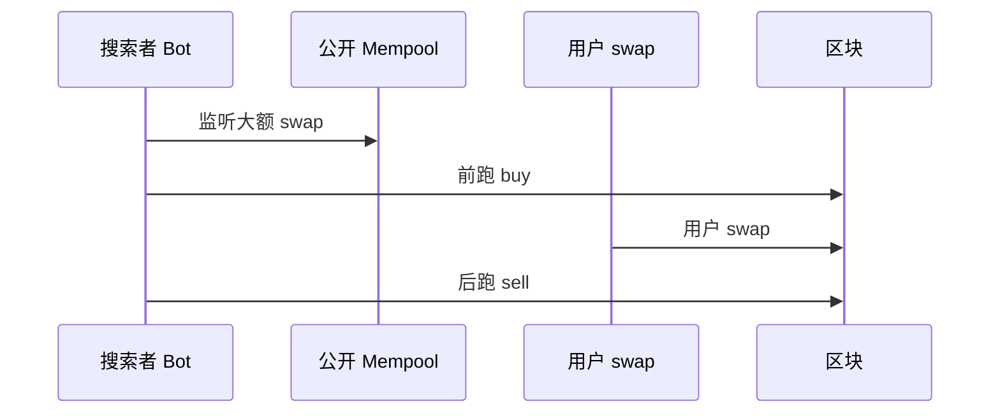

# MEV、抢跑与三明治攻击防护

## 30 秒版（开场）

> **MEV** = 区块生产者/搜索者通过 **交易排序** 获利（夹单、清算抢跑、DEX 套利）。用户大额 swap 易遭 **三明治**：前跑抬高价 → 用户成交 → 后跑卖出。防护：**私有交易通道（Flashbots Protect）、slippage 限制、分批、TWAP**。

## 3 分钟版（一面深度）

1. **是什么**：公开 mempool 中可观测 pending tx 被利用。
2. **为什么**：DEX 工程师必懂；CEX 无此问题（链下撮合）。
3. **怎么做**：产品层 + 基础设施层双层防护。

## 10 分钟版

**攻击类型**

| 类型 | 说明 |
|------|------|
| 三明治 | 夹用户 swap |
| 清算抢跑 | 抢先强平拿奖励 |
| 套利 | 跨池价差 |
| JIT LP | 临时提供流动性抽 fee |

**防护手段**

| 层级 | 手段 |
|------|------|
| 用户 | 低滑点容忍、小额、L2 |
| 前端 | Flashbots RPC、MEV Blocker |
| 协议 | CoW 批量拍卖、RFQ |
| 后端 | 私有 relayer、不广播到公开 mempool |

**Go 后端角色**

- 对接 Flashbots `eth_sendBundle`
- 监控自家 Router 被夹比例
- 告警异常 `effectiveGasPrice` 与 `price impact`

## 生产场景

- **launch 新币**：机器人扎堆 → 限流 + 人机验证
- **清算 bot 竞争**：gas 竞价；协议设计清算折扣
- **CEX 对比**：订单簿内部撮合无公开 mempool MEV

## 追问链

1. **Flashbots 原理？** → 搜索者 bundle 竞标排序权，不经过公开 mempool。
2. **EIP-1559 与 MEV？** → base fee 销毁；priority fee 给 builder。
3. **L2 MEV？** → Sequencer 中心化排序，另有风险。
4. **链上防夹合约？** → 难完全防；依赖用户参数与私有提交。

## 反模式

- **教育用户 slippage 50%** → 等于送钱给 bot
- **大额 swap 走公开 RPC** → 必被监控

## 延伸阅读

- [S-BC-06 DeFi 后端模式](../12-blockchain-web3/S-BC-06-defi-backend-patterns.md)
