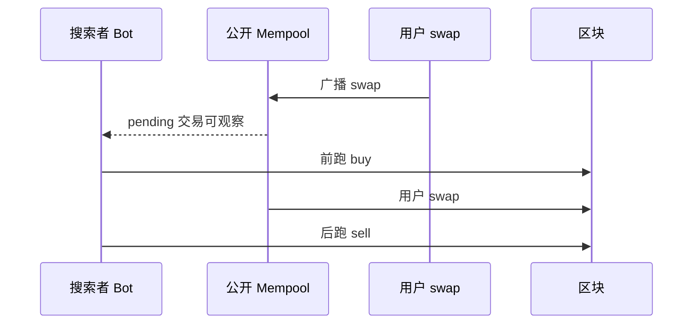

# MEV、抢跑与三明治攻击防护

## 30 秒版（开场）

> **MEV** 是通过包含、排除或重排交易获得的额外价值。搜索者发现机会，builder/validator/sequencer 等排序参与者决定能否落块。三明治是：攻击者前跑改变价格 → 用户按容忍滑点成交 → 攻击者后跑获利。防护重点是 **严格滑点、私有订单流、批量拍卖/RFQ 与协议级设计**；简单分批或 TWAP 也可能持续泄露意图。

## 3 分钟版（一面深度）

1. **是什么**：排序参与者通过包含、排除和重排交易提取价值；三明治是其中依赖可观察用户订单流的一类攻击。
2. **为什么**：DEX 工程师必懂；CEX 没有公开 mempool 三明治，但仍有内部排序公平性、延迟套利和利益冲突风险，不能回答成“CEX 完全没有 MEV 类问题”。
3. **怎么做**：产品层 + 基础设施层双层防护。

## 10 分钟版

```mermaid
sequenceDiagram
  participant Bot as 搜索者 Bot
  participant MP as 公开 Mempool
  participant User as 用户 swap
  participant Block as 区块
  User->>MP: 广播 swap
  MP-->>Bot: pending 交易可观察
  Bot->>Block: 前跑 buy
  MP->>Block: 用户 swap
  Bot->>Block: 后跑 sell
```

**攻击类型**

| 类型 | 说明 |
|------|------|
| 三明治 | 夹用户 swap |
| 清算抢跑 | 抢先强平拿奖励 |
| 套利 | 跨池价差 |
| JIT LP | 临时提供流动性抽 fee |

**防护手段**

| 层级 | 手段 |
|------|------|
| 用户 | 合理且尽量紧的滑点、限价/意图订单，避免盲目拆单 |
| 前端 | Flashbots Protect、MEV Blocker 等私有提交入口 |
| 协议 | 批量拍卖、RFQ、commit-reveal、动态费用等机制 |
| 后端 | 私有 relayer、失败回退策略、泄露面与审查风险监控 |

**Go 后端角色**

- 保护普通用户交易时，对接 provider 的私有交易 RPC；具体方法名由服务商定义
- 搜索者、keeper 或需要原子多交易执行时，才使用 `eth_sendBundle` 一类 bundle 接口
- 监控自家 Router 被夹比例
- 通过同块前后交易、池状态变化和地址聚类识别疑似夹单；不能只靠 `effectiveGasPrice`

**Ethereum 当前区块构建链路（简化）**

`searcher / private order flow → builder → relay → proposer`

在 MEV-Boost/PBS 风格流程中，builder 构造 execution payload 并向 proposer 出价，proposer 选择最高有效 bid。它与“每笔交易的 priority fee 直接给 builder”不是一回事。

## 生产场景

- **launch 新币**：机器人扎堆 → 限流 + 人机验证
- **清算 bot 竞争**：gas 竞价；协议设计清算折扣
- **CEX 对比**：订单簿内部撮合没有公开 mempool，但需要可审计的撮合优先级、时钟、权限隔离和公平接入

## 追问链

1. **Flashbots Protect 与 bundle 区别？** → Protect 面向用户私有提交；bundle 面向搜索者/keeper 的有序原子交易集合。两者都可能绕开公开 mempool，但接口与目标不同。
2. **EIP-1559 费用给谁？** → base fee 销毁；priority fee 计入执行层 `feeRecipient/coinbase`。在 builder 市场里，builder 再通过独立 bid 向 proposer 支付，不能把两笔经济关系混成一句“tip 给 builder”。
3. **L2 MEV？** → 中心化或少数 sequencer 掌握排序权；还要考虑 forced inclusion、共享排序器、批次发布与跨域 MEV。
4. **链上防夹合约？** → 难完全防；依赖用户参数与私有提交。

## 反模式

- **教育用户 slippage 50%** → 等于送钱给 bot
- **大额 swap 走公开 RPC** → 交易意图暴露给 mempool 观察者，夹单风险显著
- **私有 RPC 当成绝对安全** → 仍需评估信任、泄露、审查、失败后是否回落公开 mempool

## 延伸阅读

- [S-BC-06 DeFi 后端模式](../12-blockchain-web3/S-BC-06-defi-backend-patterns.md)
- [Ethereum.org：MEV](https://ethereum.org/en/developers/docs/mev/)
- [Flashbots 文档](https://docs.flashbots.net/)
- [EIP-1559](https://eips.ethereum.org/EIPS/eip-1559)
