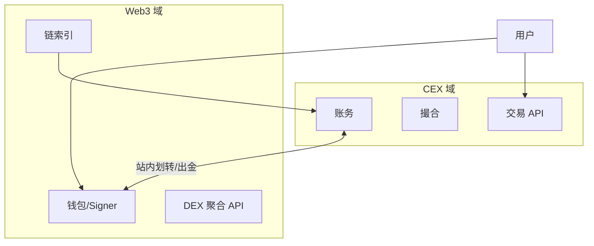

# CEX 与 DEX 混合架构（CeDeFi）

## 30 秒版（开场）

> **CeDeFi / 混合交易所** = CEX 体验（托管账户、法币、低延迟）+ DEX 资产（链上提现、Wallet Connect、链上赚币）。架构师要画清 **两条资金链**：站内账务 vs 链上钱包；以及 **合规、对账、用户教育** 边界。

## 3 分钟版（一面深度）

1. **是什么**：同一 App 内现货 CEX + Web3 钱包/DEX 入口。
2. **为什么**：交易所转型 Web3 常见面试场景。
3. **怎么做**：账户体系隔离或打通；充提桥接；统一风控视图。

## 10 分钟版

**典型产品形态**

| 形态 | 说明 |
|------|------|
| 托管交易 + 链上提 | 经典 CEX |
| 嵌入式 DEX | App 内 swap，平台收路由费 |
| 全自托管 | 仅前端 + RPC，无 CEX 账本 |
| 子账户 / MPC 钱包 | 链上地址平台协管 |

**打通难点**

| 难点 | 方案 |
|------|------|
| 同一用户 CEX/DEX 身份 | 统一 UID + 绑定链地址 |
| 资产显示 | CEX 余额 + 链上余额聚合 |
| 合规 | 链上交互 KYT；地域限制 |
| 对账 | 热钱包负债 = 用户链上托管总和 + 平台垫资 |

**Go 统一后端**

- **BFF 层**：聚合 CEX REST + Web3 服务
- **事件总线**：链上充值确认 → 触发 CEX 入账或仅展示
- **特性开关**：按地区开/关 DEX 模块

## 生产场景

- **用户混淆托管与链上** → 充错地址；强 UI 区分
- **站内「闪兑」** → 后台走 CEX 流动性或链上 Router，两套报价
- **Launchpad** → 链上认购 + CEX 分销 KYC

## 追问链

1. **为什么大厂做 DEX 模块？** → 留存、上币、手续费、生态。
2. **链上失败 CEX 已扣？** → Saga：预扣 → 广播 → 确认结算/回滚。
3. **与纯 DEX 聚合器区别？** → 可能有托管流动性、法币入口。
4. **架构师汇报怎么讲？** → 两域隔离、事件驱动、统一风控与对账。

## 反模式

- **CEX 账本与链上钱包混一张表** → 审计噩梦
- **无绑定点就链上入账** → 无法归属用户

## 延伸阅读

- [S-EXCH-02 充提钱包](./S-EXCH-02-deposit-withdraw-wallet.md)
- [S-EXCH-03 账务](./S-EXCH-03-account-ledger.md)
- [S-BC-01 EVM 基础](../12-blockchain-web3/S-BC-01-blockchain-evm-basics.md)
