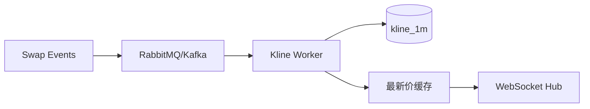

!!! tip "⭐ 重点准备"
    与 **CoinRoll K 线 / 成交流水** 履历高度匹配，见 [Gary 题单](../../resume-focus-gary.md)。

# 链上成交事件驱动 K 线与行情聚合

## 30 秒版（开场）

> DEX 无中心化撮合日志，**K 线来自链上 Swap/Trade 事件**。索引器解析成交 → **按时间窗口聚合 OHLCV** → 写时序表/Redis → API/WebSocket 推送。生产关键词：**事件顺序、窗口边界、迟到事件、幂等 (tx_hash, log_index)**。

## 3 分钟版（一面深度）

1. **是什么**：1m/5m/1h K 线 = 窗口内 open/high/low/close/volume。
2. **为什么**：链上 DEX 后端核心读模型；与 CEX 撮合日志聚合不同，**数据源是 logs**。
3. **怎么做**：MQ 消费成交事件 → 按 `(token, interval, window_start)` 更新聚合 → 推送 [S-EXCH-11](./S-EXCH-11-websocket-market-hub.md)。

## 10 分钟版（聚合逻辑）



**OHLCV 更新（单窗口）**

```go
// 幂等：已处理 log 跳过
if repo.ExistsEvent(txHash, logIndex) { return }
k := repo.GetKline(token, interval, windowStart)
price := parsePriceFromLog(log)
vol := parseVolumeFromLog(log)
if k == nil {
    k = &Kline{Open: price, High: price, Low: price, Close: price, Volume: vol}
} else {
    k.High = max(k.High, price)
    k.Low = min(k.Low, price)
    k.Close = price // 最后一笔
    k.Volume += vol
}
repo.UpsertKline(k)
```

| 难点 | 处理 |
|------|------|
| reorg 回滚 K 线 | 按块高度回滚后重算窗口（[S-BC-05](../12-blockchain-web3/S-BC-05-indexer-reorg.md)） |
| 多 Pair 价格源 | 统一 quote（USDT/BNB）换算 |
| 高并发写同一窗口 | 行锁或 Redis 增量 + 定时落库 |

## 生产场景

- **CoinRoll 类**：TokenBought/TokenSold + Pancake Swap 统一入流水表
- **排行榜**：24h volume 物化视图或 Redis ZSET
- **市场异动**：窗口内涨跌幅超阈值推 [S-EXCH-11](./S-EXCH-11-websocket-market-hub.md)

## 追问链

1. **1m K 线边界？** → `[t, t+60s)` 左闭右开；用块时间戳 `block.Time`。
2. **历史回补？** → 从 cursor 重扫；与实时流合并要防双计（幂等键）。
3. **与 CEX K 线差异？** → CEX 来自撮合引擎内存；DEX 来自链上延迟 + reorg。

## 反模式

- 用 `eth_getLogs` 直接给 C 端查 K 线 → RPC 打爆
- 不处理 reorg → K 线永久错误
- Close 用第一笔而非最后一笔 → 图表失真

## 延伸阅读

- [S-BC-05 索引器](../12-blockchain-web3/S-BC-05-indexer-reorg.md)
- [S-BC-04 事件解析](../12-blockchain-web3/S-BC-04-contract-abi-events.md)
