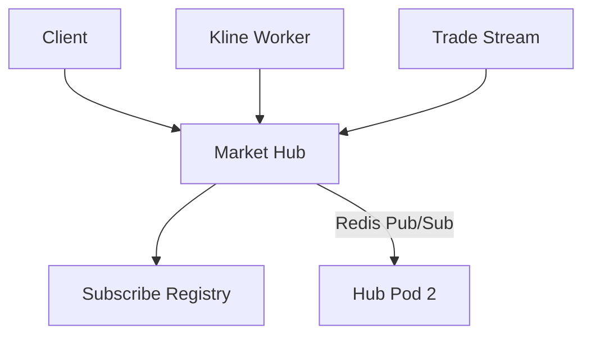

!!! tip "⭐ 重点准备"
    Web3 交易所 / 钱包方向高频题，见 [重点准备题单](../../resume-focus-web3.md)。

# WebSocket 行情 Hub 与连接治理

## 30 秒版（开场）

> **行情 Hub** = 管理订阅关系 + 将 K 线/成交/异动 **广播** 到已连接客户端。Go 常用 `map[topic]set<conn>` + goroutine per conn 读循环。生产关键词：**订阅鉴权、心跳踢线、背压、连接恢复、跨 Pod 广播**。

## 3 分钟版（一面深度）

1. **是什么**：客户端 SUB `kline:TOKEN:1m` → Hub 注册 → 聚合服务产出 tick → Hub Write。
2. **为什么**：HTTP 轮询延迟高；交易用户需要 **毫秒级** 推送。
3. **怎么做**：握手 JWT；`Ping/Pong`；单连接写 goroutine 防 concurrent write；Redis Pub/Sub 跨节点 fan-out。

## 10 分钟版（Hub 结构）

**订阅模型**

| Topic 示例 | 数据 |
|------------|------|
| `kline:{token}:{interval}` | OHLCV 更新 |
| `trade:{token}` | 逐笔成交 |
| `ticker:{token}` | 24h 涨跌量 |
| `alert:market` | 异动广播 |

**连接治理 checklist**

- 读超时 > 心跳间隔 2 倍
- `WriteJSON` 加 `select` + `ctx.Done()`，慢客户端断开避免阻塞 Hub
- 优雅关闭：广播 `going away` + 等待 `terminationGracePeriod`
- 指标：`ws_connections`、`subscribe_count`、`write_queue_depth`

## 生产场景

- **连接恢复**：客户端带 `last_seq` 补拉 HTTP 缺口再 SUB
- **健康检查**：`/health` 返回连接数、各 topic 订阅数
- **运营推送**：Token 毕业/暂停交易状态变更

## 追问链

1. **与 [S-NET-05](../06-network-governance/S-NET-05-websocket-gateway.md) 差异？** → NET-05 通用网关；本题 **行情 topic 与交易数据模型**。
2. **单机 10w 连接？** → 调 `GOMAXPROCS`、减少分配、分片多 Pod + 一致性哈希或客户端重连任意节点。
3. **消息乱序？** → tick 带 `seq`/`blockNumber`；客户端丢弃旧 seq。

## 反模式

- 多 goroutine 同时 `Write` 同一 conn → panic
- 无订阅上限 → 恶意 SUB 全市场拖死 CPU
- 仅 WS 无 HTTP 兜底 → 断线期间丢行情

## 延伸阅读

- [S-NET-05 WebSocket 网关](../06-network-governance/S-NET-05-websocket-gateway.md)
- [S-EXCH-10 K 线聚合](./S-EXCH-10-kline-event-aggregation.md)
