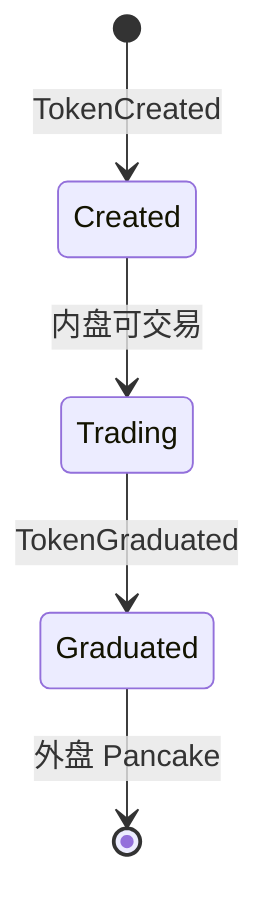

!!! tip "⭐ 重点准备"
    Web3 交易所 / 钱包方向高频题，见 [重点准备题单](../../resume-focus-web3.md)。

# Token 发行平台：毕业、分账与返佣提现

## 30 秒版（开场）

> **Launchpad + 内置 DEX** 后端 = 项目方发 Token → 曲线/池内交易 → **毕业（Graduated）** 迁到外盘（如 Pancake）→ **返佣结算** + **佣金提现（Withdrawal）**。链上事件驱动状态机；Go 管 **权限、风控、批量发放、Gas 监控**。

## 3 分钟版（一面深度）

1. **是什么**：TokenCreated → 内盘交易 → TokenGraduated → 外盘流动性；SplitPayment 分账；Withdrawal 提佣金。
2. **为什么**：BSC/Ethereum 发币 + 内盘交易平台的典型业务流程。
3. **怎么做**：索引事件更新 Token 状态；返佣表按成交累加；提现走风控 + 合约 Vault/Operator。

## 10 分钟版（状态机）

| 链上组件 | Go 后端职责 |
|----------|-------------|
| Core 发币 | 元数据、R2 图标、运营审核 |
| Swap/Pair | 成交索引、K 线 |
| SplitPayment | 分账比例配置、对账 |
| Withdrawal/Vault | 提现申请、额度、黑名单 |
| Operator/暂停 | 紧急暂停、权限审计 |

**返佣链路**

1. 成交事件 → 计算邀请人比例 → 写 `rebate_pending`
2. 定时批量上链或链下结算（产品规则）
3. 失败重试 + `rebate_id` 幂等

**提现风控**（与 [S-EXCH-05](./S-EXCH-05-risk-reconciliation.md) 联动）

- 黑名单地址、单日额度、异常交易关联
- Gas 费监控：批量发放前估算 `estimateGas`

## 生产场景

- **合约升级 UUPS**：[S-SOLID-04](../13-solidity-contracts/S-SOLID-04-upgradeable-proxy.md) 灰度迁移事件兼容
- **治理投票**：链上提案 + 索引投票权
- **运营后台**：Admin-Serv 调 Operator 暂停交易

## 追问链

1. **毕业瞬间价格跳变？** → 前后端提示；K 线标记 graduation 点。
2. **返佣链上 vs 链下？** → 成本与透明度权衡；大额链上、小额累积批量。
3. **与 [S-SOLID-08](../13-solidity-contracts/S-SOLID-08-contract-go-boundary.md)？** → 链上规则 + Go 编排。

## 反模式

- 返佣不算幂等 → 重复事件多发
- 升级合约不兼容旧事件 ABI → 索引断层
- 提现无审计 → 无法追溯运营操作

## 延伸阅读

- [S-EXCH-06 DEX AMM](./S-EXCH-06-dex-amm-liquidity.md)
- [S-SOLID-04 可升级合约](../13-solidity-contracts/S-SOLID-04-upgradeable-proxy.md)
