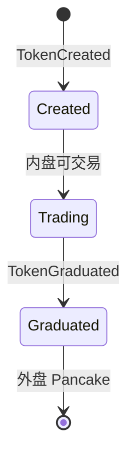

!!! tip "⭐ 重点准备"
    Web3 交易所 / 钱包方向高频题，见 [重点专题](../../web3-exchange-wallet-focus.md)。

# Token 发行平台：毕业、分账与返佣提现

## 30 秒版（开场）

> 在某些 bonding-curve Launchpad 中，“毕业”表示达到协议阈值后迁移或创建外部
> 流动性池；这不是所有发币平台的通用标准。Go 后端应把 canonical 链上状态、
> 产品规则版本、返佣账本和提现状态机分开，事件只是索引输入，不能忽略 reorg。

## 3 分钟版（一面深度）

1. **是什么**：TokenCreated → 内盘交易 → TokenGraduated → 外盘流动性；SplitPayment 分账；Withdrawal 提佣金。
2. **为什么**：BSC/Ethereum 发币 + 内盘交易平台的典型业务流程。
3. **怎么做**：索引事件更新 Token 状态；返佣表按成交累加；提现走风控 + 合约 Vault/Operator。

## 10 分钟版（状态机）

```mermaid
stateDiagram-v2
  [*] --> Created: TokenCreated
  Created --> Trading: 内盘可交易
  Trading --> Graduated: TokenGraduated
  Graduated --> [*]: 外盘 Pancake
```

| 链上组件 | Go 后端职责 |
|----------|-------------|
| Core 发币 | 元数据、R2 图标、运营审核 |
| Swap/Pair | 成交索引、K 线 |
| SplitPayment | 分账比例配置、对账 |
| Withdrawal/Vault | 提现申请、额度、黑名单 |
| Operator/暂停 | 紧急暂停、权限审计 |

**返佣链路**

1. canonical 成交/结算事件 + 当时生效的 policy version → 生成确定性 `rebate_id`
2. 在同一账务事务中写 append-only 返佣分录和待领取状态，金额使用定点整数
3. 链上可采用用户 claim/Merkle root 或批量发放；链下可进入内部账本。两种模式都要
   防重复 claim、支持冲正/重放，并绑定 root/epoch/policy version

**提现风控**（与 [S-EXCH-05](./S-EXCH-05-risk-reconciliation.md) 联动）

- 黑名单地址、单日额度、异常交易关联
- Gas 费监控：批量发放前 estimate/simulate，但状态会变化，仍需 gas cap、
  批次大小上限、失败拆批和链上执行结果核验

## 生产场景

- **合约升级 UUPS**：[S-SOLID-04](../13-solidity-contracts/S-SOLID-04-upgradeable-proxy.md)
  通过 timelock/multisig、暂停演练和 ABI 兼容检查降低风险；同一 Proxy 的升级交易
  生效后不是传统服务按流量比例灰度
- **治理投票**：链上提案 + 索引投票权
- **运营后台**：后台只发起经 RBAC、双人复核/多签或 timelock 批准的操作；
  Admin 服务不应持有可单点暂停、升级或转移资产的裸权限

## 追问链

1. **毕业瞬间价格跳变？** → 前后端提示；K 线标记 graduation 点。
2. **返佣链上 vs 链下？** → 成本与透明度权衡；大额链上、小额累积批量。
3. **与 [S-SOLID-08](../13-solidity-contracts/S-SOLID-08-contract-go-boundary.md)？** → 链上规则 + Go 编排。

## 反模式

- 返佣不算幂等 → 重复事件多发
- 升级合约不兼容旧事件 ABI → 索引断层
- 提现无审计 → 无法追溯运营操作

## 延伸阅读

- [S-EXCH-06 DEX AMM](./S-EXCH-06-dex-amm-liquidity.md)
- [S-EXCH-28 多级代理极差分润](./S-EXCH-28-affiliate-tiered-rate-rebate.md)
- [S-SOLID-04 可升级合约](../13-solidity-contracts/S-SOLID-04-upgradeable-proxy.md)
