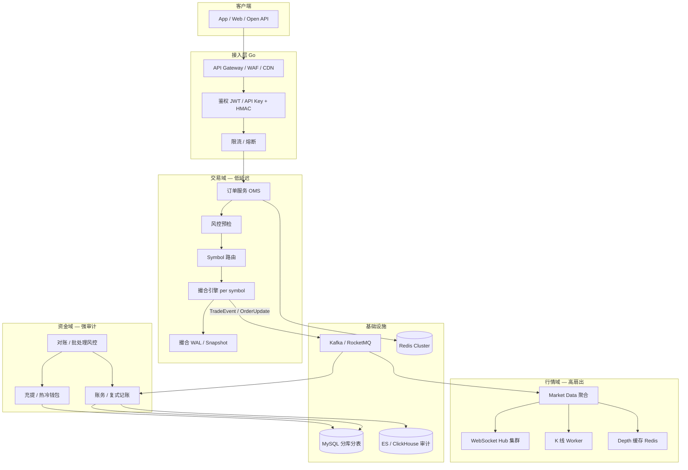
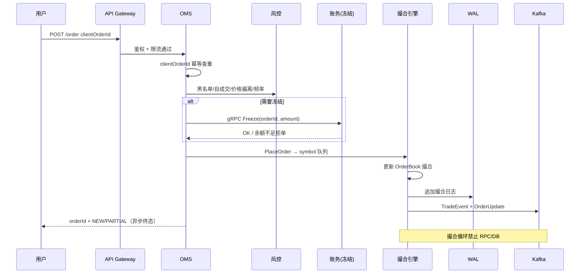
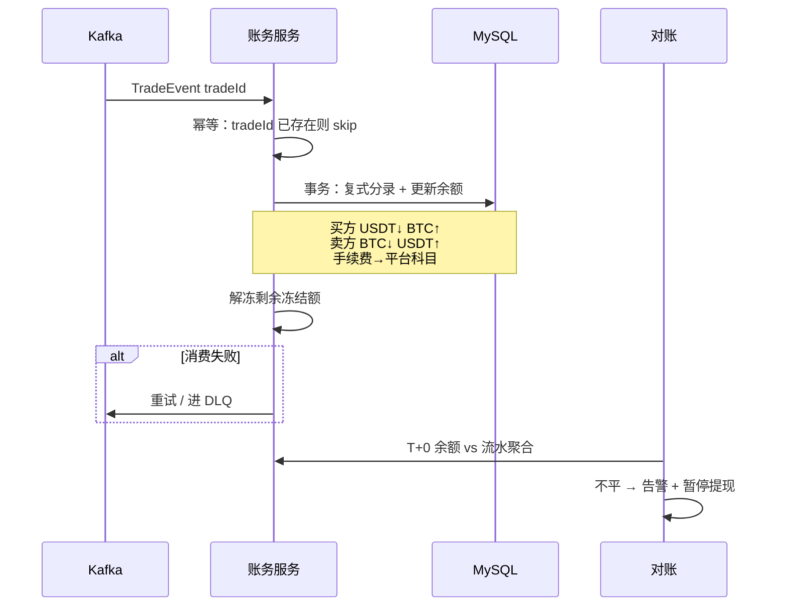
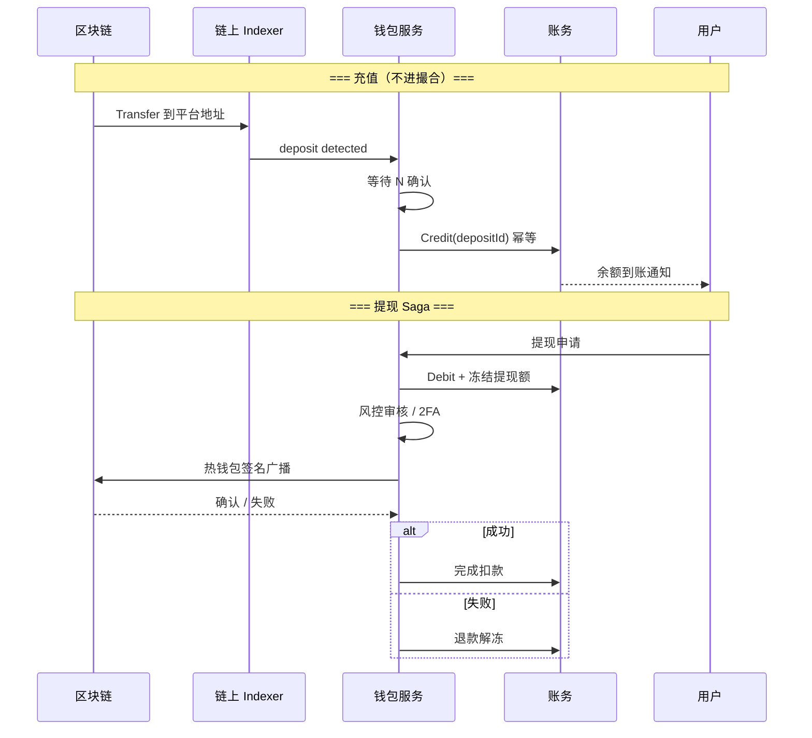
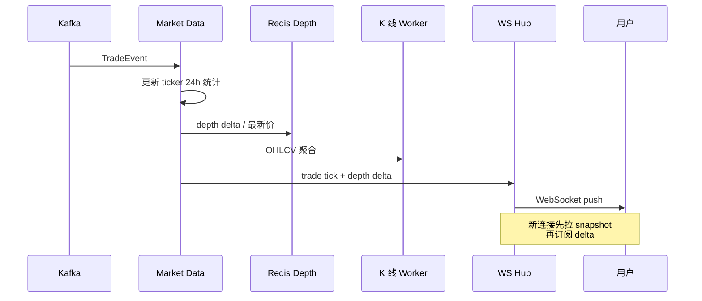
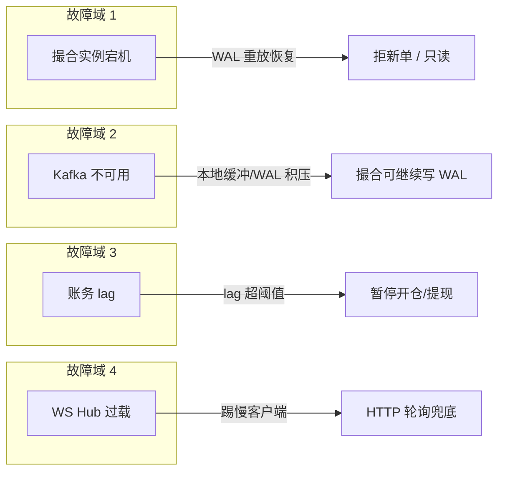

# CEX 端到端交易系统架构（45 分钟白板）

## 30 秒版（开场）

> CEX 后端 = **三域解耦**：**交易域**（下单→风控→撮合→WAL→成交事件）、**资金域**（复式账务 + 充提钱包 + 对账）、**行情域**（成交流 fan-out → depth/trade/kline → WS Hub）。Go 常做 **API Gateway、OMS 编排、账务持久化、行情 Hub**；撮合内核可 Go 单写者或 Rust/C++ 独立进程。生产关键词：**symbol 单写者、成交事件驱动账务、clientOrderId 幂等、WAL 可恢复、充提不进撮合热路径**。

## 3 分钟版（一面深度）

1. **是什么**：中心化现货/合约交易所的 **全链路分层与数据流**，不是「一个撮合服务」，而是交易、资金、行情三条主线 + 事件总线粘合。
2. **为什么**：JD 写「熟悉交易系统 / 交易所架构」时，架构师面要证明能 **串起 EXCH-01/02/03/05/11/15** 与 **MSVC 微服务拆分**，并讲清一致性边界、故障域与容量估算。
3. **怎么做**：交易热路径 **内存化 + 单写者**；成交后 **异步 MQ 扇出** 驱动账务与行情；资金路径 **T+0 复式记账**；充提走独立 Saga，与撮合 **零耦合**。

## 10 分钟版（原理 + 图示）

### 总览架构（三域 + 基础设施）



**面试一句话**：撮合只产出 **不可变成交事实**；余额变更、行情推送、大数据审计全部 **消费同一成交流**，互不阻塞热路径。

### 三域职责边界（必背）

| 域 | 核心职责 | 延迟目标 | 一致性 | 典型技术 |
|----|----------|----------|--------|----------|
| **交易域** | 接单、风控、撮合、订单状态 | P99 下单确认 < 50ms（中频所） | 单 symbol **强一致**（单写者） | 内存 OrderBook + WAL |
| **资金域** | 冻结/解冻、成交过账、充提、对账 | 账务 T+0，可秒级 lag | **复式流水** + 幂等 bizId | MySQL 事务、Saga |
| **行情域** | trade tick、depth delta、kline、ticker | WS 推送 < 100ms | **最终一致**，可补快照 | Redis + WS Hub 水平扩展 |

**域间铁律**

- 交易域 **禁止** 在撮合循环内 RPC 账务或写 MySQL
- 资金域 **禁止** 与撮合共享「一行 balance」字段而无流水
- 行情域 **允许** 丢中间 tick，**不允许** 伪造成交或乱序成交 ID

### 服务清单与限界上下文

| 服务 | 所属域 | 核心 API / 事件 | 数据归属 |
|------|--------|-----------------|----------|
| `api-gateway` | 接入 | 路由、TLS、WAF | 无状态 |
| `auth-svc` | 接入 | JWT / API Key 校验 | 用户凭证 |
| `order-svc` (OMS) | 交易 | `POST /order`、`DELETE /order` | `orders` 按 symbol 分表 |
| `risk-svc` | 交易 | 预检 gRPC | 规则配置、黑名单 |
| `matching-svc` | 交易 | 内部指令队列 | 内存簿 + WAL（不共享 DB 订单簿） |
| `ledger-svc` | 资金 | `Freeze` / `PostTrade` / `Transfer` | `ledger_entry` 只 INSERT |
| `wallet-svc` | 资金 | 充提、链上广播 | `deposits` / `withdrawals` |
| `recon-svc` | 资金 | 日终对账、不平告警 | 对账报表 |
| `market-svc` | 行情 | 消费 TradeEvent | Redis depth、kline 状态 |
| `ws-hub` | 行情 | WebSocket 订阅 | 连接注册表（内存） |

微服务拆分话术见 [S-MSVC-01](../15-microservices-exchange/S-MSVC-01-exchange-microservices-whiteboard.md)；本题侧重 **CEX 域内数据流**，MSVC 侧重 **服务边界与 BFF**。

### 45 分钟白板时间盒（口述脚本）

| 阶段 | 时间 | 你要交付什么 | 示例话术 |
|------|------|--------------|----------|
| **澄清** | 0～5 min | 现货 vs 合约、峰值 QPS、WS 连接、单机房 vs 多活 | 「先确认范围：现货为主，峰值 5 万 order/s，50 万 WS」 |
| **估算** | 5～10 min | 订单写入、成交 fan-out、账务 partition、WS 带宽 | 「50% 成交 → 2.5 万 trade/s；MQ 3 副本；账务按 userId 分 64 partition」 |
| **MVP** | 10～22 min | 画三域 + Gateway + MQ 边界 | 「撮合不直连账务，只发 TradeEvent」 |
| **扩展** | 22～32 min | symbol 分片、冷热分离、缓存、读写分离 | 「BTC/USDT 独立撮合 Pod；订单历史 symbol 分表」 |
| **非功能** | 32～38 min | 幂等、WAL、SLO、审计、合规 | 「tradeId 幂等；WAL 先写再发事件；账务 lag < 5s SLO」 |
| **演进** | 38～45 min | 单体 → 分 symbol 集群 → 单元化 | 「初期 monolith 内分 symbol goroutine；量上来拆 matching-svc」 |

### 核心链路一：下单 → 撮合 → 成交（交易域）



**步骤详解**

1. **接入**：`POST /order` → 鉴权（JWT / API Key + HMAC 签名）、限流（[S-ARCH-08](../03-system-design/S-ARCH-08-rate-limiting.md)）、参数校验 `tickSize` / `stepSize`
2. **OMS 幂等**：`(userId, clientOrderId)` 唯一索引；重试返回同一 `orderId`（[S-ARCH-04](../03-system-design/S-ARCH-04-idempotency.md)）
3. **余额冻结**：卖单冻 base、买单冻 quote（或统一折算 USDT）；小所 OMS 本地冻结表 + 成交事件结算；大所 Ledger 统一 `Freeze` 接口
4. **风控预检**：黑名单、自成交（同 user 对敲）、限价相对标记价偏离、下单频率、市价单深度保护
5. **路由**：`SymbolRouter` 哈希到 **symbol 专属撮合实例**（单写者，见 [S-EXCH-01](./S-EXCH-01-cex-matching-engine.md)）
6. **撮合输出**：`TradeEvent` + `OrderUpdate` → MQ，**至少一次**；WAL 先于或可证明等效于对外事件

**撤单**：`CancelOrder` 进 **同一 symbol 队列**，与下单全序，避免乱序竞态。

### 核心链路二：成交 → 账务清结算（资金域）



**账务要点**（详见 [S-EXCH-03](./S-EXCH-03-account-ledger.md)）

| 动作 | 触发 | 幂等键 | 分录示例 |
|------|------|--------|----------|
| 冻结 | 下单成功 | `freeze:{orderId}` | 可用 → 冻结 |
| 成交过账 | TradeEvent | `tradeId` | 买卖双方资产互换 + 手续费 |
| 解冻 | 撤单 / 成交余量 | `unfreeze:{orderId}` | 冻结 → 可用 |
| 充值入账 | 链上确认 | `depositId` / `txHash+logIndex` | 平台负债 ↑、用户可用 ↑ |
| 提现扣款 | 用户申请 | `withdrawId` | 用户可用 ↓、提现冻结 ↑ |

**消费顺序**：Kafka partition key = `userId`（或 `accountId`），保证 **同一用户账务串行**；不同用户并行扩展。

**失败处理**：重试 + 死信队列（DLQ）+ 自动补偿任务；**禁止**静默丢消息——账务 lag 超阈值触发 **暂停新开仓 / 暂停提现**（[S-EXCH-05](./S-EXCH-05-risk-reconciliation.md)）。

### 核心链路三：充值 / 提现（独立资金链）



充提详解见 [S-EXCH-02](./S-EXCH-02-deposit-withdraw-wallet.md)。**关键**：充值索引与撮合 **零交叉**；提现是 **多步 Saga**（账务扣减 → 审批 → 签名 → 广播 → 确认），每步幂等可恢复。

### 核心链路四：成交 → 行情推送（行情域）



行情详解见 [S-EXCH-11](./S-EXCH-11-websocket-market-hub.md)、[S-EXCH-10](./S-EXCH-10-kline-event-aggregation.md)。**原则**：行情可丢中间帧，靠 **周期全量 snapshot** 修复；**成交 ID 单调** 用于客户端去重。

### 事件总线与 Schema 设计

| Topic | 生产者 | 消费者 | Partition Key | 说明 |
|-------|--------|--------|---------------|------|
| `trade.matched` | 撮合 | 账务、行情、风控、数仓 | `symbol` 或 `userId` | 核心成交流 |
| `order.lifecycle` | 撮合 / OMS | 推送、审计 | `orderId` | NEW / PARTIAL / FILLED / CANCELED |
| `wallet.deposit` | Indexer | 账务 | `depositId` | 链上充值 |
| `wallet.withdraw` | 钱包 | 账务、通知 | `withdrawId` | 提现状态变更 |

**Transactional Outbox**（OMS 写库 + 发 MQ 同源）：OMS 落订单与 outbox 表同事务，独立 relay 进程扫 outbox 发 Kafka，避免 **库成功 MQ 失败** 的不一致（[Outbox 模式](https://microservices.io/patterns/data/transactional-outbox.html)）。

撮合侧通常 **先 WAL 再异步 Publisher**，不依赖 DB outbox——WAL 即事实源。

### 一致性边界（面试必画表）

| 场景 | 模型 | 手段 | 用户可见现象 |
|------|------|------|--------------|
| 撮合 vs 订单状态 | **强一致** | 单 symbol 单线程 + WAL | 撤单结果确定 |
| 撮合 vs 账务 | **最终一致** | MQ 至少一次 + `tradeId` 幂等 | 成交后余额秒级到账 |
| OMS 冻结 vs 账务余额 | **最终一致** | 冻结 gRPC 或本地表对账 | 极少短暂「可用余额未即时减少」 |
| 账务 vs 钱包链上负债 | **T+0 对账** | 平台总负债 = 用户余额汇总 | 日终不平告警 |
| 行情 vs 成交 | **最终一致** | 有序消费 + snapshot 修复 | 盘口可能滞后几十 ms |
| 充提 vs 交易 | **独立** | 不同 Saga，共用账务科目 | 提现不影响撮合 |

### 现货 vs 合约（架构差异一句话）

| 维度 | 现货 | 永续 / 交割合约 |
|------|------|-----------------|
| 撮合 | 独立 OrderBook | OrderBook + **仓位引擎同线程**（[S-EXCH-16](./S-EXCH-16-perpetual-matching-position.md)） |
| 冻结 | 冻结 base/quote | 冻结 **保证金** |
| 下游 | 账务过账 | 账务 + 仓位 + 资金费率 + 强平（[S-EXCH-04](./S-EXCH-04-futures-margin-liquidation.md)） |
| 风控 | 余额、偏离 | 追加保证金、强平单进同一 symbol 队列 |

### 容量估算（白板口算模板）

**假设**：峰值 50,000 order/s，成交率 50%，50 万 WS，200 个活跃 symbol。

| 指标 | 计算 | 结果 |
|------|------|------|
| 成交写入 | 50k × 50% | **25,000 trade/s** → Kafka 需 3～5 万 msg/s 含副本 |
| 撮合实例 | 头部 20 symbol 占 80% 量 | 热门独立 Pod，冷门合并多队列 |
| 账务吞吐 | 25k trade × 平均 4 条分录 | ~100k INSERT/s → 分库 + 批量 + 异步汇总热点户 |
| WS 扇出 | 50 万连接 × 10 更新/s（订阅 5 个 topic） | 500 万 msg/s → **WS Hub 水平扩展** + Redis Pub/Sub 跨 Pod |
| 带宽粗算 | 500 万 × 200B | ~1 GB/s → 多机房边缘节点 |

**口述结论**：瓶颈通常在 **WS 扇出** 与 **账务热点账户**，不是撮合本身（symbol 分片后线性扩展）。

### 故障域与降级策略



| 故障 | 影响 | 恢复手段 | 业务降级 |
|------|------|----------|----------|
| 单 symbol 撮合宕机 | 该币对不可交易 | WAL + Snapshot 重放 | 其他 symbol 不受影响 |
| Kafka 短暂不可用 | 账务/行情延迟 | Publisher 本地队列积压 | 撮合继续，禁止关 WAL |
| 账务 consumer 堆积 | 余额到账延迟 | 扩容 consumer、加 partition | 暂停合约新开仓 |
| MySQL 主库故障 | 下单/账务受阻 | MHA / 半同步切换 | 交易只读模式 |
| 热钱包余额不足 | 提现排队 | 冷钱包补热（[S-BC-10](../12-blockchain-web3/S-BC-10-mpc-tss-custody.md)） | 提高提现手续费门槛 |
| 开盘爆量 | 队列积压 | 市价单熔断、扩容 OMS | **撮合不异步化** |

高可用与灾备见 [S-EXCH-15](./S-EXCH-15-settlement-ha-disaster-recovery.md)。

### 数据存储与分片策略

| 数据 | 存储 | 分片键 | 说明 |
|------|------|--------|------|
| 活跃订单 / 订单簿 | 内存 + WAL | `symbol` | 不进 MySQL 热路径 |
| 订单历史 | MySQL | `symbol` + 时间 | 冷查询、审计 |
| 账务流水 | MySQL | `userId` / `accountId` | 只 INSERT，`biz_id` 唯一 |
| 最新盘口 | Redis | `symbol` | depth 版本号 |
| K 线 | Redis / TSDB | `symbol:interval` | 聚合自 trade |
| 成交大数据 | ClickHouse / ES | `symbol` + 日 | 离线分析 |

### Go 技术栈落地要点

| 层级 | Go 职责 | 禁忌 |
|------|---------|------|
| Gateway / OMS | HTTP/gRPC、幂等、编排、Outbox | 热路径同步调多个下游 |
| 撮合 | 单 goroutine MatchLoop、WAL、Publisher | 撮合循环内 DB/RPC |
| 账务 | GORM 事务、幂等、decimal | float64 金额 |
| 行情 Hub | gorilla/websocket、订阅注册表 | 多 goroutine 写同一 conn |
| 钱包 | 链 RPC、签名服务隔离 | 私钥进业务 Pod |

## 生产场景

| 场景 | 现象 | 策略 |
|------|------|------|
| **开盘 / 上新币爆量** | OMS 队列积压、P99 飙升 | 市价单熔断、临时扩容 symbol 实例、限频加严 |
| **撮合机宕机** | 某币对不可用 | WAL 重放 + Snapshot；恢复前拒新单；公告只读 |
| **MQ 堆积** | 账务 lag 上升 | 扩容 consumer；合约暂停新开仓；监控 DLQ |
| **成交未到账客诉** | 用户看到成交余额未变 | 查 `tradeId` 是否在 ledger；修 consumer 非手改余额 |
| **盘口与最新价不一致** | depth 滞后 | 查 market-svc lag；强制推 snapshot |
| **重复下单** | 同一单两次 | 查 `clientOrderId` 唯一约束 |
| **提现卡单** | 状态停在 Signing | 查 Saga 状态机、链上 nonce、热钱包余额 |
| **链重组** | 充值回滚 | Indexer reorg 处理（[S-BC-05](../12-blockchain-web3/S-BC-05-indexer-reorg.md)） |

## 排查与工具

| 现象 | 排查路径 | 关键字段 |
|------|----------|----------|
| 成交未到账 | Kafka consumer lag → `ledger_entry` by `tradeId` | `tradeId`, `offset` |
| 冻结与余额不平 | OMS 冻结表 vs Ledger 流水 | `orderId`, `freezeId` |
| 盘口不一致 | market-svc lag、Redis depth version | `seq`, `symbol` |
| 重复扣款 | 幂等表 / `biz_id` 重复 | `tradeId`, `withdrawId` |
| 提现卡单 | `withdrawals.status`、链上 tx | `nonce`, `txHash` |

## 架构取舍

| 方案 | 适用 | 不选原因 |
|------|------|----------|
| 撮合与账务 **同事务** | 小所、<500 order/s | 锁竞争拖垮撮合延迟 |
| **Kafka** 成交总线 | 多下游、要重放审计 | 仅 DB 轮询无法扇出 |
| Go **全栈**撮合 | 中低频现货、万级 QPS | 纳秒级 HFT 用 C++/FPGA |
| OMS **本地冻结表** | 创业期、简化 | 大所统一 Ledger 冻结接口 |
| **单元化**（按 user 分片） | 千万 DAU、跨机房 | 团队 <20 人运维成本过高 |
| **充提进撮合队列** | — | 绝不可行，污染热路径 |

## 追问链

1. **为什么成交用 MQ 不用 RPC 调账务？** → 解耦峰值、多订阅者（账务/行情/风控/数仓）、可重放审计、撮合不阻塞。
2. **冻结余额在 OMS 还是 Ledger？** → 小所 OMS 冻结表 + 成交事件结算；大所 Ledger 统一 `Freeze/Unfreeze` gRPC，OMS 只读可用余额缓存。
3. **合约强平插在哪？** → 风控/强平服务计算后发 **强平单** 进同一 `symbol` 队列，与 user 单全序（[S-EXCH-04](./S-EXCH-04-futures-margin-liquidation.md)）。
4. **如何保证账务不重复过账？** → `tradeId` 唯一约束 + 消费幂等；DLQ 人工处理也不二次 Post。
5. **OMS 写库成功但 MQ 失败怎么办？** → Transactional Outbox；或订单状态 `PENDING_MATCH` 由补偿任务扫表重发。
6. **如何做灰度上新交易对？** → 新 symbol 新撮合实例；Gateway 路由表 + 特性开关；先内测 API Key 白名单。
7. **读写分离下订单查询延迟？** → 下单走主库；历史订单走从库 + 用户维度缓存；终态以 WS 推送为准。
8. **与 DEX 架构最大区别？** → 信任在平台：链下撮合 + 链下账本；**提币**才是链上触点；DEX 成交在链上或链下索引（[S-EXCH-06](./S-EXCH-06-dex-amm-liquidity.md)）。
9. **多机房怎么部署？** → 单 symbol 单活（主撮合 + 热备）；账务 Kafka 跨机房复制；WS 就近接入。
10. **如何从单体演进到微服务？** → 先拆 **matching** 与 **wallet**（故障域最大），再拆 ledger、market；见 [S-MSVC-01](../15-microservices-exchange/S-MSVC-01-exchange-microservices-whiteboard.md)。

## 反模式与事故

| 反模式 | 后果 | 正确做法 |
|--------|------|----------|
| 撮合成功 **先推 WS 再写 WAL** | 宕机丢成交，用户已看到假成交 | WAL → MQ → WS |
| 账务消费 **无幂等** | 重复加钱/扣钱，重大资金事故 | `biz_id` / `tradeId` UNIQUE |
| **全库单表 orders** | 无法按 symbol 扩展 | `symbol` 分表 + 路由 |
| 充提与交易共用一个 **balance 字段** | 无法审计、无法对账 | 复式流水 + 科目分离 |
| 撮合循环内 **同步 gRPC 账务** | P99 抖动、雪崩 | 异步事件驱动 |
| 行情与账务 **共用一个 consumer** | 行情慢拖账务 | 独立 consumer group |
| 提现 **无 Saga 状态机** | 链上失败余额已扣 | 每步幂等 + 补偿退款 |
| 市价单 **无深度保护** | 插针爆仓式成交 | 价格带 / 最大滑点 |

## 代码示例

### 成交事件（账务与行情共享 Schema）

```go
type TradeEvent struct {
    TradeID      string          `json:"trade_id"`      // 全局唯一，幂等键
    Symbol       string          `json:"symbol"`
    Price        decimal.Decimal `json:"price"`
    Quantity     decimal.Decimal `json:"qty"`
    TakerSide    string          `json:"taker_side"`    // BUY / SELL
    MakerUserID  int64           `json:"maker_uid"`
    TakerUserID  int64           `json:"taker_uid"`
    MakerOrderID string          `json:"maker_order_id"`
    TakerOrderID string          `json:"taker_order_id"`
    MakerFee     decimal.Decimal `json:"maker_fee"`
    TakerFee     decimal.Decimal `json:"taker_fee"`
    Ts           int64           `json:"ts_ms"`
}
```

### 订单生命周期事件

```go
type OrderUpdateEvent struct {
    OrderID   string          `json:"order_id"`
    UserID    int64           `json:"user_id"`
    Symbol    string          `json:"symbol"`
    Status    string          `json:"status"` // NEW, PARTIALLY_FILLED, FILLED, CANCELED, REJECTED
    FilledQty decimal.Decimal `json:"filled_qty"`
    AvgPrice  decimal.Decimal `json:"avg_price"`
    Ts        int64           `json:"ts_ms"`
}
```

### 账务幂等过账（消费 TradeEvent）

```go
func (s *LedgerService) PostTrade(ctx context.Context, ev TradeEvent) error {
    return s.db.Transaction(func(tx *gorm.DB) error {
        if exists, _ := s.bizExists(tx, ev.TradeID); exists {
            return nil // 幂等跳过
        }
        entries := buildTradeEntries(ev) // 借贷平衡分录
        for _, e := range entries {
            if err := insertEntry(tx, e); err != nil {
                return err
            }
        }
        return unfreezeRemainder(tx, ev.TakerOrderID, ev.MakerOrderID)
    })
}
```

### OMS Transactional Outbox（下单落库 + 发 MQ）

```go
func (s *OrderService) PlaceOrder(ctx context.Context, req PlaceOrderReq) (*Order, error) {
    var order Order
    err := s.db.Transaction(func(tx *gorm.DB) error {
        if dup, _ := findByClientOrderID(tx, req.UserID, req.ClientOrderID); dup != nil {
            order = *dup
            return nil
        }
        order = buildOrder(req)
        if err := tx.Create(&order).Error; err != nil {
            return err
        }
        return tx.Create(&OutboxEvent{
            AggregateID: order.ID,
            Topic:       "order.placed",
            Payload:     marshal(order),
        }).Error
    })
    return &order, err
}
```

### 提现 Saga 状态（简化）

```go
type WithdrawState string

const (
    WithdrawPending      WithdrawState = "PENDING"
    WithdrawRiskReview   WithdrawState = "RISK_REVIEW"
    WithdrawDebited      WithdrawState = "DEBITED"      // 账务已扣
    WithdrawSigning      WithdrawState = "SIGNING"
    WithdrawBroadcasting WithdrawState = "BROADCASTING"
    WithdrawConfirmed    WithdrawState = "CONFIRMED"
    WithdrawFailed       WithdrawState = "FAILED"       // 触发退款
)
```

## 延伸阅读

- [S-EXCH-01 撮合引擎与订单簿](./S-EXCH-01-cex-matching-engine.md) — 单写者、WAL、订单簿
- [S-EXCH-03 账户与复式记账](./S-EXCH-03-account-ledger.md) — 成交过账、冻结
- [S-EXCH-02 充值提现与钱包](./S-EXCH-02-deposit-withdraw-wallet.md) — 充提 Saga
- [S-EXCH-05 风控与对账](./S-EXCH-05-risk-reconciliation.md) — T+0 对账
- [S-EXCH-11 WebSocket 行情 Hub](./S-EXCH-11-websocket-market-hub.md) — 扇出与连接治理
- [S-EXCH-15 清结算高可用与灾备](./S-EXCH-15-settlement-ha-disaster-recovery.md) — 多活与恢复
- [S-EXCH-16 永续撮合与仓位](./S-EXCH-16-perpetual-matching-position.md) — 合约差异
- [S-MSVC-01 交易所微服务白板](../15-microservices-exchange/S-MSVC-01-exchange-microservices-whiteboard.md) — 服务拆分
- [S-ARCH-04 幂等设计](../03-system-design/S-ARCH-04-idempotency.md)
- [S-KAFKA-03 交易事件总线](../middleware/kafka/S-KAFKA-03-trade-event-bus.md)
- [S-SOL-08 45 分钟白板模板](../11-solution-architecture/S-SOL-08-evolution-whiteboard.md)
- [Transactional Outbox](https://microservices.io/patterns/data/transactional-outbox.html)
