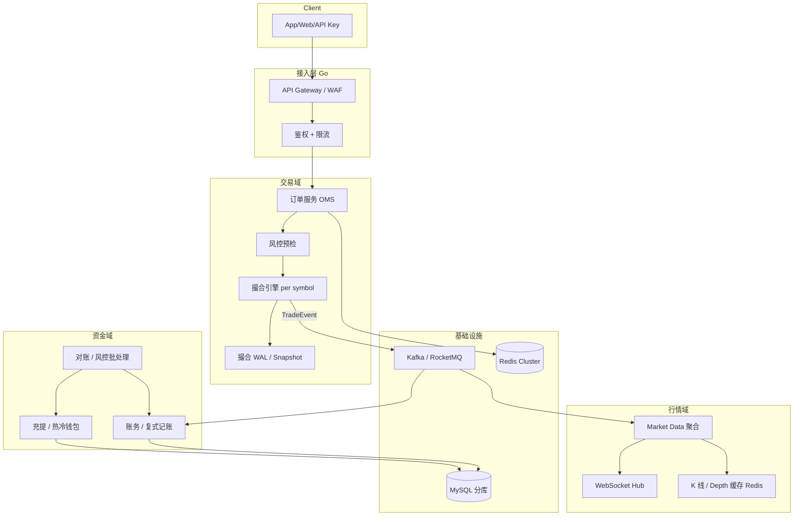

# CEX 端到端交易系统架构（45 分钟白板）

## 30 秒版（开场）

> 架构师面 CEX 常要求 **一张图画全链路**：下单 → 风控 → 撮合 → 成交事件 → 账务清结算 → 行情推送；充提走 **独立资金链** 但与账务对账。Go 多负责 **API、编排、持久化、行情 Hub**；撮合可内嵌单写者或独立内核。关键词：**symbol 单写者、成交事件驱动账务、clientOrderId 幂等、WAL 可恢复**。

## 3 分钟版（一面深度）

1. **是什么**：中心化现货/合约交易所的后端分层与数据流，不是单点撮合，而是 **交易域 + 资金域 + 行情域** 三条主线。
2. **为什么**：JD 写「熟悉交易系统」时，面试官要听能否 **串起 01/02/03/05** 等专题，并讲清一致性与故障域。
3. **怎么做**：交易热路径内存化 + 事件异步落账；资金路径 T+0 复式记账；行情从成交流 fan-out，与账务解耦。

## 10 分钟版（原理 + 图示）

### 总览架构



### 45 分钟白板时间盒

| 阶段 | 时间 | 交付物 |
|------|------|--------|
| 澄清 | 0～5 min | 现货 vs 合约、峰值 QPS、是否多机房 |
| 估算 | 5～10 min | 订单写入 QPS、成交 fan-out、WS 连接数 |
| MVP | 10～22 min | 画上图三条域 + MQ 边界 |
| 扩展 | 22～32 min | symbol 分片、读写分离、缓存 |
| 非功能 | 32～38 min | 一致性、幂等、审计、SLO |
| 演进 | 38～45 min | 从单体到分 symbol 撮合集群 |

### 核心链路（必须能口述）

**下单路径**

1. `POST /order` → 鉴权、限流（[S-ARCH-08](../03-system-design/S-ARCH-08-rate-limiting.md)）
2. OMS 校验：`clientOrderId` 幂等、余额冻结（账务预扣或 OMS 本地冻结表）
3. 风控：黑名单、自成交、价格偏离、频率
4. 路由到 **symbol 专属撮合队列**（单写者，见 [S-EXCH-01](./S-EXCH-01-cex-matching-engine.md)）
5. 撮合产出 `TradeEvent` → MQ（至少一次）

**账务路径**

- 消费 `TradeEvent`：**幂等** `tradeId`（[S-ARCH-04](../03-system-design/S-ARCH-04-idempotency.md)）
- 复式记账：买方资产↑↓、卖方资产↑↓、手续费科目（[S-EXCH-03](./S-EXCH-03-account-ledger.md)）
- 与 OMS 冻结记录对平；失败进死信 + 人工/自动补偿

**充提路径（并行，不进撮合热路径）**

- 充值：链上确认 → Indexer/Wallet → 账务入账（[S-EXCH-02](./S-EXCH-02-deposit-withdraw-wallet.md)）
- 提现：账务扣减 → 审批 → 链上广播 → 确认；**Saga** 或状态机

**行情路径**

- 从成交流聚合 tick / depth（[S-EXCH-11](./S-EXCH-11-websocket-market-hub.md)）
- Redis 存最新盘口；WS Hub 按 symbol 订阅扇出

### 一致性边界

| 场景 | 模型 | 说明 |
|------|------|------|
| 撮合 vs 订单状态 | 强一致（单 symbol 单线程） | 内存订单簿 |
| 撮合 vs 账务 | 最终一致 | 事件 + 幂等消费 |
| 账务 vs 钱包负债 | T+0 对账 + 日终批处理 | [S-EXCH-05](./S-EXCH-05-risk-reconciliation.md) |
| 行情 vs 成交 | 最终一致 | 可丢 tick 补快照，不可乱序成交 |

### 容量估算示例（口述模板）

- 假设峰值 **5 万 order/s**，50% 成交 → **2.5 万 trade/s** 写 MQ
- 行情订阅 **50 万 WS**，每 symbol 10Hz 增量 → 扇出层水平扩展
- 账务消费：按 `userId` 分 partition 保序，并行度 = partition 数

## 生产场景

- **开盘爆量**：OMS 队列 + 熔断市价单；撮合不降级为异步
- **撮合机宕机**：WAL 重放恢复订单簿；未确认订单拒新单或转只读
- **MQ 堆积**：账务 consumer lag → 暂停部分 symbol 新开仓（合约）
- **热钱包不足**：提现排队 + 冷钱包补热（[S-BC-10](../12-blockchain-web3/S-BC-10-mpc-tss-custody.md)）

## 排查与工具

| 现象 | 排查 |
|------|------|
| 用户称成交未到账 | 查 `tradeId` 是否在 Ledger；MQ 消费位点 |
| 盘口与成交不一致 | Market Data 消费 lag；Redis depth 版本 |
| 重复订单 | `clientOrderId` 唯一索引 |
| 提现卡单 | 钱包 Saga 状态机；链上 nonce |

## 架构取舍

| 方案 | 适用 | 不选 |
|------|------|------|
| 撮合与账务同事务 | 小所、低 QPS | 高 QPS 拖垮撮合 |
| Kafka 成交总线 | 多下游（账务/行情/风控/大数据） | 仅 DB 轮询 |
| Go 全栈撮合 | 中低频现货 | 纳秒级 HFT 核心 |
| 单元化（按 user 分片） | 超大 DAU | 团队 <20 人过早引入 |

## 追问链

1. **为什么成交用 MQ 不用 RPC 调账务？** → 解耦峰值、多订阅者、可重放审计。
2. **冻结余额在 OMS 还是 Ledger？** → 小所 OMS 冻结表 + 事件结算；大所 Ledger 统一冻结接口。
3. **合约强平插在哪？** → 风控/强平服务发 **强平单** 进同一 symbol 队列（[S-EXCH-04](./S-EXCH-04-futures-margin-liquidation.md)）。
4. **如何做灰度上新交易对？** → 新 symbol 新撮合实例；API 路由表 + 特性开关。
5. **与 DEX 架构最大区别？** → 信任在平台；链下撮合 + 链下账本，提币才是链上触点。

## 反模式与事故

- **撮合成功先推 WS 再落 WAL** → 宕机丢成交，客诉
- **账务消费无幂等** → 重复加钱/扣钱
- **全库单表 orders** → 无法按 symbol 扩展
- **充提与交易共用一个「余额字段」** → 无法审计、无法对账

## 代码示例

```go
// 成交事件 — 账务与行情共享同一 schema
type TradeEvent struct {
    TradeID     string          `json:"trade_id"`
    Symbol      string          `json:"symbol"`
    Price       decimal.Decimal `json:"price"`
    Quantity    decimal.Decimal `json:"qty"`
    TakerSide   string          `json:"taker_side"`
    MakerUserID int64           `json:"maker_uid"`
    TakerUserID int64           `json:"taker_uid"`
    Fee         decimal.Decimal `json:"fee"`
    Ts          int64           `json:"ts_ms"`
}
```

## 延伸阅读

- [S-EXCH-01 撮合引擎](./S-EXCH-01-cex-matching-engine.md)
- [S-EXCH-03 账务](./S-EXCH-03-account-ledger.md)
- [S-EXCH-05 风控对账](./S-EXCH-05-risk-reconciliation.md)
- [Transactional Outbox](https://microservices.io/patterns/data/transactional-outbox.html)
- [S-SOL-08 45 分钟白板模板](../11-solution-architecture/S-SOL-08-evolution-whiteboard.md)
