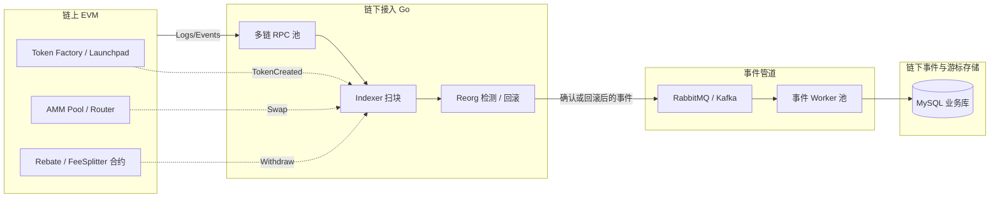
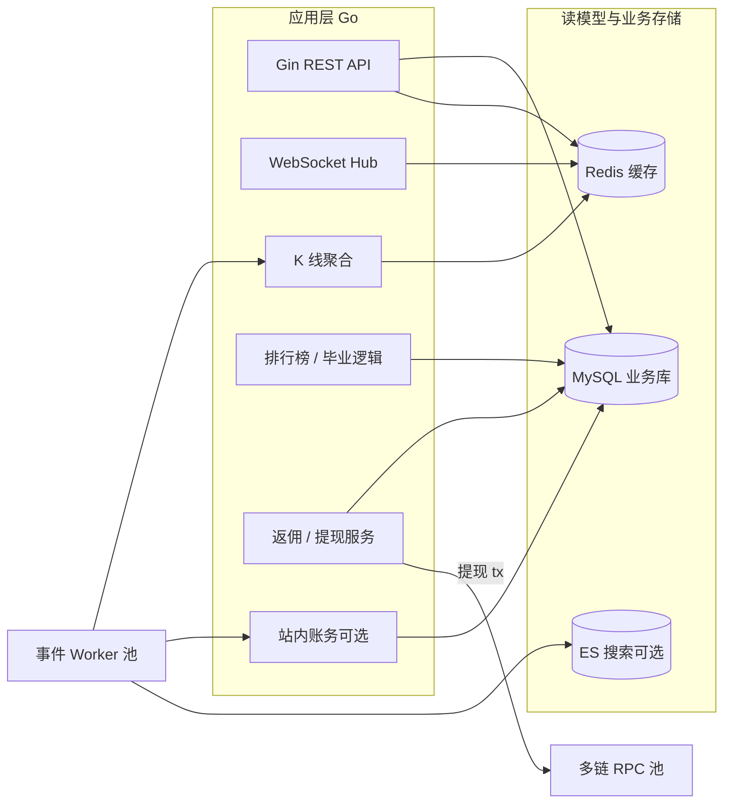
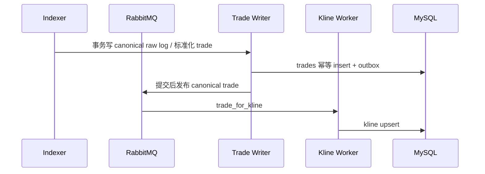

# Web3 交易所全栈架构（链上 DEX + 链下 Go）

## 30 秒版（开场）

> Web3 交易产品通常由链上合约与链下索引/API/行情组成；是否存在链下账务取决于
> 是否托管资产或提供内部余额。权威源是 canonical 区块、receipt、log 和合约状态，
> Indexer 只是可重建投影。关键词：**block lineage、事件 identity、reorg 重算、
> ABI/部署版本、链上链下信任边界**；UUPS 只是可选升级方案，不是默认答案。

## 3 分钟版（一面深度）

1. **是什么**：面向 Meme/Launchpad、链上 Swap、返佣提现类产品的 **端到端技术架构**，不是单讲 AMM 公式。
2. **为什么**：Web3 交易所岗位常要求「链上+链下都做过」；需证明能 **从合约事件讲到用户看到的 K 线**。
3. **怎么做**：先将 canonical 原始日志和区块 lineage 幂等持久化，再发布标准化业务
   事件构建 K 线/排行榜；合约地址、code hash、ABI 与生效区块必须版本化。

## 10 分钟版（原理 + 图示）

### 全栈分层

#### 链上事件写入链路



#### 应用读模型与链上副作用



### 核心事件与下游

| 链上事件 | 典型字段 | 链下处理 |
|----------|----------|----------|
| `TokenCreated` | token, creator, pool | 上新列表、初始 K 线 |
| `Swap` | pair, amountIn/Out, sender | 成交价、成交量、K 线 OHLC |
| `Sync` / `Mint` / `Burn` | reserves, liquidity | 深度、外盘迁移判断 |
| `RebatePaid` / `Withdraw` | user, amount | 返佣账务、提现状态机 |

事件 identity 常用 **`(chain_id, tx_hash, log_index)`**，同时必须保存 `block_hash`
和 canonical 状态；同一交易可能在 reorg 后重新进入另一块，不能只靠一行
`removed=true` 丢失其历史 lineage
（[S-BC-05](../12-blockchain-web3/S-BC-05-indexer-reorg.md)）。

### 45 分钟白板答题结构

1. **澄清（5 min）**：单链还是多链？是否托管用户资产？是否有 CEX 模块？
2. **链上设计（10 min）**：Factory + Pool + Router；UUPS 升级点（[S-SOLID-04](../13-solidity-contracts/S-SOLID-04-upgradeable-proxy.md)）；Operator/暂停
3. **索引层（10 min）**：游标、链最终性策略、父哈希校验、reorg 回滚/重放、补块
4. **读模型（10 min）**：K 线窗口聚合（[S-EXCH-10](./S-EXCH-10-kline-event-aggregation.md)）、WS 订阅（[S-EXCH-11](./S-EXCH-11-websocket-market-hub.md)）
5. **资金与返佣（5 min）**：链上分账 vs 链下账本；提现 Saga（[S-EXCH-12](./S-EXCH-12-token-launch-rebate.md)）
6. **非功能（5 min）**：RPC 一致性/降级、索引 lag SLO、升级权限与回滚/迁移预案

### 链上链下边界（必答）

| 放链上 | 放链下 Go |
|--------|-----------|
| 资产 custody、Swap 原子性、合约可验证规则 | K 线、排行榜、用户画像、风控与展示规则 |
| 分账规则（若需透明） | 聚合查询、ES 搜索、推送 |
| 若采用 Proxy：升级入口与链上权限 | ABI/地址/code hash 版本管理、多链配置与升级监控 |

“规则在链上”不自动等于不可变：可升级代理、admin、pause 和 oracle 都会改变信任
假设，讲解时应把权限主体和 timelock/multisig 一并画出。

详见 [S-SOLID-08](../13-solidity-contracts/S-SOLID-08-contract-go-boundary.md)

### 与 RabbitMQ 拆分（生产常见）



不要把同一条未落库的 raw log 直接扇出给 Trade Writer 和 Kline Worker；两者可能
看到不同重试/顺序。先建立 canonical trade 表，再以 outbox/CDC 发布，K 线才可重放。

见 [S-RAB-01](../middleware/rabbitmq/S-RAB-01-exchange-async-pipeline.md)

## 生产场景

- **RPC 限流**：多 provider 轮询 + 本地缓存 block header
- **Reorg**：按实际共同祖先标记 orphaned lineage，并从 canonical trades 重算受影响
  窗口；不存在固定“只回滚 6 块”的安全假设
- **合约升级**：同一 Proxy 通常切换 implementation；Go 按地址 + 生效区块选择 ABI，
  必要时并行兼容旧/新事件，而不是把 implementation 称为“新 Proxy”
- **毕业到外盘**：链上流动性阈值 + 链下任务触发 UI 状态

## 排查与工具

| 指标 | 告警 |
|------|------|
| `indexer_block_lag` | 按链出块时间与 SLO 设置；同时监控 latest/safe/finalized 差距 |
| `mq_consumer_lag` | 按用户可见新鲜度 SLO 设置时间 lag，不只看消息条数 |
| `ws_connected` | 连接数异常跌 |
| `rebate_withdraw_pending` | 积压 > 阈值 |

工具：链浏览器核对 tx、Indexer 游标表、DLQ 重放

## 架构取舍

| 选择 | 优点 | 代价 |
|------|------|------|
| 自研 Indexer vs The Graph | 可控 reorg、定制 | 运维成本 |
| K 线预聚合 vs 实时算 | WS 低延迟 | 存储冗余 |
| 链上返佣 vs 链下记账 | 透明 | Gas、灵活性低 |
| 单链 MVP | 快 | 多链需抽象 `chain_id` |

## 深挖问答

1. **K 线以链上 Swap 为准还是以池子 Sync？** → Swap 定 OHLC 成交；Sync 辅助深度。
2. **用户地址如何绑定 App 账号？** → SIWE/typed-data challenge 绑定 domain、chain、
   nonce、issued-at/expiry；智能账户用 ERC-1271 验证。平台充值地址分配是另一条托管
   流程，不能与“证明自托管地址所有权”混为一谈。
3. **MEV 对用户有何影响？** → 设置链上 minOut/price limit/deadline，评估私有提交、
   intent/batch auction 与失败回退信任；前端显示滑点本身不是防护
   （[S-EXCH-08](./S-EXCH-08-mev-sandwich.md)）。
4. **与纯 CEX 架构如何共存？** → [S-EXCH-09](./S-EXCH-09-hybrid-cex-dex.md) 两域 + 统一 BFF。
5. **45 min 如何收尾？** → 给 Phase2：多链、限价单链下订单簿、合规 KYT。

## 反模式与事故

- **Indexer 与 API 共库同表无幂等** → 重复 K 线
- **忽略 reorg** → 排行榜造假
- **托管提现没有持久化 nonce/UTXO reservation 与 unknown 状态** → RPC 超时后重签、
  replacement 冲突或卡单
- **升级/迁移未定义旧 Router、旧池和 allowance 的处置** → 流动性分裂或旧入口继续
  被使用；并非所有旧合约都能“冻结”，应在设计时提供迁移/暂停能力

## 代码示例

```go
// 原始观察记录：保留 reorg 前后的 block lineage。
type ChainLogObservation struct {
    ChainID   int64  `gorm:"uniqueIndex:uk_observation"`
    BlockHash string `gorm:"uniqueIndex:uk_observation"`
    TxHash    string `gorm:"uniqueIndex:uk_observation"`
    LogIndex  uint   `gorm:"uniqueIndex:uk_observation"`
    EventName string
    BlockNum  uint64
    Canonical bool
    Payload   []byte `gorm:"type:json"`
}
```

业务表再以 `(chain_id, tx_hash, log_index, event_semantics)` 幂等推进/冲正。不要用原始
observation 的 `block_hash` 作为“再发一次钱”的业务幂等键。

## 延伸阅读

- [S-EXCH-10 K 线聚合](./S-EXCH-10-kline-event-aggregation.md)
- [S-EXCH-12 返佣提现](./S-EXCH-12-token-launch-rebate.md)
- [S-BC-05 Indexer Reorg](../12-blockchain-web3/S-BC-05-indexer-reorg.md)
- [Uniswap V2 原理](https://docs.uniswap.org/contracts/v2/concepts/protocol-overview/how-uniswap-works)
- [S-EXCH-09 CeDeFi 混合](./S-EXCH-09-hybrid-cex-dex.md)
