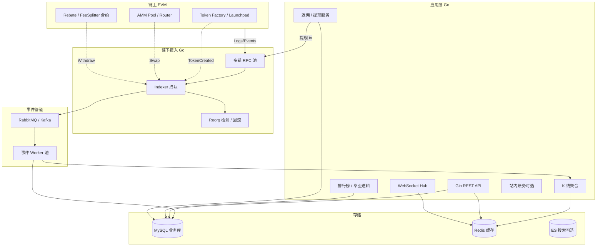
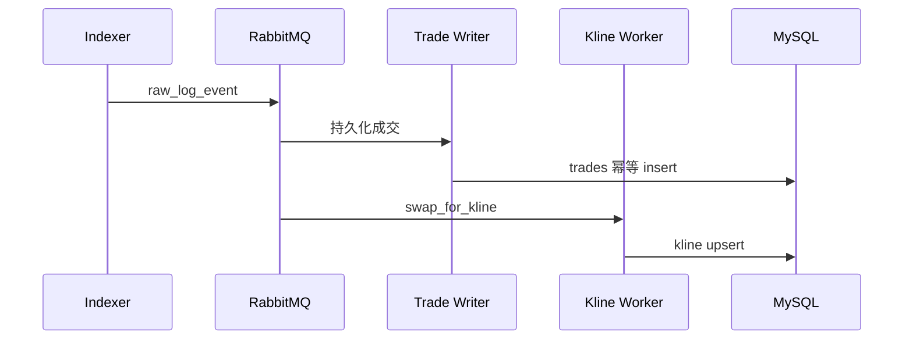

# Web3 交易所全栈架构（链上 DEX + 链下 Go）

## 30 秒版（开场）

> **Web3 交易所** = 链上 **合约（AMM/Launchpad/分账）** + 链下 **Go（索引、账务、行情、API）**。架构师要画清 **事件驱动主链路**：RPC/Indexer 扫块 → 幂等入库 → K 线/排行榜 → WebSocket 推送 → 返佣/提现 Saga。关键词：**tx_hash+log_index 幂等、reorg 回滚、链上链下边界、UUPS 可升级**。

## 3 分钟版（一面深度）

1. **是什么**：面向 Meme/Launchpad、链上 Swap、返佣提现类产品的 **端到端技术架构**，不是单讲 AMM 公式。
2. **为什么**：Web3 交易所 JD 常要求「链上+链下都做过」；需证明能 **从合约事件讲到用户看到的 K 线**。
3. **怎么做**：Indexer 为事实源；业务库为读模型；RabbitMQ/Kafka 解耦监听与写入；合约升级与 Go  ABI 版本对齐。

## 10 分钟版（原理 + 图示）

### 全栈分层



### 核心事件与下游

| 链上事件 | 典型字段 | 链下处理 |
|----------|----------|----------|
| `TokenCreated` | token, creator, pool | 上新列表、初始 K 线 |
| `Swap` | pair, amountIn/Out, sender | 成交价、成交量、K 线 OHLC |
| `Sync` / `Mint` / `Burn` | reserves, liquidity | 深度、外盘迁移判断 |
| `RebatePaid` / `Withdraw` | user, amount | 返佣账务、提现状态机 |

幂等键：**`(chain_id, tx_hash, log_index)`**（[S-BC-05](../12-blockchain-web3/S-BC-05-indexer-reorg.md)）

### 45 分钟白板答题结构

1. **澄清（5 min）**：单链还是多链？是否托管用户资产？是否有 CEX 模块？
2. **链上设计（10 min）**：Factory + Pool + Router；UUPS 升级点（[S-SOLID-04](../13-solidity-contracts/S-SOLID-04-upgradeable-proxy.md)）；Operator/暂停
3. **索引层（10 min）**：游标、确认数、reorg 深度、补块
4. **读模型（10 min）**：K 线窗口聚合（[S-EXCH-10](./S-EXCH-10-kline-event-aggregation.md)）、WS 订阅（[S-EXCH-11](./S-EXCH-11-websocket-market-hub.md)）
5. **资金与返佣（5 min）**：链上分账 vs 链下账本；提现 Saga（[S-EXCH-12](./S-EXCH-12-token-launch-rebate.md)）
6. **非功能（5 min）**：RPC 降级、索引 lag SLO、合约灰度

### 链上链下边界（必答）

| 放链上 | 放链下 Go |
|--------|-----------|
| 资产 custody、Swap 原子性、不可篡改费率 | K 线、排行榜、用户画像、风控规则 |
| 分账规则（若需透明） | 聚合查询、ES 搜索、推送 |
| 升级逻辑（Proxy） | ABI 版本管理、多链配置 |

详见 [S-SOLID-08](../13-solidity-contracts/S-SOLID-08-contract-go-boundary.md)

### 与 RabbitMQ 拆分（生产常见）



见 [S-RAB-01](../middleware/rabbitmq/S-RAB-01-exchange-async-pipeline.md)

## 生产场景

- **RPC 限流**：多 provider 轮询 + 本地缓存 block header
- **Reorg 6 块**：标记 `removed=true`，反向冲正 K 线贡献
- **合约升级**：新 Proxy 实现 + Go 双 ABI 过渡读
- **毕业到外盘**：链上流动性阈值 + 链下任务触发 UI 状态

## 排查与工具

| 指标 | 告警 |
|------|------|
| `indexer_block_lag` | > 30 块 |
| `mq_consumer_lag` | K 线延迟 > 5s |
| `ws_connected` | 连接数异常跌 |
| `rebate_withdraw_pending` | 积压 > 阈值 |

工具：链浏览器核对 tx、Indexer 游标表、DLQ 重放

## 架构取舍

| 选择 | 优点 | 代价 |
|------|------|------|
| 自研 Indexer vs The Graph | 可控 reorg、定制 | 运维成本 |
| K 线预聚合 vs 实时算 | WS 低延迟 | 存储冗余 |
| 链上返佣 vs 链下记账 | 透明 | Gas、灵活性低 |
| 单链 MVP | 快 | 多链需抽象 `chain_id` |

## 追问链

1. **K 线以链上 Swap 为准还是以池子 Sync？** → Swap 定 OHLC 成交；Sync 辅助深度。
2. **用户地址如何绑定 App 账号？** → SIWE / 签名绑定；充值地址 memo 或 CREATE2 派生。
3. **MEV 对用户有何影响？** → 前端 slippage + 私有 RPC 可选（[S-EXCH-08](./S-EXCH-08-mev-sandwich.md)）。
4. **与纯 CEX 架构如何共存？** → [S-EXCH-09](./S-EXCH-09-hybrid-cex-dex.md) 两域 + 统一 BFF。
5. **45 min 如何收尾？** → 给 Phase2：多链、限价单链下订单簿、合规 KYT。

## 反模式与事故

- **Indexer 与 API 共库同表无幂等** → 重复 K 线
- **忽略 reorg** → 排行榜造假
- **Go 直接 `eth_sendRawTransaction` 无 nonce 队列** → 提现卡死
- **合约升级未冻结旧 Router 调用** → 双池套利

## 代码示例

```go
// 事件幂等入库
type ChainEvent struct {
    ChainID   int64  `gorm:"uniqueIndex:uk_event"`
    TxHash    string `gorm:"uniqueIndex:uk_event"`
    LogIndex  uint   `gorm:"uniqueIndex:uk_event"`
    EventName string
    BlockNum  uint64
    Removed   bool   // reorg 标记
    Payload   []byte `gorm:"type:json"`
}
```

## 延伸阅读

- [S-EXCH-10 K 线聚合](./S-EXCH-10-kline-event-aggregation.md)
- [S-EXCH-12 返佣提现](./S-EXCH-12-token-launch-rebate.md)
- [S-BC-05 Indexer Reorg](../12-blockchain-web3/S-BC-05-indexer-reorg.md)
- [Uniswap V2 原理](https://docs.uniswap.org/contracts/v2/concepts/protocol-overview/how-uniswap-works)
- [S-EXCH-09 CeDeFi 混合](./S-EXCH-09-hybrid-cex-dex.md)
