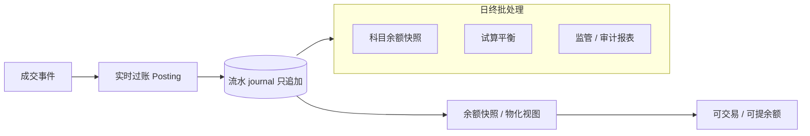
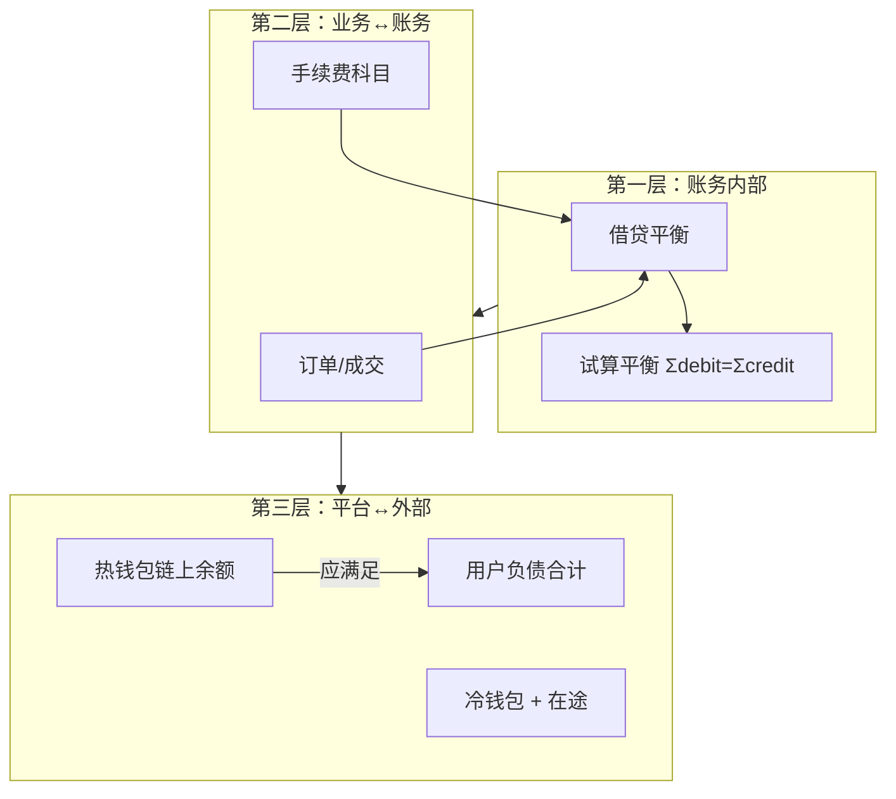
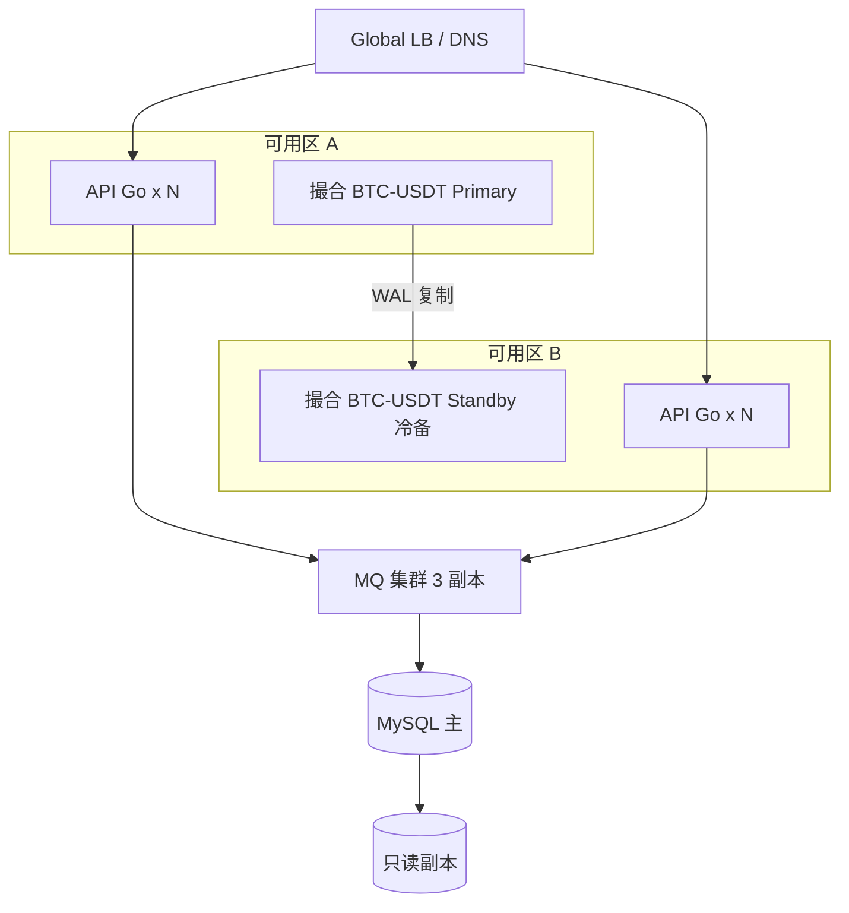

# 交易所清结算、对账与高可用架构

## 30 秒版（开场）

> 交易所 **资金正确性 > 性能**。架构师需讲清：**T+0 清结算**（成交→账务→可提余额）、**三层对账**（账务内部、账务↔钱包、平台↔链上）、**高可用**（撮合 symbol 分片、MQ 多副本、撮合主备）。关键词：**不可变流水、日终批处理、热钱包负债模型、RPO/RTO**。

## 3 分钟版（一面深度）

1. **是什么**：成交后的资金结转、平台内外账目一致、以及交易/资金系统在故障与扩容下的可用性设计。
2. **为什么**：交易所事故多源于 **对账不平、双花、热钱包超提**；架构面必问「如何证明用户的钱是对的」。
3. **怎么做**：流水只追加；余额 = sum(流水)；对账 job 独立；关键路径多活 + 人工熔断开关。

## 10 分钟版（原理 + 图示）

### 清结算链路



**T+0 vs T+1**

| 类型 | 交易所常见做法 |
|------|----------------|
| 现货成交 | T+0 实时过账，可立即用于交易 |
| 提现 | T+0 申请 + 链上 T+confirm 块 |
| 法币入金 | T+1 或渠道确认后入账 |
| 返佣 | T+0 累计，T+1 或阈值提现 |

### 三层对账模型



| 对账项 | 频率 | 不平处理 |
|--------|------|----------|
| 流水借贷平衡 | 实时 / 5min | 熔断过账 |
| 成交 vs 账务 | 15min | 补单 / 冲正 |
| 热钱包 vs 用户负债 | 1h + 日终 | 暂停提现 |
| 链上充值 vs 入账 | 每块 | 延迟入账 |

详见 [S-EXCH-05](./S-EXCH-05-risk-reconciliation.md)、[S-EXCH-03](./S-EXCH-03-account-ledger.md)

### 高可用拓扑（CEX + Web3 托管）



**RPO / RTO 口述模板**

| 组件 | RPO | RTO | 手段 |
|------|-----|-----|------|
| 撮合 WAL | 0 | 分钟级 | 主备切换 + 重放 |
| 账务 DB | 0～秒级 | 15～30 min | 半同步 / MGR |
| 行情 WS | 可丢秒级 | 自动 | 多实例无状态 |
| Indexer 游标 | 块级 | 重扫 | 游标 + 补块 |

### 故障域与降级

| 故障 | 降级策略 |
|------|----------|
| 单 symbol 撮合挂 | 仅停该交易对；其他不受影响 |
| 账务 consumer lag | 暂停新开仓 / 暂停提现 |
| RPC 全挂 | 停链上提现；站内交易可继续（CEX） |
| 对账不平 | **全局暂停提现** + 告警 |
| MQ 不可用 | OMS 同步写 Outbox，恢复后补发 |

## 生产场景

- **热钱包被盗**：冷钱包补热 + 暂停提现 + 链上追踪
- **重复消费成交** → 幂等 + 日终发现差额
- **MySQL 主从延迟** → 提现读主库或「提现可用余额」独立字段
- **大促扩容**：API/WS 水平扩；撮合按 symbol 加实例

## 排查与工具

- **Metrics**：`ledger_posting_latency`、`reconciliation_diff`、`withdraw_pending_count`
- **审计**：流水表不可 UPDATE；操作人 + 审批流
- **工具**：Grafana 对账大盘、链上余额脚本、Metabase 监管报表

## 架构取舍

| 方案 | 何时选 |
|------|--------|
| 单库账务 | MVP、<100 万用户 |
| 按 user_id 分库 | 账务 QPS 瓶颈 |
| 单元化（用户全链路同单元） | 超大规模、监管分区 |
| 链上 Merkle 证明储备 | PoR 营销/合规；与实时账务并行 |

## 追问链

1. **为什么流水不能改只能冲正？** → 审计与监管；改账不可追溯。
2. **用户余额存在哪？** → 流水为准；余额表是缓存，可重建。
3. **提现双重扣款怎么防？** → 分布式锁 + 状态机 + 幂等 `withdrawId`（[S-DIST-02](../middleware/redis/S-DIST-02-distributed-lock.md)）。
4. **撮合和 DB 同时挂？** → 恢复顺序：WAL → 撮合 → 补发 MQ → 账务对账。
5. **Web3 所 PoR 和账务关系？** → PoR 证明储备 ≥ 负债；不能替代复式记账。

## 反模式与事故

- **余额字段直接 UPDATE 无流水** → 无法对账
- **对账脚本与过账同进程** → 互相拖死
- **热钱包余额人工改库** → 刑事级风险
- **无全局提现熔断** → 对账不平仍放行

## 代码示例

```go
// 过账：双分录示例（买方 USDT 减少，BTC 增加）
func PostTrade(ctx context.Context, tx *gorm.DB, t TradeEvent) error {
    entries := []JournalEntry{
        {UserID: t.BuyerID, Asset: "USDT", Delta: t.QuoteAmount.Neg(), Ref: t.TradeID},
        {UserID: t.BuyerID, Asset: "BTC", Delta: t.BaseAmount, Ref: t.TradeID},
        {UserID: t.SellerID, Asset: "BTC", Delta: t.BaseAmount.Neg(), Ref: t.TradeID},
        {UserID: t.SellerID, Asset: "USDT", Delta: t.QuoteAmount, Ref: t.TradeID},
    }
    return insertJournalIdempotent(tx, entries) // uk(trade_id, user, asset)
}
```

## 延伸阅读

- [S-EXCH-03 复式记账](./S-EXCH-03-account-ledger.md)
- [S-EXCH-05 风控对账](./S-EXCH-05-risk-reconciliation.md)
- [S-EXCH-13 CEX 端到端架构](./S-EXCH-13-cex-end-to-end-architecture.md)
- [AWS Disaster Recovery](https://aws.amazon.com/disaster-recovery/)
- [Google SRE - SLO](https://sre.google/sre-book/service-level-objectives/)
